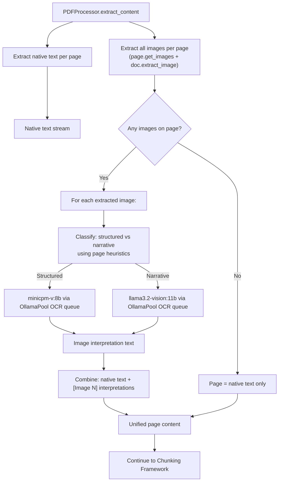
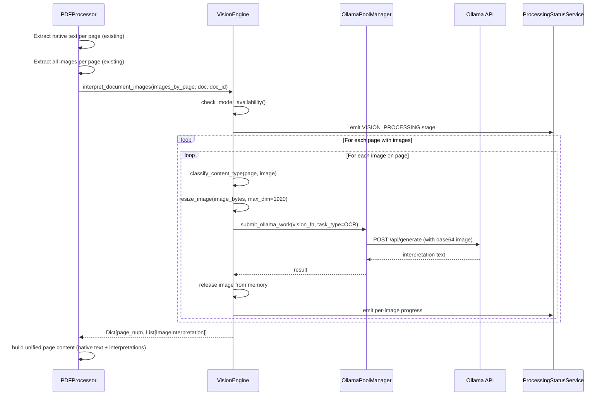

# Design Document: Vision OCR Pipeline

## Overview

The Multimodal Librarian currently extracts text from PDFs using PyMuPDF and extracts embedded images as raw `MediaElement` objects. While native text extraction works well, the content of embedded images — charts, tables, diagrams, figures, scanned pages — is never interpreted. A page with a drug interaction table as an image, or a clinical diagram, produces no searchable text from that visual content. Scanned PDFs (e.g., the 109MB Sanford Guide) can produce as few as 1 chunk for an entire document.

This design adds a Vision LLM pipeline that processes ALL embedded images on every PDF page through Ollama vision models. The approach:

1. **Extract native text** from every page (existing PyMuPDF behavior — unchanged)
2. **Extract all embedded images** from every page (existing `_extract_images_from_page` — already uses `page.get_images()` + `doc.extract_image()`)
3. **Interpret every image** via the appropriate vision LLM — producing a visual description + OCR of any text within the image
4. **Combine native text + all image interpretations** into unified page content — no information loss, never either/or

Two vision models are used with content-aware routing:
- `minicpm-v:8b` — structured content (tables, forms, charts, multi-column layouts)
- `llama3.2-vision:11b` — narrative content (diagrams, photos, illustrations)

Vision work is submitted through the `OllamaPoolManager` as a new `OCR` task type, participating in fair-share scheduling alongside bridge and KG tasks.

`OCR_STRATEGY` is either `disabled` or `vision_llm`. There is no hybrid strategy and no Tesseract.

## Architecture



### Processing Flow



### Key Design Decisions

1. **Individual images, not full-page renders**: The VisionEngine processes each extracted image individually (via `page.get_images()` + `doc.extract_image()`), NOT full-page renders. This gives better results because each image is sent at its native resolution without surrounding page chrome.

2. **Always combine, never replace**: Native text and image interpretations are ALWAYS combined. A page with both text and images includes both. It is never either/or.

3. **No scanned page detection threshold**: Every image on every page gets processed. There is no threshold-based detection of "scanned" vs "native" pages.

4. **Content-aware routing via page heuristics**: Classification uses lightweight PyMuPDF page metadata (`page.get_drawings()`, `page.get_text("dict")`) — no separate model call needed.

5. **Sequential image processing**: Images are processed one at a time to bound memory usage. Each image is released before the next is loaded.

## Components and Interfaces

### 1. VisionEngine (`src/multimodal_librarian/components/pdf_processor/vision_engine.py`)

New component responsible for interpreting images via vision LLMs. Sits alongside `pdf_processor.py`.

```python
from dataclasses import dataclass, field
from enum import Enum
from typing import Dict, List, Optional, Tuple
from uuid import UUID
import fitz


class ContentType(Enum):
    """Detected content type for model routing."""
    STRUCTURED = "structured"   # tables, forms, charts, multi-column
    NARRATIVE = "narrative"     # diagrams, photos, illustrations, prose


@dataclass
class ImageInterpretation:
    """Result of vision LLM interpretation for a single image."""
    page_number: int           # 1-indexed
    image_index: int           # Position within the page
    text: str                  # Interpretation text (description + OCR)
    content_type: ContentType  # Detected content type
    model_used: str            # Which vision model was used
    processing_time_ms: float  # Time taken
    success: bool = True
    error: Optional[str] = None


@dataclass
class VisionDocumentResult:
    """Aggregate vision processing result for an entire document."""
    interpretations: Dict[int, List[ImageInterpretation]] = field(default_factory=dict)
    # page_number -> list of interpretations
    total_images_processed: int = 0
    total_failures: int = 0
    processing_duration_seconds: float = 0.0
    models_used: Dict[str, int] = field(default_factory=dict)  # model -> count


class VisionEngine:
    """Vision LLM image interpretation engine using Ollama."""

    def __init__(
        self,
        max_image_dimension: int = 1920,
        max_megapixels: int = 20,
        max_images_per_document: int = 1000,
        structured_model: str = "minicpm-v:8b",
        narrative_model: str = "llama3.2-vision:11b",
    ):
        ...

    def interpret_document_images(
        self,
        images_by_page: Dict[int, List[MediaElement]],
        doc: fitz.Document,
        document_id: Optional[UUID] = None,
    ) -> VisionDocumentResult:
        """
        Interpret all extracted images across all pages.
        Processes images sequentially, one at a time.
        Reports progress via ProcessingStatusService.
        Triggers GC every 20 images for documents with > 100 images.
        
        Args:
            images_by_page: Dict mapping page_number to list of MediaElement images
                            (already extracted by PDFProcessor._extract_images_from_page)
            doc: The open fitz.Document (for page heuristic access)
            document_id: Optional document ID for progress reporting
            
        Returns:
            VisionDocumentResult with interpretations keyed by page number
        """
        ...

    def classify_content_type(
        self, page: fitz.Page, image_metadata: dict
    ) -> ContentType:
        """
        Classify an image as structured or narrative using page-level heuristics.
        
        Uses:
        - page.get_drawings() for line density (horizontal/vertical lines)
        - page.get_text("dict") for text block column positions
        
        If line_count > threshold OR column_count >= 2: STRUCTURED
        Otherwise: NARRATIVE
        """
        ...

    def resize_image(
        self, image_bytes: bytes, width: int, height: int
    ) -> Tuple[bytes, int, int]:
        """
        Resize image to fit within max_image_dimension and max_megapixels.
        Preserves aspect ratio. Uses Pillow.
        
        Returns (resized_png_bytes, new_width, new_height).
        """
        ...

    def _call_vision_model(
        self, image_bytes: bytes, model: str, prompt: str
    ) -> str:
        """
        Submit image to Ollama vision model via OllamaPoolManager OCR queue.
        Encodes image as base64 for the Ollama API payload.
        Returns interpretation text.
        """
        ...

    def check_model_availability(self) -> Dict[str, bool]:
        """
        Check which vision models are available in Ollama.
        Calls Ollama /api/tags endpoint.
        Returns dict like {"minicpm-v:8b": True, "llama3.2-vision:11b": False}.
        """
        ...
```

### 2. PDFProcessor Changes (`pdf_processor.py`)

The existing `PDFProcessor._extract_with_pymupdf` method is extended to:
1. Collect images by page (already done — `_extract_images_from_page`)
2. After extracting all pages, call `VisionEngine.interpret_document_images()`
3. Build unified page content: native text + `[Image N]` interpretation blocks

```python
def _extract_with_pymupdf(self, pdf_bytes: bytes) -> DocumentContent:
    doc = fitz.open(stream=pdf_bytes, filetype="pdf")
    try:
        metadata = self._extract_metadata(doc)
        full_text = []
        images = []
        charts = []
        images_by_page = {}  # NEW: track images per page for vision processing

        for page_num in range(doc.page_count):
            page = doc[page_num]
            page_text = page.get_text()
            page_label = ...  # existing label logic

            # Extract images (existing)
            page_images = self._extract_images_from_page(page, page_num + 1)
            images.extend(page_images)
            images_by_page[page_num + 1] = page_images  # NEW

            # Extract charts (existing)
            page_charts = self._extract_charts_from_page(page, page_num + 1)
            charts.extend(page_charts)

            # Build page text (will be enhanced below)
            if page_text.strip():
                full_text.append(f"[Page {page_label}]\n{page_text}")

        # NEW: Vision LLM interpretation of all images
        if self._ocr_enabled:
            vision_result = self._vision_engine.interpret_document_images(
                images_by_page, doc, self._current_document_id
            )
            # Rebuild full_text with unified page content
            full_text = self._build_unified_content(
                doc, full_text, vision_result
            )
            # Update metadata with vision stats
            metadata.vision_images_processed = vision_result.total_images_processed
            metadata.vision_failures = vision_result.total_failures

        combined_text = "\n\n".join(full_text)
        return DocumentContent(text=combined_text, images=images, ...)
    finally:
        doc.close()

def _build_unified_content(
    self, doc, page_texts, vision_result
) -> List[str]:
    """
    Build unified page content by appending image interpretations
    after native text for each page.
    
    For each page:
    - Start with native text (unchanged)
    - Append each image interpretation as [Image {index}]: {text}
    - If page has no native text but has images, content is interpretations only
    """
    ...
```

### 3. OllamaPoolManager Changes (`ollama_pool_manager.py`)

Extend the existing singleton pool manager:

- Add `OCR = "ocr"` to `TaskType` enum
- Add `_ocr_queue` (same `queue.Queue` type as bridge/kg queues)
- Extend `FairShareState` with `ocr_completed`, `ocr_target_ratio`, `ocr_actual_ratio`, `ocr_deficit`
- Extend `_parse_fair_share_ratio()` to accept three-part format `bridge:kg:ocr` while remaining backward-compatible with two-part format (OCR defaults to 0 share)
- Extend `_pick_next_task_type()` to consider OCR queue in deficit-based scheduling
- Extend `get_pool_stats()` to include `ocr_pending`, `ocr_completed`
- Route `task_type=TaskType.OCR` submissions to `_ocr_queue`

### 4. ProcessingStatusService Changes

Add `VISION_PROCESSING` to the `ProcessingStatus` enum. The existing `update_status()` method is used to emit:
- Stage start: `VISION_PROCESSING` with total image count
- Per-image progress: current image number, total, model used
- Completion summary: total processed, models used, duration

### 5. Docker / Infrastructure Changes

- Add `OCR_ENABLED`, `OCR_VISION_MODEL_STRUCTURED`, `OCR_VISION_MODEL_NARRATIVE`, `OCR_MAX_IMAGE_DIMENSION`, `OCR_MAX_IMAGES_PER_DOCUMENT` to `docker-compose.yml` for `app` and `celery-worker` services
- Update `OLLAMA_FAIR_SHARE_RATIO` default to `2:2:1`
- Add startup model availability check with warning logs

## Data Models

### Vision Configuration (Pydantic Settings)

```python
from pydantic import BaseModel, Field
from typing import Literal


class VisionOCRSettings(BaseModel):
    """Vision OCR pipeline configuration, loaded from environment variables."""
    ocr_enabled: bool = Field(default=True, description="Global kill switch for vision processing")
    ocr_vision_model_structured: str = Field(
        default="minicpm-v:8b",
        description="Ollama vision model for structured content (tables, forms, charts)"
    )
    ocr_vision_model_narrative: str = Field(
        default="llama3.2-vision:11b",
        description="Ollama vision model for narrative content (diagrams, photos)"
    )
    ocr_max_image_dimension: int = Field(
        default=1920, ge=512, le=4096,
        description="Max pixel dimension before resizing"
    )
    ocr_max_images_per_document: int = Field(
        default=1000, ge=1,
        description="Max images to process per document"
    )
```

### Document Metadata Extensions

The existing document metadata gains two fields after vision processing:

```python
vision_images_processed: int = 0    # Number of images successfully interpreted
vision_failures: int = 0            # Number of images that failed interpretation
```

### Content Type Detection Heuristics

The `classify_content_type` method uses lightweight PyMuPDF page analysis:

```python
def classify_content_type(self, page: fitz.Page, image_metadata: dict) -> ContentType:
    """
    Heuristic-based content type detection for model routing.

    Structured indicators (-> minicpm-v:8b):
    - page.get_drawings() returns high density of horizontal/vertical lines
    - page.get_text("dict") shows text blocks in >= 2 columns
    - Form-like patterns (label: value pairs)

    Narrative indicators (-> llama3.2-vision:11b):
    - Single column of flowing text
    - Few or no line structures
    - Paragraph-like text blocks

    Implementation:
    1. drawings = page.get_drawings() — count horizontal/vertical lines
    2. blocks = page.get_text("dict")["blocks"] — analyze x-positions
    3. If line_count > 10 OR distinct_columns >= 2: STRUCTURED
    4. Otherwise: NARRATIVE
    
    When only one model is available, classification is skipped and
    the available model is used for all images.
    """
    ...
```

### Vision Model Prompts

Each model receives a tailored prompt:

```python
STRUCTURED_PROMPT = (
    "Analyze this image. First, describe what you see (chart, table, form, etc.). "
    "Then transcribe ALL text exactly as written. "
    "For tables, use markdown table format preserving column alignment. "
    "Include all headers, labels, footnotes, and data values."
)

NARRATIVE_PROMPT = (
    "Analyze this image. First, describe what you see (diagram, photo, illustration, etc.). "
    "Then transcribe ALL text exactly as written. "
    "Preserve paragraph structure and reading order. "
    "Include all labels, captions, and annotations."
)
```

### Fair Share Ratio Format

The `OLLAMA_FAIR_SHARE_RATIO` environment variable supports:
- Two-part: `"2:1"` → bridge=0.67, kg=0.33, ocr=0.0 (backward compatible)
- Three-part: `"2:2:1"` → bridge=0.4, kg=0.4, ocr=0.2


## Correctness Properties

*A property is a characteristic or behavior that should hold true across all valid executions of a system — essentially, a formal statement about what the system should do. Properties serve as the bridge between human-readable specifications and machine-verifiable correctness guarantees.*

### Property 1: Image extraction completeness and ordering

*For any* PDF page containing N embedded images (N >= 0), the extraction SHALL return exactly N image elements, each with the correct `page_number` and sequential `image_index` (0 through N-1), preserving the order returned by `page.get_images()`.

**Validates: Requirements 1.1, 1.2**

### Property 2: Image resize preserves constraints and aspect ratio

*For any* image with arbitrary width W and height H, after resizing: (a) `max(new_width, new_height) <= max_image_dimension`, (b) `new_width * new_height <= max_megapixels * 1_000_000`, and (c) the aspect ratio `new_width / new_height` SHALL equal `W / H` within a tolerance of 0.01.

**Validates: Requirements 2.3, 2.4, 7.2**

### Property 3: Content-aware model routing

*For any* page with detected heuristic values (line_count, column_count), the classification SHALL be STRUCTURED when `line_count > threshold OR column_count >= 2`, and NARRATIVE otherwise. STRUCTURED images SHALL route to `minicpm-v:8b` and NARRATIVE images SHALL route to `llama3.2-vision:11b`.

**Validates: Requirements 3.1, 3.3, 3.4**

### Property 4: Unified page content combines native text and all image interpretations

*For any* page with native text T and a list of N image interpretations [I_0, ..., I_{N-1}], the unified page content SHALL: (a) contain T unchanged as a substring, (b) contain exactly N interpretation blocks each prefixed with `[Image {index}]`, (c) place native text before image interpretations, and (d) preserve image interpretation order. When T is empty and N > 0, content is interpretations only. When N = 0, content is T only. When both T is non-empty and N > 0, both are present.

**Validates: Requirements 4.1, 4.2, 4.3, 4.4**

### Property 5: Fair share ratio parsing

*For any* valid ratio string in two-part (`"a:b"`) or three-part (`"a:b:c"`) format with positive weights, the parsed target ratios SHALL sum to 1.0 (within floating-point tolerance), each ratio SHALL equal its weight divided by the total weight, and a two-part format SHALL assign OCR a target ratio of 0.0.

**Validates: Requirements 5.6, 6.3**

### Property 6: Progress percentage calculation

*For any* pair `(completed, total)` where `total > 0` and `0 <= completed <= total`, the reported vision processing progress percentage SHALL equal `round((completed / total) * 100)`.

**Validates: Requirements 8.2**

### Property 7: Vision metadata accuracy

*For any* set of image processing results where each result is marked as success or failure, the document metadata SHALL have `vision_images_processed` equal to the count of successful results and `vision_failures` equal to the count of failed results, and their sum SHALL equal the total number of images attempted.

**Validates: Requirements 10.5**

## Error Handling

### Image-Level Errors

| Error | Handling | Recovery |
|-------|----------|----------|
| Image extraction fails (corrupt xref) | Skip image, log warning with page/index | Continue with remaining images on page |
| Image resize fails (MemoryError) | Skip image, log error | Continue processing remaining images |
| Vision model returns empty text | Record as failure, log warning | Continue; image gets no interpretation |
| Ollama API timeout | Retry once with extended timeout, then skip | Continue processing remaining images |
| Ollama API connection error mid-document | Skip remaining images, log error | Return whatever interpretations were collected |

### Document-Level Errors

| Error | Handling | Recovery |
|-------|----------|----------|
| Ollama service unreachable at start | Skip all vision processing, log warning | Process document with native text only |
| Neither vision model is pulled | Skip all vision processing, log error | Process document with native text only |
| OCR_MAX_IMAGES_PER_DOCUMENT exceeded | Process first M images, log warning | Remaining images get no interpretation |
| All image interpretations fail | Record failures in metadata | Document still has native text |

### Graceful Degradation Chain

```
1. Both models available → content-aware routing (best quality)
2. Only one model available → use available model for all images
3. Ollama unreachable → skip vision processing entirely, native text only
4. OCR_ENABLED=false → no vision processing (existing behavior)
```

### Error Metadata

After processing, the document metadata includes:
- `vision_images_processed`: successfully interpreted images
- `vision_failures`: images where interpretation failed

This allows downstream consumers to assess vision coverage quality.

## Testing Strategy

### Property-Based Tests (Hypothesis)

Each correctness property maps to a property-based test with minimum 100 iterations. The project already uses Hypothesis (`.hypothesis/` directory present).

| Property | Test File | Generator Strategy |
|----------|-----------|-------------------|
| P1: Image extraction completeness | `tests/components/test_vision_engine_properties.py` | Random (page_count: 1-20, images_per_page: 0-10) |
| P2: Image resize constraints | `tests/components/test_vision_engine_properties.py` | Random (width: 100-10000, height: 100-10000, max_dim: 512-4096, max_mp: 1-50) |
| P3: Content-aware routing | `tests/components/test_vision_engine_properties.py` | Random (line_count: 0-100, column_count: 1-5) |
| P4: Unified page content | `tests/components/test_vision_engine_properties.py` | Random (native_text: text(), num_images: 0-10, interpretation_texts: list of text()) |
| P5: Fair share ratio parsing | `tests/components/test_ollama_pool_ocr_properties.py` | Random (weights: 2 or 3 positive floats) |
| P6: Progress percentage | `tests/components/test_vision_engine_properties.py` | Random (completed: 0-total, total: 1-1000) |
| P7: Vision metadata accuracy | `tests/components/test_vision_engine_properties.py` | Random (results: list of bool success/failure, length 1-100) |

Tag format: `# Feature: vision-ocr-pipeline, Property {N}: {title}`

### Unit Tests (Example-Based)

| Test | Description |
|------|-------------|
| Default settings values | Verify defaults: OCR_ENABLED=true, models, max_dimension=1920, max_images=1000 |
| OCR_ENABLED=false bypass | Verify no vision processing when disabled |
| Two-part ratio backward compat | Parse "2:1", verify OCR ratio is 0 |
| Three-part ratio parsing | Parse "2:2:1", verify ratios are 0.4, 0.4, 0.2 |
| TaskType.OCR exists | Verify enum value exists |
| OCR pool stats inclusion | Verify get_pool_stats includes ocr_pending, ocr_completed |
| Single model fallback | When only one model available, all images use it |
| Ollama unreachable fallback | Mock Ollama down, verify native text extraction completes |
| Neither model available | Mock both models missing, verify skip and error log |
| GC trigger for large docs | Verify gc.collect called every 20 images for >100 image docs |
| Image failure continues | Mock one image failing, verify remaining images still process |
| VISION_PROCESSING stage emitted | Verify status update with correct stage at start |
| Completion summary emitted | Verify summary message with counts and duration |
| No-image page unchanged | Page with no images produces native text only |
| No-text page with images | Page with images but no native text produces interpretations only |

### Integration Tests

| Test | Description |
|------|-------------|
| End-to-end PDF with images | Process a known PDF with embedded images, verify interpretations appear in unified content |
| WebSocket progress updates | Verify VISION_PROCESSING stage and per-image updates emitted via WebSocket |
| OllamaPoolManager OCR routing | Submit OCR task, verify it goes to OCR queue with fair-share scheduling |
| Chunking unified content | Pass unified content through chunking framework, verify no errors |
| Sequential memory release | Verify images are released between processing calls |

### Test Configuration

- Property tests: minimum 100 iterations via `@settings(max_examples=100)`
- Mocking: Use `unittest.mock` for Ollama API, OllamaPoolManager, ProcessingStatusService
- Fixtures: Create small test PDFs with known image content using PyMuPDF
- Library: Hypothesis (already in project)
