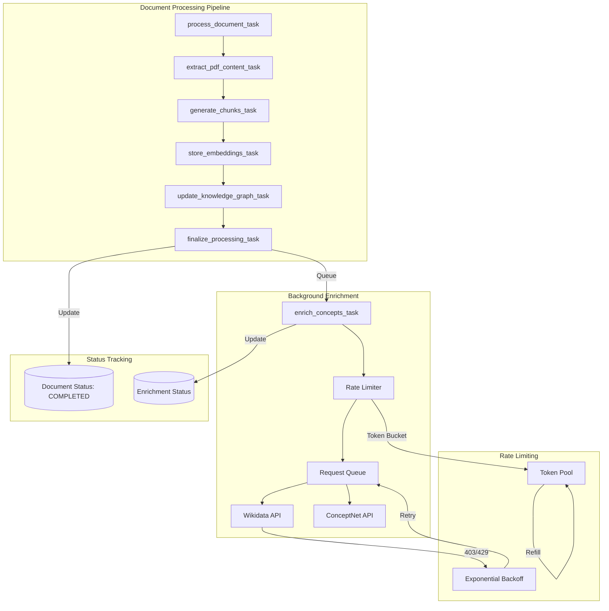
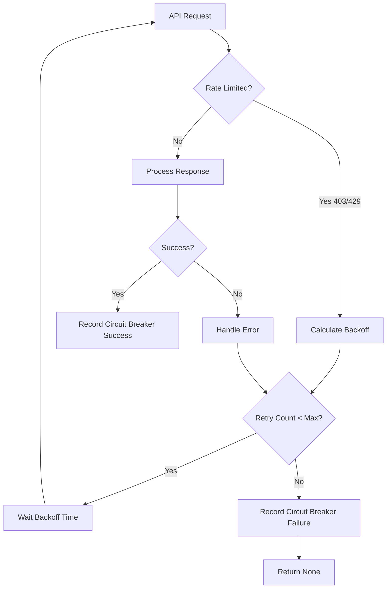

# Design Document: Wikidata Rate Limiting and Background Enrichment

## Overview

This design addresses two interconnected problems in the document processing pipeline:

1. **Rate Limiting**: The Wikidata API enforces rate limits that cause HTTP 403/429 errors when the system makes too many requests. The current implementation has basic retry logic but lacks proper rate limiting to prevent these errors proactively.

2. **Synchronous Blocking**: Enrichment currently runs within the `update_knowledge_graph_task`, blocking document completion and causing Celery soft time limit exceptions (25 minutes).

The solution introduces:
- A token bucket rate limiter with request queuing
- Exponential backoff specifically for 403/429 responses
- A separate Celery task for background enrichment
- Independent status tracking for enrichment progress

## Architecture



## Components and Interfaces

### 1. RateLimiter Class

A token bucket rate limiter that controls the rate of outgoing API requests.

```python
class RateLimiter:
    """Token bucket rate limiter for API request throttling."""
    
    def __init__(
        self,
        rate: float = 10.0,  # requests per second
        burst: int = 20,     # maximum burst size
        timeout: float = 30.0  # max wait time in seconds
    ):
        """
        Initialize the rate limiter.
        
        Args:
            rate: Maximum sustained request rate (requests/second)
            burst: Maximum tokens in bucket (allows short bursts)
            timeout: Maximum time to wait for a token
        """
        pass
    
    async def acquire(self, timeout: Optional[float] = None) -> bool:
        """
        Acquire a token, waiting if necessary.
        
        Args:
            timeout: Override default timeout
            
        Returns:
            True if token acquired, False if timeout
            
        Raises:
            RateLimitTimeoutError: If timeout exceeded
        """
        pass
    
    def get_stats(self) -> RateLimiterStats:
        """Get current rate limiter statistics."""
        pass
```

### 2. RequestQueue Class

A queue that buffers requests and releases them at a controlled rate.

```python
class RequestQueue:
    """Async request queue with rate limiting."""
    
    def __init__(
        self,
        rate_limiter: RateLimiter,
        max_queue_size: int = 1000
    ):
        """
        Initialize the request queue.
        
        Args:
            rate_limiter: Rate limiter instance
            max_queue_size: Maximum pending requests
        """
        pass
    
    async def submit(
        self,
        request_fn: Callable[[], Awaitable[T]],
        timeout: Optional[float] = None
    ) -> T:
        """
        Submit a request to the queue.
        
        Args:
            request_fn: Async function to execute
            timeout: Maximum wait time
            
        Returns:
            Result of request_fn
            
        Raises:
            QueueFullError: If queue is at capacity
            RateLimitTimeoutError: If timeout exceeded
        """
        pass
    
    async def drain(self, timeout: float = 30.0) -> int:
        """
        Drain pending requests during shutdown.
        
        Args:
            timeout: Maximum time to wait for drain
            
        Returns:
            Number of requests drained
        """
        pass
```

### 3. Enhanced WikidataClient

Updated client with integrated rate limiting and improved backoff.

```python
class WikidataClient:
    """Enhanced Wikidata client with rate limiting."""
    
    def __init__(
        self,
        rate_limiter: Optional[RateLimiter] = None,
        backoff_base: float = 1.0,
        backoff_max: float = 60.0,
        max_retries: int = 5
    ):
        """
        Initialize the Wikidata client.
        
        Args:
            rate_limiter: Rate limiter instance (created if None)
            backoff_base: Base delay for exponential backoff
            backoff_max: Maximum backoff delay
            max_retries: Maximum retry attempts for rate limit errors
        """
        pass
    
    async def search_entity_with_rate_limit(
        self,
        concept_name: str,
        context: Optional[str] = None
    ) -> Optional[WikidataEntity]:
        """
        Search for entity with rate limiting and backoff.
        
        Handles 403/429 responses with exponential backoff.
        """
        pass
```

### 4. Background Enrichment Task

A separate Celery task for asynchronous enrichment.

```python
@celery_app.task(
    bind=True,
    name='enrich_concepts_task',
    max_retries=3,
    default_retry_delay=60,
    soft_time_limit=1800,  # 30 minutes
    time_limit=2100  # 35 minutes
)
def enrich_concepts_task(
    self,
    document_id: str,
    concept_ids: List[str],
    checkpoint: Optional[Dict] = None
):
    """
    Background task for concept enrichment.
    
    Args:
        document_id: Document being enriched
        concept_ids: List of concept IDs to enrich
        checkpoint: Resume checkpoint from previous attempt
    """
    pass
```

### 5. EnrichmentStatusService

Service for tracking enrichment status independently.

```python
class EnrichmentStatusService:
    """Service for managing enrichment status."""
    
    async def create_status(
        self,
        document_id: UUID,
        total_concepts: int
    ) -> EnrichmentStatus:
        """Create initial enrichment status record."""
        pass
    
    async def update_progress(
        self,
        document_id: UUID,
        concepts_enriched: int,
        yago_hits: int,
        conceptnet_hits: int,
        errors: int
    ) -> None:
        """Update enrichment progress."""
        pass
    
    async def mark_completed(
        self,
        document_id: UUID,
        stats: EnrichmentResult
    ) -> None:
        """Mark enrichment as completed with final stats."""
        pass
    
    async def mark_failed(
        self,
        document_id: UUID,
        error_message: str,
        retry_count: int
    ) -> None:
        """Mark enrichment as failed."""
        pass
    
    async def get_status(
        self,
        document_id: UUID
    ) -> Optional[EnrichmentStatus]:
        """Get current enrichment status."""
        pass
    
    async def get_checkpoint(
        self,
        document_id: UUID
    ) -> Optional[EnrichmentCheckpoint]:
        """Get checkpoint for resuming failed enrichment."""
        pass
    
    async def save_checkpoint(
        self,
        document_id: UUID,
        last_concept_index: int,
        partial_results: Dict
    ) -> None:
        """Save checkpoint for resumption."""
        pass
```

## Data Models

### RateLimiterStats

```python
@dataclass
class RateLimiterStats:
    """Statistics for rate limiter monitoring."""
    tokens_available: float
    bucket_size: int
    rate_per_second: float
    total_requests: int
    total_waits: int
    total_timeouts: int
    average_wait_ms: float
    queue_depth: int
```

### EnrichmentStatus

```python
class EnrichmentState(str, Enum):
    """Enrichment status states."""
    PENDING = "pending"
    ENRICHING = "enriching"
    COMPLETED = "completed"
    FAILED = "failed"
    SKIPPED = "skipped"


@dataclass
class EnrichmentStatus:
    """Enrichment status for a document."""
    document_id: UUID
    state: EnrichmentState
    total_concepts: int
    concepts_enriched: int
    yago_hits: int
    conceptnet_hits: int
    cache_hits: int
    error_count: int
    retry_count: int
    started_at: Optional[datetime]
    completed_at: Optional[datetime]
    duration_ms: Optional[float]
    last_error: Optional[str]
    checkpoint_index: Optional[int]
```

### EnrichmentCheckpoint

```python
@dataclass
class EnrichmentCheckpoint:
    """Checkpoint for resuming enrichment."""
    document_id: UUID
    last_concept_index: int
    concepts_processed: List[str]
    partial_stats: Dict[str, int]
    created_at: datetime
```

### Configuration Settings

```python
# Added to Settings class in config.py

# Wikidata rate limiting
wikidata_rate_limit_rps: float = Field(
    default=10.0,
    description="Wikidata API rate limit (requests per second)"
)
wikidata_burst_size: int = Field(
    default=20,
    description="Maximum burst size for Wikidata requests"
)
wikidata_backoff_base: float = Field(
    default=1.0,
    description="Base delay for exponential backoff (seconds)"
)
wikidata_backoff_max: float = Field(
    default=60.0,
    description="Maximum backoff delay (seconds)"
)
wikidata_request_timeout: float = Field(
    default=30.0,
    description="Maximum wait time for rate limiter (seconds)"
)

# Background enrichment
enrichment_batch_size: int = Field(
    default=50,
    description="Number of concepts to process per batch"
)
enrichment_checkpoint_interval: int = Field(
    default=10,
    description="Save checkpoint every N concepts"
)
enrichment_max_retries: int = Field(
    default=3,
    description="Maximum retry attempts for enrichment task"
)
enrichment_retry_delay: int = Field(
    default=60,
    description="Base delay between retries (seconds)"
)
```

### Database Schema Addition

```sql
-- Enrichment status table
CREATE TABLE IF NOT EXISTS enrichment_status (
    id UUID PRIMARY KEY DEFAULT gen_random_uuid(),
    document_id UUID NOT NULL REFERENCES documents(id) ON DELETE CASCADE,
    state VARCHAR(20) NOT NULL DEFAULT 'pending',
    total_concepts INTEGER NOT NULL DEFAULT 0,
    concepts_enriched INTEGER NOT NULL DEFAULT 0,
    yago_hits INTEGER NOT NULL DEFAULT 0,
    conceptnet_hits INTEGER NOT NULL DEFAULT 0,
    cache_hits INTEGER NOT NULL DEFAULT 0,
    error_count INTEGER NOT NULL DEFAULT 0,
    retry_count INTEGER NOT NULL DEFAULT 0,
    started_at TIMESTAMP,
    completed_at TIMESTAMP,
    duration_ms FLOAT,
    last_error TEXT,
    checkpoint_index INTEGER,
    checkpoint_data JSONB,
    created_at TIMESTAMP NOT NULL DEFAULT NOW(),
    updated_at TIMESTAMP NOT NULL DEFAULT NOW(),
    UNIQUE(document_id)
);

CREATE INDEX idx_enrichment_status_document ON enrichment_status(document_id);
CREATE INDEX idx_enrichment_status_state ON enrichment_status(state);
```


## Correctness Properties

*A property is a characteristic or behavior that should hold true across all valid executions of a system—essentially, a formal statement about what the system should do. Properties serve as the bridge between human-readable specifications and machine-verifiable correctness guarantees.*

### Property 1: Exponential Backoff Calculation

*For any* retry attempt number N (where N >= 0) and configured base delay B and max delay M, the calculated backoff delay SHALL equal min(B * 2^N, M).

**Validates: Requirements 1.1**

### Property 2: Token Bucket Rate Limiting

*For any* token bucket with rate R requests/second and burst size B:
- Immediately after initialization, B requests SHALL succeed without waiting
- Over any time window T seconds, at most (B + R*T) requests SHALL be permitted
- After the bucket is empty, requests SHALL wait approximately 1/R seconds per token

**Validates: Requirements 1.2, 1.3, 2.1, 2.2**

### Property 3: Timeout Exception Guarantee

*For any* request submitted to the queue with timeout T, if no token becomes available within T seconds, the queue SHALL raise a RateLimitTimeoutError (not return None or silently fail).

**Validates: Requirements 2.3**

### Property 4: Graceful Shutdown Drain

*For any* queue with N pending requests and drain timeout T, calling drain() SHALL either:
- Complete all N requests if total processing time < T, OR
- Cancel remaining requests and return after T seconds

**Validates: Requirements 2.5**

### Property 5: Circuit Breaker Recording on Retry Exhaustion

*For any* sequence of consecutive failures exceeding max_retries, the Wikidata client SHALL:
- Call circuit_breaker.record_failure() exactly once
- Return None (not raise an exception)
- Not crash or hang

**Validates: Requirements 1.5**

### Property 6: Document Completion Before Enrichment

*For any* document processing flow, the document status SHALL transition to COMPLETED before the enrichment status transitions from PENDING to ENRICHING.

**Validates: Requirements 3.2**

### Property 7: Batch Processing Size

*For any* enrichment task with N concepts and batch size B, the task SHALL process concepts in ceil(N/B) batches, where each batch (except possibly the last) contains exactly B concepts.

**Validates: Requirements 3.3**

### Property 8: Enrichment Failure Isolation

*For any* enrichment task failure, the document's processing status SHALL remain COMPLETED (unchanged), while only the enrichment status changes to FAILED.

**Validates: Requirements 3.4**

### Property 9: Enrichment Status State Machine

*For any* enrichment status, the state SHALL be one of: "pending", "enriching", "completed", "failed", or "skipped". No other state values are valid.

**Validates: Requirements 4.1**

### Property 10: Combined Status Response

*For any* document status query, the response SHALL include both:
- document_status (from documents table)
- enrichment_status (from enrichment_status table)

**Validates: Requirements 4.2**

### Property 11: Enrichment Status Completeness

*For any* enrichment status record:
- Progress percentage SHALL equal (concepts_enriched / total_concepts) * 100
- When state is COMPLETED, duration_ms, yago_hits, conceptnet_hits, and cache_hits SHALL all be non-null

**Validates: Requirements 4.3, 4.4**

### Property 12: Retry Counter Preservation

*For any* enrichment retry, the retry_count SHALL increment by exactly 1, and the previous last_error SHALL be preserved until a new error occurs.

**Validates: Requirements 4.5**

### Property 13: Celery Retry with Backoff

*For any* failed enrichment task with retry_count < max_retries, Celery SHALL schedule a retry with delay = base_delay * 2^retry_count.

**Validates: Requirements 5.1**

### Property 14: Checkpoint and Resume

*For any* enrichment task:
- A checkpoint SHALL be saved every checkpoint_interval concepts (default 10)
- On retry, processing SHALL resume from checkpoint_index (not from 0)
- Concepts before checkpoint_index SHALL not be re-processed

**Validates: Requirements 5.2, 5.3**

### Property 15: Retry Exhaustion Final State

*For any* enrichment task that exhausts all retries (retry_count >= max_retries), the enrichment status SHALL be FAILED with last_error containing the final error message.

**Validates: Requirements 5.4**

### Property 16: Circuit Breaker Deferral

*For any* enrichment task that starts when the circuit breaker is OPEN, the task SHALL:
- Not make any API requests
- Requeue itself with a delay equal to circuit_breaker.recovery_timeout
- Not count as a retry attempt

**Validates: Requirements 5.5**

### Property 17: Health Check Enrichment Metrics

*For any* health check request, the response SHALL include:
- enrichment_queue_depth (number of pending enrichment tasks)
- enrichment_processing_rate (tasks completed per minute)

**Validates: Requirements 7.5**

## Error Handling

### Rate Limiting Errors

| Error Type | Handling Strategy |
|------------|-------------------|
| HTTP 403 (Forbidden) | Exponential backoff, record with circuit breaker after max retries |
| HTTP 429 (Too Many Requests) | Exponential backoff, respect Retry-After header if present |
| Connection Timeout | Retry with backoff, record failure |
| DNS Resolution Failure | Immediate circuit breaker trip |

### Queue Errors

| Error Type | Handling Strategy |
|------------|-------------------|
| Queue Full | Raise QueueFullError, caller decides to retry or fail |
| Token Timeout | Raise RateLimitTimeoutError with wait time info |
| Shutdown During Request | Cancel pending requests, return partial results |

### Enrichment Task Errors

| Error Type | Handling Strategy |
|------------|-------------------|
| Circuit Breaker Open | Defer task, requeue with delay |
| Partial Failure | Save checkpoint, continue with remaining concepts |
| Database Error | Retry task, preserve checkpoint |
| All Retries Exhausted | Mark as FAILED, preserve error for debugging |

### Error Recovery Flow



## Testing Strategy

### Unit Tests

Unit tests focus on specific examples and edge cases:

1. **Rate Limiter Tests**
   - Token bucket initialization with various configurations
   - Edge case: zero tokens available
   - Edge case: burst exactly at bucket size
   - Edge case: timeout at exactly 0 seconds

2. **Backoff Calculation Tests**
   - Specific retry counts (0, 1, 2, 5, 10)
   - Edge case: backoff exceeds max delay
   - Edge case: negative retry count (should handle gracefully)

3. **Status Transition Tests**
   - Valid state transitions
   - Invalid state transitions (should fail)
   - Edge case: concurrent status updates

### Property-Based Tests

Property tests use Hypothesis to verify universal properties across many generated inputs.

**Configuration**: Minimum 100 iterations per property test.

**Tag Format**: `Feature: wikidata-rate-limiting-background-enrichment, Property N: {property_text}`

1. **Property 1 Test: Exponential Backoff**
   - Generate: retry_count (0-20), base_delay (0.1-10.0), max_delay (10-120)
   - Verify: calculated delay matches formula

2. **Property 2 Test: Token Bucket Behavior**
   - Generate: rate (1-100), burst (1-50), request_count (1-200)
   - Verify: throughput constraints hold

3. **Property 6 Test: Document Completion Ordering**
   - Generate: random document processing sequences
   - Verify: COMPLETED always precedes ENRICHING

4. **Property 8 Test: Failure Isolation**
   - Generate: random failure scenarios
   - Verify: document status unchanged after enrichment failure

5. **Property 14 Test: Checkpoint Round-Trip**
   - Generate: random concept lists, checkpoint intervals
   - Verify: resume from checkpoint processes correct subset

### Integration Tests

1. **End-to-End Rate Limiting**
   - Submit burst of requests to mock Wikidata endpoint
   - Verify rate limiting prevents 429 errors

2. **Background Enrichment Flow**
   - Process document through pipeline
   - Verify document completes before enrichment
   - Verify enrichment runs asynchronously

3. **Failure Recovery**
   - Simulate API failures during enrichment
   - Verify checkpoint saves and resume works

### Test Dependencies

```python
# requirements-test.txt additions
hypothesis>=6.0.0
pytest-asyncio>=0.21.0
pytest-celery>=0.0.0  # For Celery task testing
fakeredis>=2.0.0  # For Redis mocking
aioresponses>=0.7.0  # For async HTTP mocking
```
