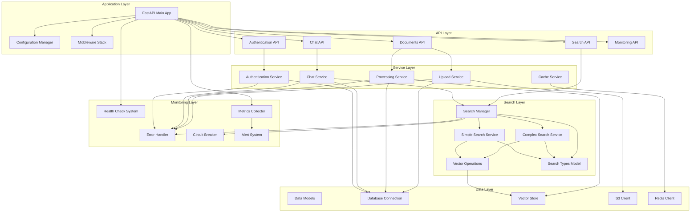
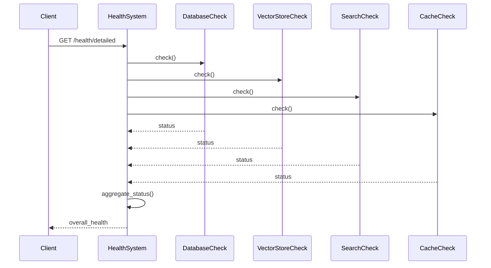

# Component Relationships and Dependencies

## Overview

This document provides detailed information about component relationships, dependencies, and interaction patterns within the Multimodal Librarian system. Understanding these relationships is crucial for system maintenance, debugging, and future development.

## Component Dependency Graph



## Detailed Component Analysis

### 1. Core Application Components

#### FastAPI Main Application (`src/multimodal_librarian/main.py`)
**Dependencies:**
- Configuration Manager
- All API routers
- Middleware stack
- Background services

**Dependents:**
- None (top-level component)

**Key Relationships:**
```python
# Service initialization order
1. Configuration loading
2. Middleware registration
3. Router registration
4. Background service startup
5. Health monitoring activation
```

**Circular Import Prevention:**
- Uses lazy loading for optional components
- Imports services only when needed
- Graceful degradation for missing components

#### Configuration Manager (`src/multimodal_librarian/config/`)
**Dependencies:**
- Environment variables
- Configuration files

**Dependents:**
- All other components

**Key Features:**
- Environment-specific configurations
- Feature flag management
- Validation and type checking

### 2. API Layer Components

#### Documents API (`src/multimodal_librarian/api/routers/documents.py`)
**Dependencies:**
```python
# Direct dependencies
from ...services.upload_service_mock import UploadService
from ...services.processing_service import ProcessingService
from ...models.documents import Document, DocumentUploadRequest

# Indirect dependencies (through services)
- S3 storage
- PostgreSQL database
- Vector store (for processing)
```

**Key Interactions:**
1. **Upload Flow**: API → Upload Service → S3 + Database
2. **Processing Flow**: API → Processing Service → Vector Store + Database
3. **Retrieval Flow**: API → Database → Response formatting

#### Search API (`src/multimodal_librarian/api/routers/search.py`)
**Dependencies:**
```python
# Direct dependencies
from ...components.vector_store.search_service import EnhancedSemanticSearchService
from ...models.search_types import SearchQuery, SearchResponse

# Indirect dependencies
- Vector store
- Cache service
- Error handling
```

**Fallback Chain:**
```
Search API → Search Manager → Complex Search Service
                           ↓ (on failure)
                           → Simple Search Service
                           ↓ (on failure)
                           → Error response
```

### 3. Search Architecture Deep Dive

#### Search Service Manager
**Purpose**: Unified interface with automatic fallback capability

**Component Relationships:**
```python
class EnhancedSemanticSearchService:
    def __init__(self, vector_store, config=None):
        # Try complex search first
        if COMPLEX_SEARCH_AVAILABLE:
            self.search_service = ComplexSearchService(vector_store, config)
            self.service_type = "complex"
        else:
            # Fallback to simple search
            self.search_service = SimpleSemanticSearchService(vector_store)
            self.service_type = "simple"
```

**Dependency Resolution:**
1. **Import Time**: Attempts to import complex search components
2. **Runtime**: Falls back to simple search if complex unavailable
3. **Error Handling**: Graceful degradation with logging

#### Simple Search Service Optimizations
**Performance Enhancements:**
```python
class OptimizedSimpleSemanticSearchService:
    def __init__(self, vector_store, cache_size=1000):
        # Multi-level caching
        self.query_cache = {}  # L1: Memory cache
        self.cache_access_order = deque()  # LRU tracking
        
        # Performance monitoring
        self.metrics = SearchPerformanceMetrics()
        self.response_times = deque(maxlen=100)
        
        # Auto-optimization
        self.auto_optimize_enabled = True
```

**Cache Strategy:**
1. **L1 Cache**: In-memory LRU cache for recent queries
2. **L2 Cache**: Redis for distributed caching
3. **L3 Cache**: Database for persistent caching

#### Circular Import Resolution
**Problem**: Search components had circular dependencies
**Solution**: Shared types module

```python
# Before (circular imports)
search_service.py → hybrid_search.py → search_service.py

# After (resolved)
search_service.py → search_types.py ← hybrid_search.py
```

**Implementation:**
```python
# src/multimodal_librarian/models/search_types.py
@dataclass
class SearchResult:
    chunk_id: str
    content: str
    # ... shared fields

@dataclass
class SearchQuery:
    query_text: str
    # ... shared fields
```

### 4. Data Layer Components

#### Database Connection Management
**Connection Pool Configuration:**
```python
# Connection pool settings
POOL_SIZE = 20
MAX_OVERFLOW = 30
POOL_TIMEOUT = 30
POOL_RECYCLE = 3600
```

**Health Monitoring:**
```python
def check_database_health():
    return {
        'active_connections': pool.checkedout(),
        'pool_size': pool.size(),
        'checked_in': pool.checkedin(),
        'overflow': pool.overflow(),
        'invalid': pool.invalid()
    }
```

#### Vector Store Integration
**Abstraction Layer:**
```python
class VectorStore:
    """Abstract base class for vector operations"""
    
class OptimizedVectorStore(VectorStore):
    """Performance-optimized wrapper"""
    
    def __init__(self, base_store):
        self.base_store = base_store
        self.optimizer = VectorOperationsOptimizer()
```

**Performance Optimizations:**
1. **Batch Operations**: Group multiple operations
2. **Connection Pooling**: Reuse connections
3. **Query Optimization**: Optimize similarity searches
4. **Caching**: Cache frequent embeddings

### 5. Monitoring and Error Handling

#### Health Check System Architecture
```python
class HealthCheckSystem:
    def __init__(self):
        self.checks = {
            'database': DatabaseHealthCheck(),
            'vector_store': VectorStoreHealthCheck(),
            'search_service': SearchServiceHealthCheck(),
            'cache': CacheHealthCheck()
        }
```

**Health Check Flow:**


#### Circuit Breaker Pattern
**Implementation:**
```python
class CircuitBreaker:
    def __init__(self, failure_threshold=5, recovery_timeout=60):
        self.failure_threshold = failure_threshold
        self.recovery_timeout = recovery_timeout
        self.failure_count = 0
        self.last_failure_time = None
        self.state = CircuitState.CLOSED
```

**State Transitions:**
```
CLOSED → OPEN (failures exceed threshold)
OPEN → HALF_OPEN (after recovery timeout)
HALF_OPEN → CLOSED (successful operation)
HALF_OPEN → OPEN (operation fails)
```

#### Error Handling Chain
```python
# Error propagation chain
Service Error → Error Handler → Circuit Breaker → Alert System
                              ↓
                         Recovery Manager → Service Restart
```

### 6. Service Integration Patterns

#### Dependency Injection Pattern
```python
# Service dependencies
def get_upload_service() -> UploadService:
    return UploadService()

def get_search_service() -> EnhancedSemanticSearchService:
    vector_store = get_vector_store()
    return EnhancedSemanticSearchService(vector_store)

# Usage in API endpoints
@router.post("/upload")
async def upload_document(
    upload_service: UploadService = Depends(get_upload_service)
):
    # Use service
```

#### Service Lifecycle Management
```python
# Startup sequence
@app.on_event("startup")
async def startup_event():
    await initialize_cache_service()
    await start_alert_evaluation()
    await initialize_health_monitoring()

# Shutdown sequence
@app.on_event("shutdown")
async def shutdown_event():
    await stop_health_monitoring()
    await stop_alert_evaluation()
    await disconnect_cache_service()
```

### 7. Performance Optimization Patterns

#### Multi-Level Caching
```python
class CacheManager:
    def __init__(self):
        self.l1_cache = LRUCache(maxsize=1000)  # Memory
        self.l2_cache = RedisCache()            # Distributed
        self.l3_cache = DatabaseCache()         # Persistent
    
    async def get(self, key):
        # Try L1 first
        if value := self.l1_cache.get(key):
            return value
        
        # Try L2
        if value := await self.l2_cache.get(key):
            self.l1_cache.set(key, value)  # Promote to L1
            return value
        
        # Try L3
        if value := await self.l3_cache.get(key):
            await self.l2_cache.set(key, value)  # Promote to L2
            self.l1_cache.set(key, value)        # Promote to L1
            return value
        
        return None
```

#### Async Processing Pipeline
```python
# Document processing pipeline
async def process_document(document_id):
    # Stage 1: Parse document
    content = await parse_document(document_id)
    
    # Stage 2: Generate chunks
    chunks = await generate_chunks(content)
    
    # Stage 3: Generate embeddings (parallel)
    embeddings = await asyncio.gather(*[
        generate_embedding(chunk) for chunk in chunks
    ])
    
    # Stage 4: Store in vector database
    await store_embeddings(embeddings)
```

## Component Communication Patterns

### 1. Synchronous Communication
- **API Endpoints**: HTTP request/response
- **Database Operations**: Direct SQL queries
- **Cache Operations**: Redis commands

### 2. Asynchronous Communication
- **Document Processing**: Background tasks
- **Health Monitoring**: Periodic checks
- **Alert Evaluation**: Scheduled tasks

### 3. Event-Driven Communication
- **WebSocket Messages**: Real-time chat
- **Error Events**: Circuit breaker triggers
- **Health Events**: Status changes

## Testing Strategy for Components

### 1. Unit Testing
```python
# Test individual components
def test_search_service_fallback():
    # Mock complex search failure
    with patch('complex_search.search', side_effect=Exception):
        service = EnhancedSemanticSearchService(mock_vector_store)
        result = service.search(mock_query)
        assert result.fallback_mode is True
```

### 2. Integration Testing
```python
# Test component interactions
def test_document_upload_pipeline():
    # Test full pipeline: API → Upload → Processing → Vector Store
    response = client.post("/api/documents/upload", files={"file": test_pdf})
    assert response.status_code == 200
    
    # Verify processing completion
    document_id = response.json()["document_id"]
    wait_for_processing_completion(document_id)
    
    # Verify searchability
    search_response = client.post("/api/search", json={"query": "test"})
    assert len(search_response.json()["results"]) > 0
```

### 3. Performance Testing
```python
# Test component performance
def test_search_performance():
    start_time = time.time()
    for _ in range(100):
        service.search(random_query())
    
    avg_time = (time.time() - start_time) / 100
    assert avg_time < 0.5  # 500ms target
```

## Deployment Dependencies

### 1. Infrastructure Dependencies
```yaml
# docker-compose.yml
services:
  app:
    depends_on:
      - postgres
      - redis
      - milvus
  
  postgres:
    image: postgres:13
  
  redis:
    image: redis:6
  
  milvus:
    image: milvusdb/milvus:latest
```

### 2. Service Startup Order
1. **Infrastructure**: Database, Redis, Vector Store
2. **Core Services**: Configuration, Authentication
3. **Business Services**: Upload, Processing, Search
4. **API Layer**: REST endpoints, WebSocket
5. **Monitoring**: Health checks, Metrics collection

### 3. Health Check Dependencies
```python
# Health check dependency chain
Overall Health ← Database Health
               ← Vector Store Health
               ← Cache Health
               ← Search Service Health
```

## Future Architecture Considerations

### 1. Microservices Decomposition
```
Current Monolith → Future Microservices
├── Document Service (upload, processing)
├── Search Service (vector operations)
├── Chat Service (AI interactions)
├── User Service (authentication)
└── Analytics Service (metrics, reporting)
```

### 2. Event-Driven Architecture
```
Service A → Event Bus → Service B
         ↓
    Event Store → Analytics
```

### 3. Service Mesh Integration
```
Service A ←→ Istio Proxy ←→ Service B
           ↓
    Observability Stack
```

---

*This component relationship documentation is maintained as part of the system architecture. Updates should be made when component relationships change. Last updated: January 2026*