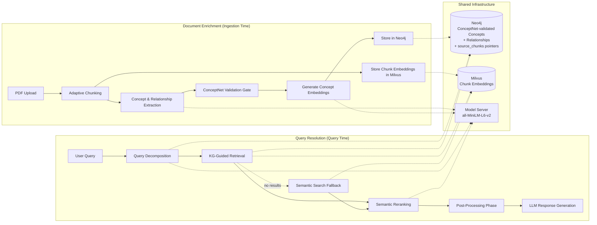
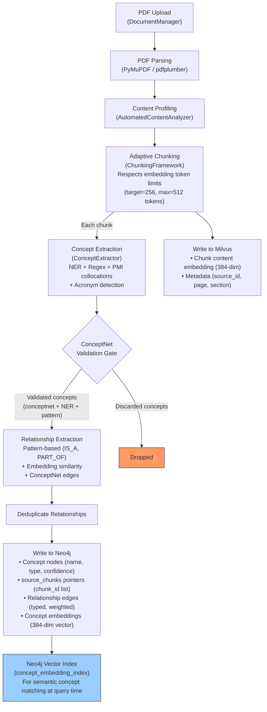
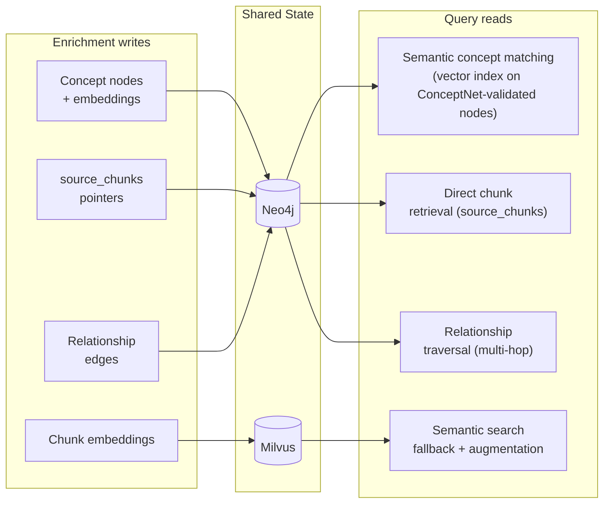

# Enrichment & Query Resolution Architecture

Two workflows share the Neo4j knowledge graph and Milvus vector store. The enrichment workflow populates them at document ingestion time; the query resolution workflow reads from them at query time.

## High-Level Overview

## Enrichment Workflow (Document Ingestion)

### Key enrichment details:
- Concept embeddings are generated by the model server (all-MiniLM-L6-v2, 384 dimensions)
- Each Concept node stores a `source_chunks` property: a serialized list of chunk IDs where that concept appears
- The `concept_embedding_index` is a Neo4j vector index used at query time for semantic concept matching
- ConceptNet validation acts as a quality gate — concepts must be confirmed by ConceptNet, NER, or pattern matching
- Relationships come from three sources: ConceptNet API, syntactic patterns, and embedding cosine similarity

## Query Resolution Workflow

```mermaid
flowchart TD
    Q["User Query"] --> QP["QueryProcessor.process_query\n(concept extraction + metadata)"]
    QP --> SD["RAGService._search_documents\n(Two-Phase Pipeline)"]

    subgraph Phase1["Phase 1: Retrieval (_retrieval_phase)"]
        direction TB
        KG_AVAIL{"KG Retrieval\navailable?"}
        KG_AVAIL -->|Yes| DECOMP["QueryDecomposer.decompose\n(reuses precomputed decomposition)"]

        DECOMP --> SEM_MATCH["Semantic Concept Matching\n• Embed full query via model server\n• Vector search against concept_embedding_index\n  on ConceptNet-validated :Concept nodes\n• Threshold ≥ 0.80 cosine similarity"]
        DECOMP --> LEX_MATCH["Lexical Matching (Lucene)\n• Neo4j fulltext index on :Concept nodes\n• Only used if semantic unavailable"]

        SEM_MATCH --> STRATEGY{"Semantic\nreturned results?"}
        STRATEGY -->|"Yes"| USE_SEM["Use semantic matches\n(suppress lexical)"]
        STRATEGY -->|"No results but available"| NO_MATCH["No concepts relevant\n→ fallback to semantic search"]
        STRATEGY -->|"Unavailable"| USE_LEX["Use lexical as fallback"]
        LEX_MATCH --> USE_LEX

        USE_SEM --> STAGE1["Stage 1: KG Retrieval"]
        USE_LEX --> STAGE1

        subgraph STAGE1["KG-Guided Chunk Retrieval"]
            DIRECT["Direct Chunks\n• Follow source_chunks pointers\n• Score = concept match_score\n  (semantic × 10 for normalization)"]
            RELATED["Related Chunks\n• Traverse relationships (max 2 hops)\n• Score = decay^hop_distance"]
            AGG["Aggregate & Deduplicate\n• Direct chunks: normalize score/10 → [0.1, 1.0]\n• Related chunks: hop decay, capped count\n• Direct wins on duplicates"]
        end

        DIRECT --> AGG
        RELATED --> AGG

        AGG --> AUG{"Chunks <\naugmentation\nthreshold?"}
        AUG -->|Yes| SEM_AUG["Semantic Augmentation\n(vector search for extra chunks)"]
        AUG -->|No| RERANK

        SEM_AUG --> RERANK["SemanticReranker\n• Embed query + chunk content\n• final_score = 0.7 × kg_score + 0.3 × semantic_score\n• Return top-k"]

        NO_MATCH --> FALLBACK["Semantic Search Fallback\n(plain Milvus vector search)"]
        KG_AVAIL -->|No| FALLBACK

        RERANK --> P1_OUT["Phase 1 Output:\nRanked chunks with final_score"]
        FALLBACK --> P1_OUT
    end

    subgraph Phase2["Phase 2: Post-Processing (_post_processing_phase)"]
        direction TB
        TAG["Tag all chunks as LIBRARIAN"]
        TAG --> RELEVANCE{"Best score ≥ 0.5\nAND count ≥ 3?"}

        RELEVANCE -->|"Thin or irrelevant"| WEB_CHECK{"SearXNG\nenabled?"}
        RELEVANCE -->|"Sufficient & relevant"| BOOST

        WEB_CHECK -->|Yes| SEARXNG["SearXNG Web Search\n• Query SearXNG JSON API\n• Tag results as WEB_SEARCH\n• Normalize scores to [0, 1]"]
        WEB_CHECK -->|No| BOOST

        SEARXNG --> IRRELEVANT{"Librarian results\nirrelevant?\n(best < 0.5)"}
        IRRELEVANT -->|"Yes"| DROP_LIB["Drop librarian chunks\n(don't pollute with noise)"]
        IRRELEVANT -->|"No"| MERGE

        DROP_LIB --> MERGE["Merge LIBRARIAN + WEB_SEARCH"]
        BOOST["Apply Librarian Boost\nscore × 1.15 (capped at 1.0)"]
        MERGE --> BOOST

        BOOST --> SORT["Sort by boosted score desc\n(LIBRARIAN wins ties)"]
        SORT --> P2_OUT["Phase 2 Output:\nFinal ranked results"]
    end

    SD --> Phase1
    P1_OUT --> Phase2
    P2_OUT --> CTX["ContextPreparer\n(select top chunks for LLM context)"]
    CTX --> LLM["LLM Generation\n(Gemini / Ollama)\nGenerate response with sources"]
    LLM --> RESP["Chat Response\n+ Source Citations"]

    style NO_MATCH fill:#f96,stroke:#333
    style DROP_LIB fill:#f96,stroke:#333
    style SEARXNG fill:#9cf,stroke:#333
```

## How the Two Workflows Connect

The critical link is the **concept embedding**: enrichment generates a 384-dim embedding for each concept name and stores it on the Neo4j `:Concept` node (which passed ConceptNet validation during ingestion). At query time, the QueryDecomposer embeds the full user query and does vector similarity search against these ConceptNet-validated concept embeddings via `concept_embedding_index`. This is what enables semantic-first concept matching — "What is allow_dangerous_code=True used for?" matches the concept "allow_dangerous_code" at 0.92 similarity, while "Who is the president of Venezuela?" matches nothing above the 0.80 threshold, correctly routing to web search.
