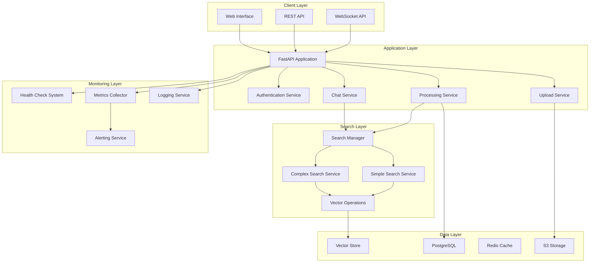
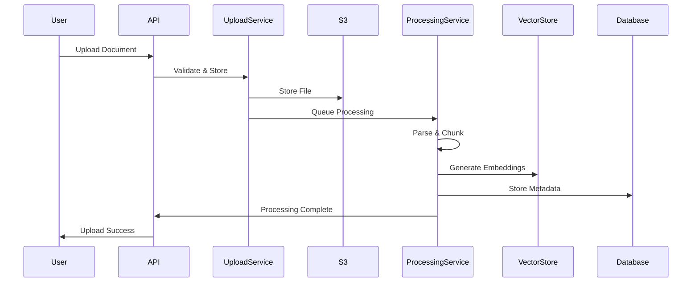
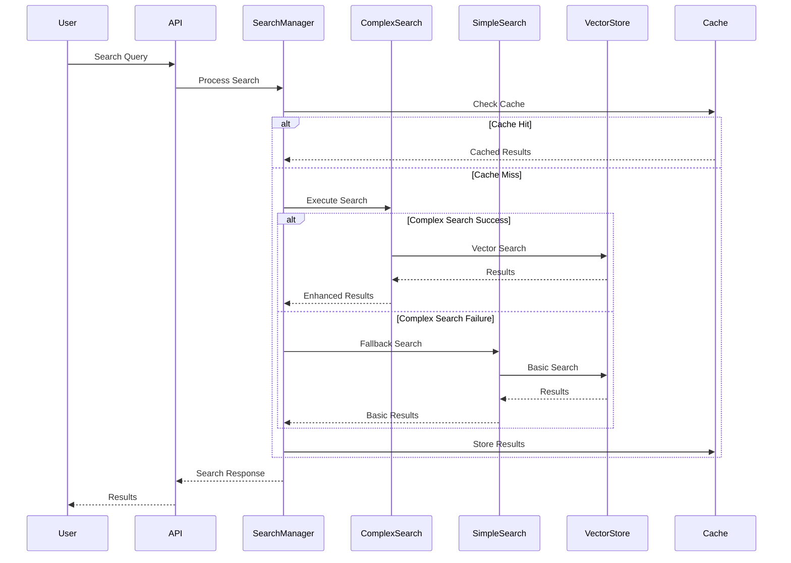
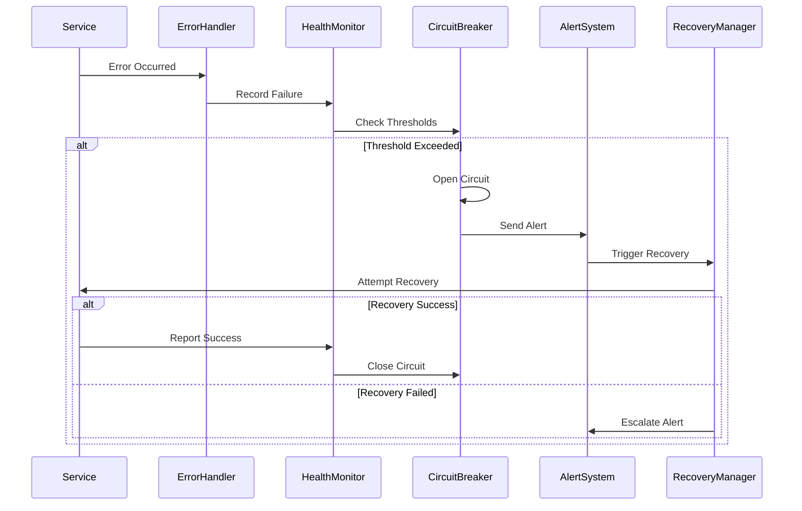
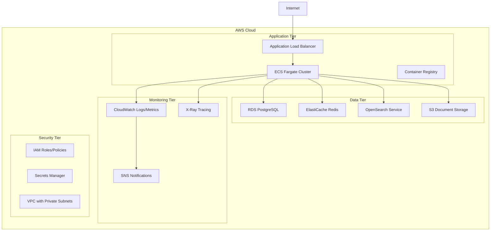

# System Architecture Documentation

## Overview

The Multimodal Librarian is a production-ready AI-powered document management system built with a microservices architecture on AWS. The system provides semantic search, document processing, and intelligent chat capabilities with comprehensive monitoring and error handling.

## Architecture Principles

### 1. Separation of Concerns
- Clear boundaries between components
- Modular design with well-defined interfaces
- Independent service deployments

### 2. Graceful Degradation
- System continues operating when components fail
- Automatic fallback mechanisms
- Circuit breaker patterns for resilience

### 3. Performance First
- Optimized for speed and efficiency
- Multi-level caching strategies
- Asynchronous processing where possible

### 4. Observability
- Comprehensive monitoring and logging
- Performance metrics collection
- Health checks and alerting

### 5. Resilience
- Automatic recovery from failures
- Error handling and retry mechanisms
- Disaster recovery capabilities

## High-Level Architecture



## Component Architecture

### 1. Application Core

#### FastAPI Application (`src/multimodal_librarian/main.py`)
- **Purpose**: Main application entry point and service orchestration
- **Responsibilities**:
  - Service initialization and lifecycle management
  - Middleware configuration (logging, authentication, metrics)
  - Route registration and API endpoint management
  - Background task coordination
- **Dependencies**: All other services
- **Health Check**: `/health/simple`

#### Configuration Management (`src/multimodal_librarian/config/`)
- **Purpose**: Centralized configuration management
- **Components**:
  - Environment-specific configurations (dev, staging, prod)
  - AWS service configurations
  - Database connection settings
  - Feature flags and toggles

### 2. API Layer

#### Document Management API (`src/multimodal_librarian/api/routers/documents.py`)
- **Purpose**: Document upload, processing, and management endpoints
- **Key Endpoints**:
  - `POST /api/documents/upload` - Document upload with validation
  - `GET /api/documents/` - Document listing and search
  - `GET /api/documents/{id}` - Document retrieval
  - `DELETE /api/documents/{id}` - Document deletion
- **Features**:
  - File type validation (PDF, TXT)
  - Size limits (100MB max)
  - Asynchronous processing integration
  - S3 storage integration

#### Chat API (`src/multimodal_librarian/api/routers/chat*.py`)
- **Purpose**: Real-time chat and AI interaction endpoints
- **Components**:
  - WebSocket chat interface
  - REST API for chat history
  - Context-aware responses
  - Document integration for RAG

#### Authentication API (`src/multimodal_librarian/api/routers/auth.py`)
- **Purpose**: User authentication and authorization
- **Features**:
  - JWT token management
  - Role-based access control
  - Optional authentication middleware
  - Session management

### 3. Search Architecture

#### Search Service Manager (`src/multimodal_librarian/components/vector_store/search_service.py`)
- **Purpose**: Unified search interface with automatic fallback
- **Architecture**:
  ```python
  class EnhancedSemanticSearchService:
      def __init__(self, vector_store, config=None):
          # Try complex search first, fallback to simple
          if COMPLEX_SEARCH_AVAILABLE:
              self.search_service = ComplexSearchService(vector_store, config)
              self.service_type = "complex"
          else:
              self.search_service = SimpleSemanticSearchService(vector_store)
              self.service_type = "simple"
  ```
- **Features**:
  - Automatic service detection and fallback
  - Unified request/response interfaces
  - Performance monitoring and analytics
  - Health checking and recovery

#### Simple Search Service (`src/multimodal_librarian/components/vector_store/search_service_simple.py`)
- **Purpose**: Optimized fallback search with enhanced performance
- **Optimizations**:
  - Query result caching with LRU eviction
  - Enhanced relevance scoring with keyword matching
  - Batch processing optimizations
  - Memory-efficient operations
  - Auto-optimization based on usage patterns
- **Performance Features**:
  - Multi-level caching (L1: Memory, L2: Redis, L3: Database)
  - Query similarity detection for cache reuse
  - Automatic cache warming and invalidation
  - Performance metrics and auto-tuning

#### Vector Store Integration (`src/multimodal_librarian/components/vector_store/`)
- **Components**:
  - `vector_store.py` - Core vector database interface
  - `vector_store_optimized.py` - Performance optimizations
  - `hybrid_search.py` - Hybrid vector/keyword search
  - `search_analytics.py` - Search performance analytics

### 4. Data Models

#### Shared Types (`src/multimodal_librarian/models/search_types.py`)
- **Purpose**: Avoid circular imports and provide consistent interfaces
- **Key Types**:
  ```python
  @dataclass
  class SearchResult:
      chunk_id: str
      content: str
      source_type: SourceType
      similarity_score: float
      # ... additional fields
  
  @dataclass
  class SearchQuery:
      query_text: str
      limit: int = 10
      similarity_threshold: float = 0.0
      # ... filtering parameters
  ```

#### Core Models (`src/multimodal_librarian/models/core.py`)
- **Purpose**: Fundamental data structures
- **Components**:
  - Enums for content types and source types
  - Base classes for documents and chunks
  - Validation and serialization methods

### 5. Services Layer

#### Upload Service (`src/multimodal_librarian/services/upload_service*.py`)
- **Purpose**: Handle document uploads and storage
- **Features**:
  - S3 integration for file storage
  - File validation and virus scanning
  - Metadata extraction and storage
  - Processing pipeline integration

#### Processing Service (`src/multimodal_librarian/services/processing_service.py`)
- **Purpose**: Document processing and indexing
- **Pipeline**:
  1. Document parsing (PDF, TXT)
  2. Content chunking and analysis
  3. Vector embedding generation
  4. Database storage and indexing
  5. Search index updates

#### Chat Service (`src/multimodal_librarian/services/chat_service*.py`)
- **Purpose**: AI-powered chat and conversation management
- **Features**:
  - Context-aware responses
  - Document retrieval integration (RAG)
  - Conversation history management
  - Multi-turn dialogue support

#### Cache Service (`src/multimodal_librarian/services/cache_service.py`)
- **Purpose**: Multi-level caching for performance optimization
- **Architecture**:
  ```python
  class CacheManager:
      def __init__(self):
          self.l1_cache = LRUCache(maxsize=1000)  # Memory
          self.l2_cache = RedisCache()            # Distributed
          self.l3_cache = DatabaseCache()         # Persistent
  ```

### 6. Monitoring and Observability

#### Health Check System (`src/multimodal_librarian/monitoring/health_check_system.py`)
- **Purpose**: Comprehensive system health monitoring
- **Components**:
  - Component-specific health checks
  - Readiness and liveness probes
  - Health status aggregation
  - Automatic recovery triggers

#### Metrics Collection (`src/multimodal_librarian/monitoring/comprehensive_metrics_collector.py`)
- **Purpose**: Performance and business metrics collection
- **Metrics Types**:
  - Performance metrics (response times, throughput)
  - Business metrics (user activity, document processing)
  - System metrics (memory, CPU, disk usage)
  - Error metrics (error rates, failure patterns)

#### Error Handling (`src/multimodal_librarian/monitoring/error_*.py`)
- **Components**:
  - `error_logging_service.py` - Structured error logging
  - `error_monitoring_system.py` - Error pattern detection
  - `error_handler.py` - Centralized error handling
- **Features**:
  - Error classification and categorization
  - Context extraction and correlation
  - Recovery workflow integration
  - Alert generation and escalation

#### Circuit Breaker (`src/multimodal_librarian/monitoring/circuit_breaker.py`)
- **Purpose**: Prevent cascading failures
- **States**: Closed → Open → Half-Open
- **Features**:
  - Configurable failure thresholds
  - Automatic recovery testing
  - Service isolation and protection

### 7. Database Layer

#### PostgreSQL Integration
- **Purpose**: Primary data storage for documents, users, and metadata
- **Schema**:
  - Documents table with metadata
  - Users and authentication data
  - Chat history and conversations
  - Analytics and usage data

#### Redis Cache
- **Purpose**: High-performance caching and session storage
- **Usage**:
  - Search result caching
  - Session data storage
  - Rate limiting counters
  - Background job queues

#### Vector Store (OpenSearch/Milvus)
- **Purpose**: Semantic search and vector operations
- **Features**:
  - High-dimensional vector storage
  - Similarity search operations
  - Hybrid search capabilities
  - Scalable indexing

## Data Flow Architecture

### 1. Document Upload Flow



### 2. Search Flow with Fallback



### 3. Error Recovery Flow



## Deployment Architecture

### AWS Infrastructure



### Container Architecture

```dockerfile
# Multi-stage build for optimization
FROM python:3.11-slim as builder
WORKDIR /app
COPY requirements.txt .
RUN pip install --no-cache-dir -r requirements.txt

FROM python:3.11-slim as runtime
WORKDIR /app
COPY --from=builder /usr/local/lib/python3.11/site-packages /usr/local/lib/python3.11/site-packages
COPY src/ ./src/
COPY static/ ./static/
EXPOSE 8000
CMD ["uvicorn", "src.multimodal_librarian.main:app", "--host", "0.0.0.0", "--port", "8000"]
```

## Performance Characteristics

### Response Time Targets
- **Search Operations**: < 500ms (95th percentile)
- **Document Upload**: < 2 minutes per MB
- **Chat Responses**: < 2 seconds
- **Health Checks**: < 100ms

### Scalability Metrics
- **Concurrent Users**: 50+ simultaneous users
- **Document Storage**: 10,000+ documents
- **Search Throughput**: 100+ searches/minute
- **Memory Usage**: < 2GB baseline

### Availability Targets
- **System Uptime**: > 99.9%
- **Error Rate**: < 0.1%
- **Recovery Time**: < 5 minutes
- **Fallback Activation**: < 1% of operations

## Security Architecture

### Authentication & Authorization
- JWT-based authentication
- Role-based access control (RBAC)
- Optional authentication for gradual rollout
- Session management with Redis

### Data Protection
- Encryption at rest (RDS, S3)
- Encryption in transit (TLS 1.3)
- Secrets management (AWS Secrets Manager)
- Input validation and sanitization

### Network Security
- VPC with private subnets
- Security groups and NACLs
- WAF protection for public endpoints
- VPC endpoints for AWS services

## Monitoring and Alerting

### Health Monitoring
- Component health checks every 60 seconds
- Readiness and liveness probes
- Automatic service recovery
- Health status dashboards

### Performance Monitoring
- Response time tracking
- Resource utilization monitoring
- Cache hit rate analysis
- Search performance metrics

### Error Monitoring
- Structured error logging
- Error pattern detection
- Automatic alert generation
- Recovery workflow integration

### Business Metrics
- User activity tracking
- Document processing statistics
- Search analytics
- Usage pattern analysis

## Disaster Recovery

### Backup Strategy
- Automated database backups (daily)
- S3 cross-region replication
- Configuration backup to Git
- Recovery runbooks and procedures

### Recovery Procedures
- Database point-in-time recovery
- Application rollback procedures
- Infrastructure recreation scripts
- Data consistency validation

## Future Architecture Considerations

### Scalability Enhancements
- Microservices decomposition
- Event-driven architecture
- Kubernetes migration
- Multi-region deployment

### Performance Optimizations
- CDN integration for static assets
- Database read replicas
- Advanced caching strategies
- Async processing improvements

### Feature Additions
- Real-time collaboration
- Advanced AI capabilities
- Mobile application support
- Third-party integrations

---

*This document is maintained as part of the system integration and stability specification. Last updated: January 2026*