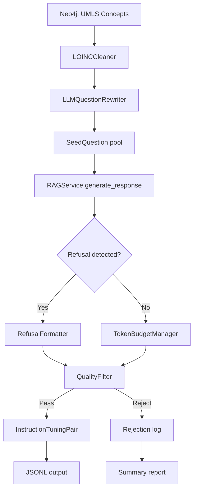

# Design Document: Conversational Training Data

## Overview

This design replaces the UMLS template-based seed question generation in `RAGQAStrategy` with an LLM-rewritten conversational question pipeline, adds an integrated quality filter, implements token-budget-aware response formatting, and strengthens refusal training. The goal is to produce training data that teaches the fine-tuned model to respond conversationally with proper citations rather than in MCQ/textbook style.

The existing `RAGQAStrategy` class in `src/multimodal_librarian/ml/rag_qa_strategy.py` generates seed questions by filling `TEMPLATES_BY_SEMANTIC_TYPE` templates with UMLS concept names (e.g., "What is the mechanism of action of {concept_name}?"). These template questions produce exam-style training data that causes the fine-tuned model to output MCQ-format answers and hallucinate about unknown substances. This design introduces four new components that slot into the existing pipeline:

1. **LLMQuestionRewriter** — rewrites template questions into conversational phrasing via DeepSeek
2. **LOINCCleaner** — strips LOINC-coded fields from concept names before question generation
3. **QualityFilter** — rejects MCQ-style, textbook-style, and malformed training pairs
4. **TokenBudgetManager** — estimates token counts and summarizes over-budget responses

These components integrate into the existing `RAGQAStrategy.generate()` flow without changing the RAG pipeline, concurrency model, or serialization format.

## Architecture



The pipeline runs inside the existing `RAGQAStrategy.generate()` method. The concurrency model (asyncio.Semaphore with 8 concurrent calls) and partial-save behavior are preserved. New components are injected as constructor dependencies or instantiated internally.

### Key Design Decisions

1. **LLM rewriting happens at seed generation time, not at RAG call time.** This keeps the RAG pipeline unchanged and allows batch rewriting with a single LLM call per semantic type.

2. **Quality filtering is integrated into the generation loop, not post-hoc.** The existing `scripts/filter_training_data.py` runs after generation and discards data. The new `QualityFilter` runs inside `_process_seed()` so rejected pairs are replaced by processing more seeds, maintaining the target count.

3. **Token budget estimation uses a simple heuristic (chars / 4) rather than a tokenizer dependency.** The Llama 3 tokenizer averages ~3.5–4.2 chars per token for English medical text. A conservative 4.0 ratio avoids adding `transformers` as a runtime dependency in the generation pipeline. The `max_seq_length` of 5000 from `TrainingConfig` is the budget.

4. **Refusal detection reuses the existing RAG response text patterns** rather than adding a separate classifier. The RAG pipeline already produces distinctive refusal phrases ("could not find any information", "not mentioned in any of the given documents").

## Components and Interfaces

### LOINCCleaner

A stateless utility module at `src/multimodal_librarian/ml/loinc_cleaner.py`.

```python
import re

# Patterns matching LOINC-coded fields in UMLS concept names
_LOINC_PIPE_PATTERN = re.compile(r'\|[^|]*')  # pipe-separated fields
_HTML_ENTITY_PATTERN = re.compile(r'&#x[0-9A-Fa-f]+;')
_CODED_SUFFIX_PATTERN = re.compile(
    r'\b(ANYProp|ANYTm|ANYSys|ANYMeth|Pt|Bld|Ser|Plas|'
    r'Urine|CSF|LC/MS/MS|IA|Qn|Ord|Nom)\b'
)

def clean_concept_name(raw_name: str) -> str:
    """Strip LOINC-coded fields from a UMLS concept name.
    
    Returns the human-readable portion, or empty string if
    nothing remains after cleaning.
    """
    ...

def is_loinc_coded(name: str) -> bool:
    """Return True if the name contains LOINC-coded fields."""
    ...
```

Called in `_generate_umls_concept_seeds()` and `_generate_template_seeds()` before question generation. If `clean_concept_name()` returns empty, the concept is skipped.

### LLMQuestionRewriter

A new class at `src/multimodal_librarian/ml/question_rewriter.py` that uses DeepSeek to rewrite template questions into conversational phrasing.

```python
class LLMQuestionRewriter:
    """Rewrites template-style medical questions into conversational phrasing."""

    def __init__(self, llm_client: Any, max_concurrent: int = 4) -> None:
        """
        Args:
            llm_client: An LLM client with an async generate/chat method
                (the same DeepSeek client used by the RAG pipeline).
            max_concurrent: Semaphore limit for concurrent LLM calls.
        """
        ...

    async def rewrite_questions(
        self,
        seed_questions: List[SeedQuestion],
    ) -> List[SeedQuestion]:
        """Rewrite a batch of seed questions into conversational phrasing.
        
        For each seed question, sends the template question to the LLM
        with a system prompt instructing it to rephrase as a natural
        user query. Returns new SeedQuestion objects with the rewritten
        question text and source="llm_rewritten".
        
        Questions that fail rewriting are kept with their original text.
        """
        ...

    async def _rewrite_single(self, question: str, semantic_type: str) -> str:
        """Rewrite a single question via LLM call."""
        ...
```

The rewriter prompt instructs DeepSeek to:
- Rephrase as if a patient or healthcare worker is asking in a chat app
- Vary sentence structure (questions, statements seeking info, "Can you tell me about...")
- Avoid textbook stems ("What is the mechanism of action of", "Describe the", "What is the pathophysiology of")
- Keep the medical concept but use natural language
- Return only the rewritten question, no preamble

The rewriter is called after seed generation and before RAG calls, operating on the full seed pool. It uses its own semaphore (default 4) to avoid overwhelming the LLM API alongside RAG calls.

### QualityFilter

A new class at `src/multimodal_librarian/ml/quality_filter.py` that evaluates training pairs against style, format, and content criteria.

```python
@dataclass
class FilterResult:
    """Result of filtering a single pair."""
    passed: bool
    rejection_reasons: List[str]

@dataclass  
class FilterSummary:
    """Aggregate filtering statistics."""
    total_evaluated: int
    total_passed: int
    total_rejected: int
    rejections_by_reason: Dict[str, int]
    pass_rate: float

class QualityFilter:
    """Evaluates training pairs against conversational quality criteria."""

    def __init__(
        self,
        min_response_tokens: int = 50,
        max_uncited_tokens: int = 800,
    ) -> None:
        ...

    def evaluate(self, pair: InstructionTuningPair, is_refusal: bool = False) -> FilterResult:
        """Evaluate a single pair against all quality criteria.
        
        Checks (in order):
        1. MCQ markers in response (3+ of A./B./C./D./(a)/(b)/(c)/(d)/"correct answer is")
        2. LOINC-coded terms in instruction
        3. Response too long (>800 tokens) without citations
        4. Response too short (<50 tokens), unless is_refusal=True
        5. Textbook-style instruction classification
        6. Production-divergent response style (bullet-only, "student", "exam")
        """
        ...

    def classify_question_style(self, instruction: str) -> str:
        """Classify instruction as 'conversational' or 'textbook'.
        
        Uses pattern matching against known textbook stems and
        structural markers (e.g., "Describe the", "What is the 
        pathophysiology of", enumeration-style phrasing).
        """
        ...

    def summarize(self) -> FilterSummary:
        """Return aggregate statistics for all evaluated pairs."""
        ...
```

The `QualityFilter` is instantiated once per generation run and called inside `_process_seed()` after the RAG response is received. Rejected pairs cause the seed to be skipped (not counted toward `target_count`), so the pipeline processes additional seeds to compensate.

The textbook-style classifier uses a regex-based approach matching against the stems in `TEMPLATES_BY_SEMANTIC_TYPE` and common exam-style patterns. This is deterministic and fast — no LLM call needed.

### TokenBudgetManager

A new class at `src/multimodal_librarian/ml/token_budget.py` that estimates token counts and handles over-budget responses.

```python
class TokenBudgetManager:
    """Manages token budget estimation and response summarization."""

    def __init__(
        self,
        max_tokens: int = 5000,
        chars_per_token: float = 4.0,
        llm_client: Optional[Any] = None,
    ) -> None:
        """
        Args:
            max_tokens: Maximum total tokens for a training example.
            chars_per_token: Character-to-token ratio for estimation.
            llm_client: Optional LLM client for response summarization.
                If None, over-budget pairs are rejected instead of summarized.
        """
        ...

    def estimate_tokens(self, text: str) -> int:
        """Estimate token count using chars_per_token ratio."""
        ...

    def estimate_pair_tokens(
        self,
        pair: InstructionTuningPair,
        system_prompt: str,
    ) -> int:
        """Estimate total tokens for a formatted training example.
        
        Accounts for: system prompt + user message (instruction + context) 
        + assistant response + chat template overhead (~20 tokens).
        """
        ...

    def fits_budget(self, pair: InstructionTuningPair, system_prompt: str) -> bool:
        """Return True if the pair fits within the token budget."""
        ...

    async def summarize_response(
        self,
        response: str,
        target_tokens: int,
        citations: List[str],
    ) -> Optional[str]:
        """Summarize a response to fit within target_tokens.
        
        Preserves all source citations and core factual content.
        Returns None if summarization fails or no LLM client is available.
        """
        ...
```

The system prompt from `qlora_trainer.py` is passed in to accurately estimate the full training example size. The chat template overhead (special tokens, role markers) is estimated at ~20 tokens.

### RefusalFormatter

A utility function (not a class) in `src/multimodal_librarian/ml/refusal_formatter.py`:

```python
# Phrases that indicate the RAG pipeline could not find information
REFUSAL_INDICATORS = [
    "could not find any information",
    "not mentioned in any of the given documents",
    "no information available",
    "unable to find relevant information",
    "no relevant sources",
    "don't have information about",
]

def is_refusal_response(response_text: str) -> bool:
    """Detect if a RAG response is a refusal (no information found)."""
    ...

def has_refusal_then_fabrication(response_text: str) -> bool:
    """Detect if a response starts with refusal but then provides info about a different topic."""
    ...

def format_refusal(question: str, response_text: str) -> str:
    """Format a refusal response as a concise, conversational refusal.
    
    Returns a short response (under 200 tokens) that:
    - Acknowledges the question
    - States the information is not in the available sources
    - Optionally suggests where the user might look
    - Does not fabricate any medical content
    """
    ...
```

### Integration into RAGQAStrategy

The existing `RAGQAStrategy` class gains new constructor parameters and modified methods:

```python
class RAGQAStrategy:
    def __init__(
        self,
        rag_service: Any,
        neo4j_client: Any,
        umls_client: Any,
        # New parameters:
        question_rewriter: Optional[LLMQuestionRewriter] = None,
        quality_filter: Optional[QualityFilter] = None,
        token_budget_manager: Optional[TokenBudgetManager] = None,
    ) -> None:
        ...
```

The `generate()` method is modified to:
1. Call `LOINCCleaner.clean_concept_name()` during seed generation
2. Call `question_rewriter.rewrite_questions()` on the seed pool after generation
3. Inside `_process_seed()`, after receiving the RAG response:
   a. Check for refusal with `is_refusal_response()` and format with `format_refusal()`
   b. Check token budget with `token_budget_manager.fits_budget()`; summarize if over budget
   c. Run `quality_filter.evaluate()` and skip if rejected
4. After generation, log the `FilterSummary` and refusal statistics
5. Warn if refusal percentage is outside 15%–30% or rejection rate exceeds 40%

The `generate_seed_questions()` method is modified to:
1. Clean concept names with `LOINCCleaner` before template filling
2. After generating all seeds, pass them through `LLMQuestionRewriter` if available
3. Produce at least 5 distinct phrasings per semantic type (ensured by the rewriter's diversity prompt)

## Data Models

### Existing Models (unchanged)

- `InstructionTuningPair` — core training example with instruction, context, response, metadata
- `PairMetadata` — strategy, source_concepts, confidence_score, source_document, chunk_ids
- `SeedQuestion` — question, source, semantic_type, concept_name
- `TrainingDataConfig` — target_pair_count, strategies, output_dir, etc.

### New Models

```python
# In src/multimodal_librarian/ml/quality_filter.py

@dataclass
class FilterResult:
    """Result of evaluating a single training pair."""
    passed: bool
    rejection_reasons: List[str]  # empty if passed

@dataclass
class FilterSummary:
    """Aggregate statistics from a quality filter run."""
    total_evaluated: int
    total_passed: int
    total_rejected: int
    rejections_by_reason: Dict[str, int]  # reason_code -> count
    pass_rate: float  # total_passed / total_evaluated
```

### Modified Models

The `SeedQuestion.source` field gains a new valid value: `"llm_rewritten"` for questions that have been rewritten by the `LLMQuestionRewriter`. The existing values (`"umls_concept"`, `"template"`, `"chapter_heading"`) remain valid.

The `PairMetadata` model is unchanged. Pairs generated by the new pipeline still use `strategy="rag"` since they go through the same RAG pipeline.

### Rejection Reason Codes

The `QualityFilter` uses these standardized reason codes in `FilterResult.rejection_reasons` and `FilterSummary.rejections_by_reason`:

| Code | Description |
|------|-------------|
| `mcq_markers` | Response contains 3+ multiple-choice markers |
| `loinc_instruction` | Instruction contains uncleaned LOINC-coded terms |
| `uncited_long_response` | Response >800 tokens with no source citations |
| `response_too_short` | Response <50 tokens (non-refusal) |
| `textbook_style` | Instruction classified as textbook/exam style |
| `production_divergent` | Response uses bullet-only format, "student", or "exam" phrasing |
| `refusal_then_fabrication` | Response starts with refusal then provides unrelated info |
| `token_budget_exceeded` | Pair exceeds token budget and summarization failed |


## Correctness Properties

*A property is a characteristic or behavior that should hold true across all valid executions of a system — essentially, a formal statement about what the system should do. Properties serve as the bridge between human-readable specifications and machine-verifiable correctness guarantees.*

### Property 1: LOINC cleaning removes all coded patterns

*For any* UMLS concept name string containing LOINC-coded patterns (pipe-separated fields, HTML entities like `&#x7C;`, or coded suffixes like `ANYProp`, `ANYTm`, `ANYSys`, `ANYMeth`), `clean_concept_name()` SHALL return a string that contains none of those patterns, and `is_loinc_coded()` applied to the cleaned output SHALL return False.

**Validates: Requirements 1.3, 4.2**

### Property 2: Textbook style classification correctness

*For any* question string that begins with a known textbook stem (e.g., "What is the mechanism of action of", "What is the pathophysiology of", "Describe the", "What are the indications and contraindications for"), `classify_question_style()` SHALL return `"textbook"`. Conversely, *for any* question string that does not begin with any banned textbook stem and does not match exam-style structural patterns, `classify_question_style()` SHALL return `"conversational"`.

**Validates: Requirements 1.1, 1.5, 4.5**

### Property 3: MCQ marker detection and rejection

*For any* response string, if it contains three or more multiple-choice markers from the set {`A.`, `B.`, `C.`, `D.`, `(a)`, `(b)`, `(c)`, `(d)`, `"correct answer is"`}, the `QualityFilter` SHALL reject the pair with reason `"mcq_markers"`. If the response contains fewer than three such markers, the filter SHALL NOT reject for this reason.

**Validates: Requirements 4.1**

### Property 4: Refusal detection identifies refusal phrases

*For any* response string containing at least one phrase from the `REFUSAL_INDICATORS` list (e.g., "could not find any information", "not mentioned in any of the given documents"), `is_refusal_response()` SHALL return True. *For any* response string that does not contain any refusal indicator phrase, `is_refusal_response()` SHALL return False.

**Validates: Requirements 2.2**

### Property 5: Refusal formatting produces bounded, non-fabricating responses

*For any* question string, the output of `format_refusal(question, response)` SHALL have an estimated token count under 200 (using the chars/4 heuristic), SHALL contain a phrase indicating the information is not available, and SHALL NOT contain medical dosage numbers, treatment regimen details, or drug interaction specifics.

**Validates: Requirements 2.4**

### Property 6: Token budget estimation consistency

*For any* `InstructionTuningPair` and system prompt string, `fits_budget(pair, system_prompt)` SHALL return True if and only if `estimate_pair_tokens(pair, system_prompt) <= max_tokens`. Additionally, `estimate_tokens(s)` SHALL be monotonically non-decreasing with respect to `len(s)` — that is, *for any* two strings where `len(a) <= len(b)`, `estimate_tokens(a) <= estimate_tokens(b)`.

**Validates: Requirements 3.1, 3.2**

### Property 7: Citation preservation through summarization

*For any* response string containing `[Source N]` citation markers, if `summarize_response()` succeeds (returns a non-None result), the summarized output SHALL contain every `[Source N]` marker that was present in the original response.

**Validates: Requirements 3.4**

### Property 8: Quality filter rejects uncited long responses

*For any* `InstructionTuningPair` where the response has an estimated token count exceeding 800 and contains no `[Source N]` citation pattern, the `QualityFilter` SHALL reject the pair with reason `"uncited_long_response"`. *For any* pair where the response is 800 tokens or fewer, or contains at least one citation, the filter SHALL NOT reject for this reason.

**Validates: Requirements 4.3**

### Property 9: Quality filter exempts refusals from minimum length

*For any* `InstructionTuningPair` flagged as a refusal (`is_refusal=True`), the `QualityFilter` SHALL NOT reject the pair with reason `"response_too_short"` regardless of response length. *For any* non-refusal pair where the response has an estimated token count below 50, the filter SHALL reject with reason `"response_too_short"`.

**Validates: Requirements 4.4**

### Property 10: Quality filter summary count invariant

*For any* sequence of `evaluate()` calls on a `QualityFilter` instance, the resulting `FilterSummary` SHALL satisfy: `total_evaluated == total_passed + total_rejected`, `pass_rate == total_passed / total_evaluated` (when `total_evaluated > 0`), and the sum of all values in `rejections_by_reason` SHALL equal `total_rejected`.

**Validates: Requirements 4.7**

### Property 11: Confidence score is bounded and monotonic

*For any* non-negative integer `citation_count` and positive integer `min_citations`, the computed confidence score SHALL be in the range [0.0, 1.0]. Additionally, *for any* two citation counts where `a < b` (with the same `min_citations`), the confidence score for `b` SHALL be greater than or equal to the confidence score for `a`.

**Validates: Requirements 5.4**

### Property 12: JSONL round-trip preservation for new pipeline output

*For any* valid `InstructionTuningPair` produced by the conversational training data pipeline (including pairs with `source="llm_rewritten"` seed questions and refusal-formatted responses), serializing to JSONL and deserializing back SHALL produce an equivalent pair.

**Validates: Requirements 7.1, 7.2**

## Error Handling

### LLM Rewriter Failures

- If the DeepSeek LLM call fails for a question rewrite (timeout, rate limit, API error), the original template question is kept unchanged. The rewriter logs a warning and continues with the next question.
- If the LLM returns an empty or nonsensical rewrite (e.g., shorter than 10 characters, or identical to the input), the original question is kept.
- If more than 50% of rewrite attempts fail, the rewriter logs an error-level message suggesting the LLM service may be degraded.

### RAG Pipeline Failures

- Existing behavior is preserved: if `RAGService.generate_response` raises an exception, the seed is skipped and the failure is logged.
- If the RAG response text is empty after stripping whitespace, the seed is skipped.
- The pipeline generates 1.5x the target seed count to account for RAG failures and quality filter rejections.

### Token Budget Failures

- If `summarize_response()` fails (LLM error or no LLM client configured), the pair is rejected with reason `"token_budget_exceeded"` and logged.
- If the summarized response still exceeds the budget after one summarization attempt, the pair is rejected rather than retried.

### Quality Filter Edge Cases

- If a pair triggers multiple rejection reasons, all reasons are recorded in `FilterResult.rejection_reasons` and all are counted in the summary.
- If the quality filter rejection rate exceeds 40%, a warning is logged indicating potential issues with seed question quality or RAG response quality.
- Empty or whitespace-only instruction/response fields are caught by Pydantic validation before reaching the filter.

### Refusal Detection Edge Cases

- Responses that begin with a refusal phrase but then provide information about a different substance (refusal-then-fabrication) are detected by `has_refusal_then_fabrication()` and either truncated to the refusal portion or rejected entirely.
- The refusal formatter never fabricates medical content — it uses a fixed template with the question text inserted.

### Concurrency and Partial Save

- The existing `asyncio.Semaphore(8)` for RAG calls is preserved. The LLM rewriter uses a separate semaphore (default 4) to avoid contention.
- Partial save behavior is preserved: each accepted pair is written to the partial save file immediately after passing the quality filter.
- Thread safety for partial save writes uses the existing `threading.Lock`.

## Testing Strategy

### Property-Based Tests (Hypothesis)

The project uses **Hypothesis** for property-based testing, consistent with the existing test suite (e.g., `tests/ml/test_instruction_tuning_pair.py`). Each correctness property maps to one or more Hypothesis test functions with a minimum of 100 iterations.

**Test file**: `tests/ml/test_conversational_training_data.py`

Each property test is tagged with a comment referencing the design property:
```python
# Feature: conversational-training-data, Property N: <property_text>
```

**Properties to implement as PBT:**

| Property | Component Under Test | Key Hypothesis Strategies |
|----------|---------------------|--------------------------|
| 1: LOINC cleaning | `LOINCCleaner` | `st.text()` with injected pipe/HTML/suffix patterns |
| 2: Textbook classification | `QualityFilter.classify_question_style` | `st.sampled_from(TEXTBOOK_STEMS)` + `st.text()` |
| 3: MCQ detection | `QualityFilter.evaluate` | `st.text()` with injected A./B./C./D. markers |
| 4: Refusal detection | `is_refusal_response` | `st.text()` with injected refusal phrases |
| 5: Refusal formatting | `format_refusal` | `st.text(min_size=5, max_size=200)` for questions |
| 6: Token budget consistency | `TokenBudgetManager` | `instruction_tuning_pair_strategy()` + `st.text()` |
| 7: Citation preservation | `TokenBudgetManager.summarize_response` | `st.text()` with injected `[Source N]` markers |
| 8: Uncited long response | `QualityFilter.evaluate` | Pairs with long responses and no citations |
| 9: Refusal length exemption | `QualityFilter.evaluate` | Short-response pairs with `is_refusal=True/False` |
| 10: Summary count invariant | `QualityFilter.summarize` | `st.lists(instruction_tuning_pair_strategy())` |
| 11: Confidence monotonicity | Confidence scoring logic | `st.integers(min_value=0, max_value=20)` |
| 12: JSONL round-trip | `InstructionTuningPair` | Reuse `unicode_instruction_tuning_pair_strategy()` |

### Unit Tests (Example-Based)

**Test file**: `tests/ml/test_conversational_training_data_unit.py`

- Refusal-then-fabrication detection with known examples (Req 2.5)
- Summarized responses end with complete sentences (Req 3.3)
- Logging output contains expected summary fields (Req 8.1)
- Warning logged when refusal percentage outside 15–30% (Req 8.2)
- Warning logged when rejection rate exceeds 40% (Req 8.3)
- System prompt matches production constant (Req 6.2)
- Progress callback is invoked during generation (Req 8.4)
- Rejection log entries contain reason and instruction text (Req 4.6)

### Integration Tests

**Test file**: `tests/ml/test_conversational_training_data_integration.py`

- Full pipeline run with mocked RAG service and Neo4j client
- LLM rewriter called and produces non-identical outputs (Req 1.2)
- At least 5 distinct question phrasings per semantic type (Req 1.4)
- Refusal pairs produced when RAG returns refusal responses (Req 2.1)
- Concurrency controls preserved (semaphore limits) (Req 5.5)
- Partial save file written incrementally (Req 5.5)
- Citation format preserved from RAG response (Req 5.2)
- Context field populated from RAG response sources (Req 5.3)

### Test Configuration

```python
# Hypothesis settings for all PBT tests
@settings(max_examples=100)
```

All property tests use `@pytest.mark.pbt` and `@pytest.mark.unit` markers consistent with the existing test suite. Integration tests use `@pytest.mark.integration`.
