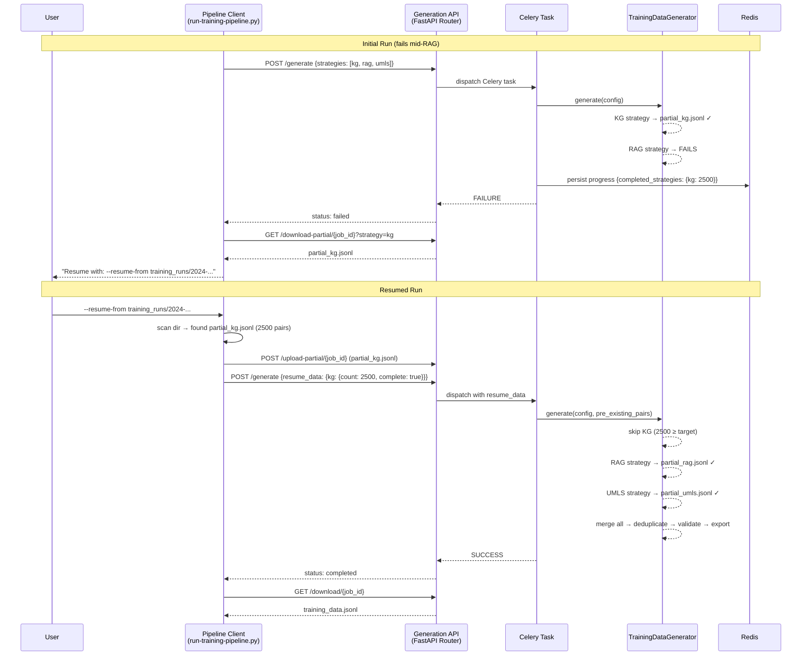

# Design Document: Data Generation Resume

## Overview

This feature adds resume support for partially-completed ML training data generation jobs. The current pipeline (`step_generate` in `scripts/run-training-pipeline.py`) triggers a long-running Celery task that generates instruction-tuning Q&A pairs via three strategies (KG, RAG, UMLS Reasoning). When a job fails mid-way, all progress is lost.

The generator already saves partial JSONL files per strategy (`partial_kg.jsonl`, `partial_rag.jsonl`, `partial_umls.jsonl`) inside the output directory on the server. This design leverages those existing partial files to enable:

1. **Automatic partial data recovery** — the Pipeline_Client downloads partial files when a job fails
2. **Resume-aware generation** — the server accepts previously generated pairs and skips completed strategies
3. **A `--resume-from` CLI flag** — a single command to restart from where a failed run left off

The design touches four layers: the CLI pipeline script, the FastAPI API router, the Celery task, and the `TrainingDataGenerator` class.

## Architecture



### Key Design Decisions

1. **Client-side partial file storage**: Partial files are downloaded to the Run_Directory on the host. This means resume works even if the Docker volume is wiped between runs. The server is stateless across job restarts.

2. **Pre-existing pairs skip validation**: Pairs from partial files were already generated by the same pipeline and would have passed validation in a successful run. Re-validating them (especially the NER check) would add significant latency for no benefit. Only newly generated pairs go through validation.

3. **Deduplication spans all pairs**: Even though pre-existing pairs were deduplicated within their strategy, cross-strategy deduplication must include all pairs (pre-existing + new) to catch duplicates between strategies.

4. **Per-strategy completion tracking in Redis**: The Celery task already persists progress to Redis. We extend the progress snapshot with a `completed_strategies` dict so the client can determine which strategies finished even after a hard worker crash.

## Components and Interfaces

### 1. Pipeline Client Changes (`scripts/run-training-pipeline.py`)

**New CLI argument:**
```
--resume-from <path>    Path to a previous Run_Directory containing partial data files
```

**New function: `_load_saved_config(run_dir: Path) -> Optional[Dict]`**
- Reads `pipeline_config.json` from the specified Run_Directory
- Returns the parsed dict on success, or `None` if the file is missing or contains invalid JSON
- Logs a warning if the file is missing or unparseable

**New function: `_apply_saved_config(args: argparse.Namespace, saved_config: Dict, explicit_args: Set[str]) -> argparse.Namespace`**
- Takes the current parsed args, the saved config dict, and the set of arguments explicitly provided on the command line
- For each key in `saved_config` that is NOT in `explicit_args`, overwrites the corresponding value in `args`
- Logs which parameters were restored from the saved config
- Returns the updated args namespace

**Modified: `main()`**
- After `parser.parse_args()`, determine which arguments were explicitly provided by the user (vs. defaults)
- When `--resume-from` is provided, call `_load_saved_config()` on the resume directory
- If a saved config is found, call `_apply_saved_config()` to merge saved values as defaults, with explicit CLI args taking precedence
- This happens before any pipeline steps execute, so all downstream code sees the merged configuration

**New function: `_scan_partial_data(run_dir: Path) -> Dict[str, PartialStrategyData]`**
- Scans a directory for `partial_kg.jsonl`, `partial_rag.jsonl`, `partial_umls.jsonl`
- Parses each file, counts valid pairs, logs warnings for invalid lines
- Returns a dict mapping strategy name → `{path, pair_count, pairs}`

**New function: `_download_partial_data(job_id: str, run_dir: Path, strategies: List[str]) -> Dict[str, int]`**
- Called when a job fails
- Hits `GET /download-partial/{job_id}` to discover available partial files
- Downloads each partial JSONL file to the Run_Directory
- Returns pair counts per strategy

**New function: `_upload_partial_data(job_id: str, partial_data: Dict) -> bool`**
- Uploads partial JSONL files to the server via `POST /upload-partial/{job_id}`
- Called before triggering a resumed generation

**Modified: `step_generate()`**
- Accepts optional `resume_from: Path` parameter
- On failure: calls `_download_partial_data()` and prints resume command
- On resume: calls `_scan_partial_data()`, `_upload_partial_data()`, and includes `resume_data` in the POST /generate payload

### 2. API Router Changes (`src/multimodal_librarian/api/routers/ml_training.py`)

**New Pydantic models:**

```python
class ResumeStrategyInfo(BaseModel):
    pair_count: int
    complete: bool

class ResumeManifest(BaseModel):
    strategies: Dict[str, ResumeStrategyInfo]
```

**Modified: `TrainingDataRequest`**
- Add optional `resume_data: Optional[ResumeManifest]` field

**New endpoint: `GET /download-partial/{job_id}`**
- Query param `strategy` (optional): if provided, streams the specific partial JSONL file
- Without `strategy`: returns JSON listing available partial files and pair counts
- Returns 404 if no partial data exists for the job

**New endpoint: `POST /upload-partial/{job_id}`**
- Accepts multipart file upload with a `strategy` form field
- Saves the file to the job's output directory as `partial_{strategy}.jsonl`
- Returns 200 with pair count on success

**Modified: `POST /generate`**
- Passes `resume_data` through to the Celery task config dict

**Modified: `TrainingDataStatusResponse`**
- Add optional `completed_strategies: Optional[Dict[str, int]]` field

### 3. Celery Task Changes (`src/multimodal_librarian/services/ml_training_tasks.py`)

**Modified: `generate_training_data_task()`**
- Accepts `resume_data` from `config_dict`
- When `resume_data` is present, loads pre-existing pairs from uploaded partial files
- Passes pre-existing pairs to `generator.generate()`
- Updates `_progress_callback` to include `completed_strategies` in the Redis snapshot

**Modified: `_progress_callback()`**
- After each strategy completes, adds it to `completed_strategies` in the progress state
- Persists to Redis immediately after each strategy completion (not just at intervals)

### 4. Generator Changes (`src/multimodal_librarian/ml/training_data_generator.py`)

**Modified: `generate()` signature**
```python
async def generate(
    self,
    config: TrainingDataConfig,
    progress_callback: Optional[Callable] = None,
    pre_existing_pairs: Optional[Dict[str, List[InstructionTuningPair]]] = None,
) -> TrainingDataResult:
```

**Resume logic inside `generate()`:**
- For each strategy, check if `pre_existing_pairs[strategy]` meets or exceeds the per-strategy target
- If yes: skip the strategy, log that it was skipped, add pre-existing pairs to `all_pairs`
- If partially complete: reduce the strategy's target by the pre-existing count, run the strategy for the remainder, then combine
- After all strategies: merge pre-existing + new pairs, deduplicate across all, validate only new pairs, export combined

**Modified: `TrainingDataConfig`**
- Add optional `resume_data: Optional[Dict]` field (passed through from API)

## Data Models

### ResumeManifest (API layer — Pydantic)

```python
class ResumeStrategyInfo(BaseModel):
    """Per-strategy resume information."""
    pair_count: int = Field(
        ..., ge=0,
        description="Number of valid pairs from the previous run."
    )
    complete: bool = Field(
        ...,
        description="Whether this strategy fully completed in the previous run."
    )

class ResumeManifest(BaseModel):
    """Describes previously completed work for resume."""
    strategies: Dict[str, ResumeStrategyInfo] = Field(
        ...,
        description="Per-strategy completion info. Keys: 'kg', 'rag', 'umls_reasoning'."
    )
```

### Extended TrainingDataRequest (API layer — Pydantic)

```python
class TrainingDataRequest(BaseModel):
    # ... existing fields ...
    resume_data: Optional[ResumeManifest] = Field(
        default=None,
        description="Resume manifest from a previous failed run."
    )
```

### Extended TrainingDataStatusResponse (API layer — Pydantic)

```python
class TrainingDataStatusResponse(BaseModel):
    # ... existing fields ...
    completed_strategies: Optional[Dict[str, int]] = Field(
        default=None,
        description="Strategies that completed with their pair counts."
    )
```

### Redis Progress Snapshot (extended)

```json
{
    "phase": "rag_generation",
    "percentage": 45.2,
    "pairs_per_strategy": {"kg": 2500, "rag": 312},
    "eta_seconds": 14400,
    "started_at": 1700000000,
    "completed_strategies": {"kg": 2500}
}
```

### Partial Data File Convention

Files are stored in the job's output directory (`/app/uploads/ml_training/{job_id}/`):
- `partial_kg.jsonl` — KG strategy pairs
- `partial_rag.jsonl` — RAG strategy pairs  
- `partial_umls.jsonl` — UMLS Reasoning strategy pairs

Each file contains one `InstructionTuningPair` JSON object per line, using the existing JSONL format with fields: `instruction`, `context`, `response`, `metadata`.

## Correctness Properties

*A property is a characteristic or behavior that should hold true across all valid executions of a system — essentially, a formal statement about what the system should do. Properties serve as the bridge between human-readable specifications and machine-verifiable correctness guarantees.*

### Property 1: Strategy target reduction

*For any* target pair count T and any pre-existing pair count P (where T > 0 and P ≥ 0), the effective target for a strategy SHALL be `max(0, T - P)`. When P ≥ T, the strategy is skipped entirely (effective target = 0).

**Validates: Requirements 4.1, 4.2**

### Property 2: Validation scope — pre-existing pairs bypass validation

*For any* set of pre-existing pairs and any set of newly generated pairs, the final accepted dataset SHALL include all pre-existing pairs (subject only to deduplication) regardless of whether they would pass quality validation. Only newly generated pairs are subject to validation filtering.

**Validates: Requirements 4.5**

### Property 3: Export completeness after resume

*For any* set of pre-existing pairs and any set of new pairs, the exported JSONL file SHALL contain exactly the union of (all pre-existing pairs that survive deduplication) and (all new pairs that survive both deduplication and validation), with no pairs lost or invented.

**Validates: Requirements 4.3, 4.6**

### Property 4: JSONL partial file parsing resilience

*For any* JSONL file containing a mix of valid `InstructionTuningPair` lines and invalid lines (malformed JSON, missing fields, empty lines), the parser SHALL return exactly the set of valid pairs, skipping all invalid lines without error.

**Validates: Requirements 7.1, 7.2**

### Property 5: Resume manifest pair count accuracy

*For any* partial JSONL file containing N valid `InstructionTuningPair` lines (and any number of invalid lines), the Resume_Manifest constructed by the Pipeline_Client SHALL report a `pair_count` of exactly N for that strategy.

**Validates: Requirements 5.3**

### Property 6: Saved config restoration with CLI override precedence

*For any* saved `pipeline_config.json` containing a set of parameter values S, and any set of explicitly provided CLI arguments E, the merged configuration SHALL equal S overridden by E. That is, for each parameter p: if p ∈ E then `merged[p] == E[p]`, else `merged[p] == S[p]`. Parameters not present in either S or E use the parser's default values.

**Validates: Requirements 8.2, 8.3**

## Error Handling

### Pipeline Client Error Handling

| Scenario | Behavior |
|----------|----------|
| Partial data download fails (network error, 404) | Log warning, continue without partial data. Do not abort the pipeline. (Req 1.4) |
| `--resume-from` directory does not exist | Log error and exit with non-zero code. |
| `--resume-from` directory has no partial files | Log warning, proceed with fresh generation. (Req 5.6) |
| Partial JSONL file contains invalid lines | Skip invalid lines, log warning with line number, use only valid pairs. (Req 7.2) |
| Partial JSONL file is completely empty or all-invalid | Treat as 0 pairs for that strategy; log warning. |
| Upload of partial data to server fails | Log warning, attempt generation without resume data (fresh run). |
| `pipeline_config.json` missing in resume directory | Log warning, proceed with standard CLI defaults. (Req 8.4) |
| `pipeline_config.json` contains invalid JSON | Log warning, proceed with standard CLI defaults. (Req 8.5) |

### API Error Handling

| Scenario | Behavior |
|----------|----------|
| `GET /download-partial/{job_id}` — no partial data | Return 404 with descriptive message. (Req 2.4) |
| `GET /download-partial/{job_id}` — invalid strategy param | Return 422 with valid strategy list. |
| `POST /upload-partial/{job_id}` — invalid JSONL content | Accept the file; validation happens at parse time in the Generator. |
| `POST /generate` with invalid `resume_data` strategies | Return 422 — strategy names must be from the valid set. |

### Generator Error Handling

| Scenario | Behavior |
|----------|----------|
| Pre-existing pairs file not found on server | Log warning, treat strategy as having 0 pre-existing pairs. |
| Strategy fails during resumed generation | Same as current behavior — log error, return empty list for that strategy, continue with other strategies. |
| Deduplication removes all new pairs | Log warning, export only pre-existing pairs. |

### Celery Task Error Handling

| Scenario | Behavior |
|----------|----------|
| Redis persistence fails | Log warning, continue — progress is best-effort. (Existing behavior) |
| Worker crash mid-strategy | `completed_strategies` in Redis reflects only strategies that finished before the crash. Client can resume from there. |

## Testing Strategy

### Unit Tests

Unit tests verify specific examples, edge cases, and error conditions:

- **Target reduction edge cases**: target=0, pre-existing=0, pre-existing exactly equals target, pre-existing exceeds target by 1
- **Resume manifest construction**: empty directory, directory with one partial file, directory with all three partial files
- **API endpoint responses**: 404 for missing partial data, 200 for existing partial data, correct JSON structure
- **CLI argument parsing**: `--resume-from` with valid path, with `--run-dir` override, without `--run-dir`
- **Progress persistence**: `completed_strategies` field present after strategy completion
- **Error resilience**: download failure doesn't abort, empty resume directory triggers warning
- **Config restoration**: saved config loaded and applied as defaults, explicit CLI args override saved values, missing config file triggers warning, invalid JSON triggers warning, restored parameters are logged

### Property-Based Tests

Property-based tests verify universal properties across randomized inputs using **Hypothesis** (already used in this project — `.hypothesis/` directory exists).

Each property test runs a minimum of **100 iterations** with randomly generated inputs.

- **Property 1 — Target reduction**: Generate random `(target, pre_existing)` pairs, verify `max(0, target - pre_existing)` invariant.
  - Tag: `Feature: data-generation-resume, Property 1: Strategy target reduction`

- **Property 2 — Validation scope**: Generate random pre-existing pairs (some with empty instructions that would fail validation) and new pairs, run the resume-aware generate logic, verify all pre-existing pairs survive (minus dedup) while invalid new pairs are rejected.
  - Tag: `Feature: data-generation-resume, Property 2: Validation scope — pre-existing pairs bypass validation`

- **Property 3 — Export completeness**: Generate random pre-existing and new pair sets, run merge + dedup + validation + export, parse the output JSONL, verify the result is exactly the expected set.
  - Tag: `Feature: data-generation-resume, Property 3: Export completeness after resume`

- **Property 4 — JSONL parsing resilience**: Generate random JSONL files with interspersed valid `InstructionTuningPair` lines and invalid lines (malformed JSON, missing fields, random strings), verify only valid pairs are returned.
  - Tag: `Feature: data-generation-resume, Property 4: JSONL partial file parsing resilience`

- **Property 5 — Pair count accuracy**: Generate random JSONL files with known valid/invalid line counts, construct a Resume_Manifest, verify the reported pair_count matches the actual valid line count.
  - Tag: `Feature: data-generation-resume, Property 5: Resume manifest pair count accuracy`

- **Property 6 — Saved config restoration with CLI override precedence**: Generate random saved config dicts and random sets of explicit CLI overrides, apply the merge logic, verify that explicit args always win and non-explicit args are restored from saved config.
  - Tag: `Feature: data-generation-resume, Property 6: Saved config restoration with CLI override precedence`

### Integration Tests

- **End-to-end resume flow**: Start a generation job, simulate failure, download partial data, resume with `--resume-from`, verify the final dataset contains pairs from both runs.
- **API round-trip**: Upload partial data via `POST /upload-partial`, trigger resumed generation via `POST /generate` with `resume_data`, poll status, download result.
- **Redis progress persistence**: Run a multi-strategy generation, verify `completed_strategies` is updated in Redis after each strategy completes.

