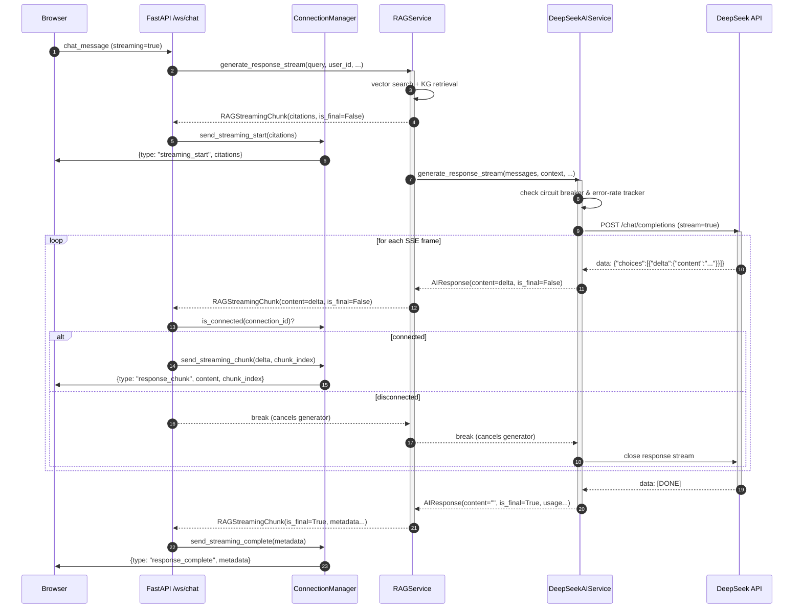
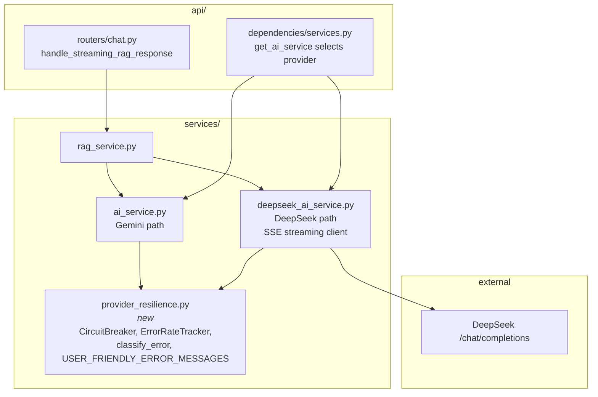
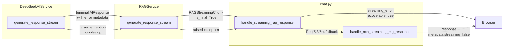
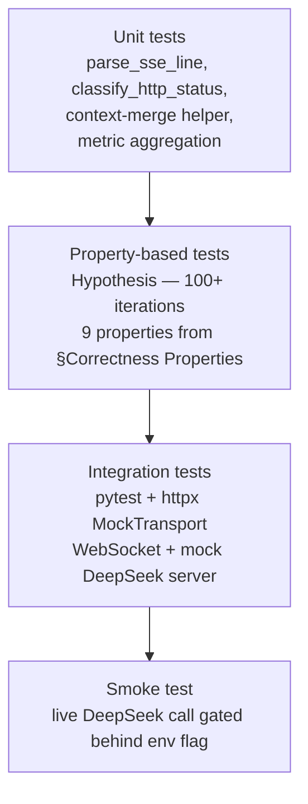

# Design Document

## Overview

This feature re-enables true token-level streaming for chat responses by replacing the compatibility shim in `DeepSeekAIService.generate_response_stream` with a real streaming client for DeepSeek's OpenAI-compatible `POST /chat/completions` endpoint. The implementation reads the response body as an asynchronous byte stream, parses Server-Sent Event (SSE) frames line-by-line, and yields each `choices[0].delta.content` fragment as a partial `AIResponse`. The resulting chunk stream flows unchanged through `RAGService.generate_response_stream`, through the WebSocket `ConnectionManager`, and onto the browser via the existing `streaming_start` / `response_chunk` / `response_complete` / `streaming_error` JSON message contract.

### Why this design

- **No frontend changes required.** The WebSocket handler (`handle_streaming_rag_response`) already forwards `AIResponse` content deltas as `response_chunk` messages and already performs `manager.is_connected(connection_id)` checks before each send, so the only production code path that needs to change is inside `DeepSeekAIService`. The frontend JS (`chat.js`, `unified_interface.js`) listens for `response_chunk` / `response_complete` — type strings that must remain exactly as they are today.
- **Resilience is generalized, not duplicated.** `ai_service.py` already defines `GeminiCircuitBreaker`, `ErrorRateTracker`, `GeminiError`, and `classify_error`. We extract these into a provider-agnostic `provider_resilience` module (renamed without the `Gemini` prefix) and have both `AIService` (Gemini) and `DeepSeekAIService` consume the same primitives. This eliminates the shim that currently makes `DeepSeekAIService` the only AI service without circuit breaker / error-rate tracking.
- **RAG pipeline is unchanged.** `RAGService.generate_response_stream` already yields citations first, then forwards AI deltas, then yields a final metadata chunk. It consumes `AIResponse` chunks via `async for chunk in self.ai_service.generate_response_stream(...)`, and both `AIService` and `DeepSeekAIService` honor that contract today. The only thing that has been missing is actual incremental output from the DeepSeek path.
- **Cancellation is first-class.** We design the HTTP request to use `httpx.AsyncClient.stream(...)` inside an `async with` block, so client disconnect detection (via `manager.is_connected`) lets us break out of the iteration loop and the context manager closes the underlying TCP connection promptly, cancelling the DeepSeek generation.

### Scope

In scope:
- New SSE streaming client inside `DeepSeekAIService`.
- Extraction of `CircuitBreaker`, `ErrorRateTracker`, `Error classification`, and `USER_FRIENDLY_ERROR_MESSAGES` into a provider-agnostic `services/provider_resilience.py` module.
- Re-wiring `DeepSeekAIService` to use those primitives.
- New configuration knobs (`DEEPSEEK_STREAMING_ENABLED`, `DEEPSEEK_STREAM_TIMEOUT`, `DEEPSEEK_STREAM_TOTAL_TIMEOUT`, `DEEPSEEK_STREAM_INCLUDE_USAGE`).
- Observability: structured log events, metrics aggregation in `get_provider_status()`.
- Unit tests (SSE parser, property-based) and integration tests (WebSocket + mocked DeepSeek server).

Out of scope:
- Changes to `RAGService`, `ConnectionManager`, `chat.py` router, or any frontend JS.
- Replacing Gemini's streaming implementation (it keeps its existing code path per Requirement 11).
- Streaming for non-chat flows (training-data generation, enrichment) — those continue to use `generate_response`.

## Architecture

### System context (runtime flow)



### Module responsibilities



### Key design decisions

| Decision | Choice | Rationale |
|---|---|---|
| HTTP client | `httpx.AsyncClient` (already used by `DeepSeekAIService.generate_response`) | Reuses the existing cached client with keepalive, no new dependency, native async streaming via `client.stream(...)`. |
| SSE parsing | Hand-rolled line parser over `response.aiter_lines()` | DeepSeek's SSE format is a narrow subset of the spec (`data: {json}\n\n`, `data: [DONE]`). Third-party SSE libraries add deps and don't handle the OpenAI-style `[DONE]` sentinel any better than ~40 lines of our own code. Keeps the parser pure (no I/O) so it is trivially property-testable. |
| Resilience primitive reuse | Extract `GeminiCircuitBreaker` and `ErrorRateTracker` to `provider_resilience.py`, rename to `CircuitBreaker` / `ErrorRateTracker` | Avoids a second, divergent implementation for DeepSeek. The existing Gemini classes are already provider-agnostic in their logic; only their names suggest otherwise. |
| Shared error classifier | Reuse `classify_error` keyed by HTTP status code (new helper `classify_http_status`) in addition to the existing exception-based classifier | DeepSeek errors surface as HTTP status codes on `httpx.Response`, not as typed exceptions, so we need a status-code-aware classifier in addition to the exception-based one. |
| Streaming fallback | Consume the same `generate_response` non-streaming path and wrap it as a single terminal chunk when `streaming_enabled_config` is false, when the error-rate tracker has disabled streaming, or when the circuit is `OPEN` | Matches the existing Gemini behavior and keeps `RAGService` oblivious to fallback mechanics. |
| Cancellation | `async with client.stream(...)` + `async for line in response.aiter_lines()`; break out of the loop on `is_connected=False` (enforced in `chat.py`, propagates as generator close-down to `DeepSeekAIService`) | `httpx`'s stream context manager closes the TCP connection on exit, which terminates the DeepSeek generation server-side. No explicit `CancelledError` handling needed beyond what `async for` gives us. |
| SSE buffering | None — forward each non-empty `delta.content` as its own chunk | Requirement 8.3 requires byte-level forwarding with no markdown-aware chunking. The frontend's incremental renderer already handles partial markdown tokens. |

## Components and Interfaces

### 1. `services/provider_resilience.py` (new)

Extracted, renamed versions of the resilience primitives currently defined at the top of `ai_service.py`. No behavioral changes — this is purely a relocation and rename so that `DeepSeekAIService` and `AIService` (Gemini) share a single implementation.

```python
# services/provider_resilience.py

class ErrorType(Enum):
    TIMEOUT = "timeout"
    RATE_LIMIT = "rate_limit"
    INVALID_RESPONSE = "invalid_response"
    NETWORK_ERROR = "network_error"
    AUTHENTICATION = "authentication"
    CONTENT_BLOCKED = "content_blocked"
    QUOTA_EXCEEDED = "quota_exceeded"
    MODEL_OVERLOADED = "model_overloaded"
    CIRCUIT_BREAKER = "circuit_breaker"
    UNKNOWN = "unknown"

USER_FRIENDLY_ERROR_MESSAGES: Dict[ErrorType, str] = { ... }

def classify_error(error: Exception) -> ErrorType: ...
def classify_http_status(status_code: int, body_excerpt: str = "") -> ErrorType:
    """Classify an HTTP status code into an ErrorType.
    
    401/403 -> AUTHENTICATION
    429 -> RATE_LIMIT
    5xx -> MODEL_OVERLOADED
    4xx (other) -> INVALID_RESPONSE
    """

@dataclass
class ProviderError:  # was GeminiError
    error_type: ErrorType
    user_message: str
    technical_message: str
    recoverable: bool
    retry_after_seconds: Optional[float] = None

class CircuitState(Enum): ...
@dataclass
class CircuitBreakerConfig: ...
class CircuitBreaker: ...  # Was GeminiCircuitBreaker, identical logic
@dataclass
class ErrorRateConfig: ...
class ErrorRateTracker: ...  # Unchanged logic
class CircuitBreakerOpenError(Exception): ...
```

**Backwards-compat shims in `ai_service.py`:** we keep `GeminiCircuitBreaker = CircuitBreaker`, `GeminiErrorType = ErrorType`, etc. aliased at the top of `ai_service.py` so that external imports continue to resolve. This keeps the blast radius of the rename contained to one file.

### 2. `services/deepseek_ai_service.py` — streaming client

The existing `DeepSeekAIService` is extended with a real streaming client. Its interface to `RAGService` (`generate_response_stream`) is preserved; the body is rewritten.

#### 2.1 Constructor additions

```python
class DeepSeekAIService:
    def __init__(self, ...):
        # ... existing fields ...
        self.streaming_enabled_config: bool = os.environ.get(
            "DEEPSEEK_STREAMING_ENABLED", "true"
        ).lower() == "true"
        self.stream_ttft_timeout: float = float(
            os.environ.get("DEEPSEEK_STREAM_TIMEOUT", "60.0")
        )
        self.stream_total_timeout: float = float(
            os.environ.get("DEEPSEEK_STREAM_TOTAL_TIMEOUT", "180.0")
        )
        self.stream_include_usage: bool = os.environ.get(
            "DEEPSEEK_STREAM_INCLUDE_USAGE", "true"
        ).lower() == "true"
        
        # Shared resilience primitives
        self._circuit_breaker = CircuitBreaker()
        self._error_rate_tracker = ErrorRateTracker()
        
        # Streaming metrics
        self._stream_total = 0
        self._stream_success = 0
        self._stream_failed = 0
        self._stream_duration_samples: deque = deque(maxlen=100)
        self._stream_ttft_samples: deque = deque(maxlen=100)
        self._stream_chunks_samples: deque = deque(maxlen=100)
```

#### 2.2 `generate_response_stream` signature and flow

```python
async def generate_response_stream(
    self,
    messages: List[Dict[str, str]],
    context: Optional[str] = None,
    temperature: float = 0.7,
    max_tokens: int = 2048,
    preferred_provider: Optional[Any] = None,
) -> AsyncGenerator[AIResponse, None]:
    """True SSE streaming to DeepSeek /chat/completions."""
```

Flow:

```mermaid
flowchart TD
    Start([Start]) --> FlagOff{streaming_enabled_config<br/>== false?}
    FlagOff -- yes --> Fallback[Call generate_response,<br/>yield single final chunk]
    FlagOff -- no --> RateOff{error_rate_tracker<br/>.streaming_enabled == false?}
    RateOff -- yes --> Fallback
    RateOff -- no --> CBOpen{circuit_breaker<br/>.allow_request == false?}
    CBOpen -- yes --> CBBlock[Yield terminal chunk<br/>error_type=circuit_breaker]
    CBOpen -- no --> Merge[Merge context into<br/>last user message]
    Merge --> OpenStream[httpx: async with<br/>client.stream POST /chat/completions]
    OpenStream --> Status{status 2xx?}
    Status -- no --> HTTPErr[Read body ≤1000 chars,<br/>classify status, record failure,<br/>yield terminal error chunk]
    Status -- yes --> Iter[Iterate aiter_lines]
    Iter --> Frame{line startswith data:?}
    Frame -- no --> Iter
    Frame -- yes --> Done{payload == [DONE]?}
    Done -- yes --> Final[Yield final chunk<br/>with aggregated usage,<br/>record success]
    Done -- no --> Parse{json.loads ok?}
    Parse -- no --> Warn[WARN log malformed]
    Warn --> Iter
    Parse -- yes --> Delta{delta.content non-empty?}
    Delta -- no --> UsageCheck{has usage?}
    UsageCheck -- yes --> StashUsage[Stash usage for final]
    UsageCheck -- no --> Iter
    StashUsage --> Iter
    Delta -- yes --> Yield[Yield AIResponse<br/>content=delta,<br/>is_final=False,<br/>chunk_index++]
    Yield --> Iter
    Final --> End([End])
    HTTPErr --> End
    CBBlock --> End
    Fallback --> End
```

#### 2.3 Request body

```python
payload = {
    "model": self.model,
    "messages": messages_with_context,
    "temperature": temperature,
    "max_tokens": max_tokens,
    "stream": True,
}
if self.stream_include_usage:
    payload["stream_options"] = {"include_usage": True}
```

#### 2.4 SSE parser (pure function, property-testable)

The parser is factored into a small pure function so that property-based tests can exercise it directly without any HTTP mock:

```python
@dataclass(frozen=True)
class SSEFrame:
    """A single parsed SSE frame from DeepSeek."""
    kind: Literal["delta", "done", "usage", "malformed", "empty"]
    delta_content: Optional[str] = None       # for kind="delta"
    finish_reason: Optional[str] = None        # on any kind
    usage: Optional[Dict[str, int]] = None     # for kind="usage" or delta with usage
    raw_line: Optional[str] = None             # for kind="malformed"

def parse_sse_line(line: str) -> Optional[SSEFrame]:
    """Parse a single SSE line into an SSEFrame.
    
    Returns None for blank lines / non-data lines (heartbeats, retries).
    Never raises. Malformed JSON yields SSEFrame(kind='malformed').
    """
    line = line.strip()
    if not line or not line.startswith("data:"):
        return None
    payload = line[len("data:"):].strip()
    if payload == "[DONE]":
        return SSEFrame(kind="done")
    try:
        obj = json.loads(payload)
    except json.JSONDecodeError:
        return SSEFrame(kind="malformed", raw_line=payload[:200])
    choice = (obj.get("choices") or [{}])[0]
    delta = (choice.get("delta") or {}).get("content") or ""
    finish = choice.get("finish_reason")
    usage = obj.get("usage")
    if delta:
        return SSEFrame(kind="delta", delta_content=delta, finish_reason=finish, usage=usage)
    if usage is not None:
        return SSEFrame(kind="usage", usage=usage, finish_reason=finish)
    # e.g. choices=[{delta:{role:"assistant"}, finish_reason: None}] - first frame
    return SSEFrame(kind="empty", finish_reason=finish)
```

The streaming loop uses this parser:

```python
async with self._client.stream("POST", "/chat/completions", json=payload) as resp:
    if resp.status_code != 200:
        body = (await resp.aread()).decode("utf-8", errors="replace")[:1000]
        yield self._make_http_error_chunk(resp.status_code, body)
        return
    
    chunk_index = 0
    final_usage: Optional[Dict[str, int]] = None
    final_finish_reason: str = "stop"
    cumulative_chars = 0
    first_token_at: Optional[float] = None
    
    async for line in resp.aiter_lines():
        frame = parse_sse_line(line)
        if frame is None:
            continue
        if frame.kind == "malformed":
            logger.warning("DeepSeek malformed SSE line: %s", frame.raw_line)
            continue
        if frame.kind == "done":
            break
        if frame.kind == "usage":
            final_usage = frame.usage
            if frame.finish_reason:
                final_finish_reason = frame.finish_reason
            continue
        if frame.kind == "empty":
            if frame.finish_reason:
                final_finish_reason = frame.finish_reason
            continue
        # frame.kind == "delta"
        if first_token_at is None:
            first_token_at = time.time()
            self._log_first_token(call_id, first_token_at - start_time)
        if frame.finish_reason == "content_filter":
            yield self._make_content_blocked_chunk(chunk_index)
            return
        if frame.usage is not None:
            final_usage = frame.usage
        if frame.finish_reason:
            final_finish_reason = frame.finish_reason
        cumulative_chars += len(frame.delta_content)
        yield AIResponse(
            content=frame.delta_content,
            provider="deepseek",
            model=self.model,
            tokens_used=cumulative_chars // 4,  # rough live estimate
            processing_time_ms=0,
            metadata={
                "is_final": False,
                "chunk_index": chunk_index,
            },
        )
        chunk_index += 1
    
    # Terminal frame
    yield self._make_final_chunk(
        chunk_index=chunk_index,
        finish_reason=final_finish_reason,
        usage=final_usage,
        duration_ms=int((time.time() - start_time) * 1000),
        cumulative_chars=cumulative_chars,
    )
```

#### 2.5 Integration with resilience primitives

Before opening the stream:

```python
if not self.streaming_enabled_config:
    async for chunk in self._streaming_disabled_fallback(messages, context, ...):
        yield chunk
    return

if not self._error_rate_tracker.streaming_enabled:
    # Requirement 5.1
    async for chunk in self._streaming_disabled_fallback(messages, context, ...):
        yield chunk
    return

if not await self._circuit_breaker.allow_request():
    # Requirement 5.2
    yield self._make_circuit_breaker_chunk()
    return
```

After stream completion:

```python
# On success (no HTTP error, no network drop)
await self._circuit_breaker.record_success()
await self._error_rate_tracker.record_call(success=True)

# On HTTP error / timeout / network drop / non-content-filter failures
await self._circuit_breaker.record_failure()
await self._error_rate_tracker.record_call(success=False)

# On content_filter (Requirement 6.5)
await self._circuit_breaker.record_success()  # API call succeeded
await self._error_rate_tracker.record_call(success=True)
```

#### 2.6 Timeout handling

We enforce two timeouts:

- **Time-to-first-token (`DEEPSEEK_STREAM_TIMEOUT`, default 60s):** implemented as `httpx.Timeout(connect=..., read=self.stream_ttft_timeout, ...)` on the initial `client.stream` call; `httpx` raises `ReadTimeout` if no bytes arrive within the window before the first chunk.
- **Total duration (`DEEPSEEK_STREAM_TOTAL_TIMEOUT`, default 180s):** wrapped around the `aiter_lines` loop with `asyncio.wait_for` per-iteration with remaining budget, OR simpler: an outer `asyncio.wait_for` of the entire `async for` loop. We choose the simpler approach because it keeps partial responses intact (any chunks already yielded remain delivered).

On timeout we yield a terminal chunk with `metadata["finish_reason"] = "timeout"` and `metadata["is_final"] = True`.

#### 2.7 Cancellation semantics

When the WebSocket handler detects a client disconnect via `manager.is_connected(connection_id) == False`, it `return`s from `handle_streaming_rag_response` without advancing the `async for chunk in ...` generator. Python's garbage collector then calls `aclose()` on the generator, which propagates `GeneratorExit` up through `RAGService.generate_response_stream` to `DeepSeekAIService.generate_response_stream`. Because the SSE loop runs inside `async with self._client.stream(...) as resp:`, the context manager's `__aexit__` closes the underlying TCP connection, which terminates the DeepSeek generation (saving quota).

We add an explicit `try / finally` guard to emit the `client_disconnect` log event:

```python
async def generate_response_stream(...):
    call_id = uuid.uuid4().hex[:8]
    start_time = time.time()
    aborted = False
    try:
        # ... streaming loop yields chunks ...
    except GeneratorExit:
        aborted = True
        raise
    finally:
        if aborted:
            logger.info(
                "deepseek_stream_aborted",
                extra={
                    "event": "deepseek_stream_aborted",
                    "call_id": call_id,
                    "reason": "client_disconnect",
                    "chunks_sent": chunk_index,
                    "duration_ms": int((time.time() - start_time) * 1000),
                },
            )
```

The existing chat router's finally block, combined with `manager.add_to_conversation_history` only being called on `chunk.is_final`, means the partial response is not currently persisted on client disconnect. To meet Requirement 7.3, `handle_streaming_rag_response` is modified to persist whatever `cumulative_content` has been accumulated before returning on the `not manager.is_connected(connection_id)` branch. This is a small, additive change in `chat.py`:

```python
if not manager.is_connected(connection_id):
    logger.info(f"Connection {connection_id} disconnected, cancelling stream")
    if cumulative_content:
        manager.add_to_conversation_history(
            connection_id, "assistant", cumulative_content,
            citations=citations,
            metadata={"aborted": True},
        )
        thread_id = manager.get_thread_id(connection_id)
        if thread_id:
            await _persist_message(
                thread_id, cumulative_content, MessageType.SYSTEM,
                citations=citations, metadata={"aborted": True},
            )
    return
```

(`add_to_conversation_history` and `_persist_message` both need an optional `metadata` kwarg; today they accept `citations`.)

#### 2.8 Error classification table

| Condition | HTTP status | `error_type` | Recoverable | User-facing message | Circuit breaker | Error rate tracker |
|---|---|---|---|---|---|---|
| Auth failure | 401, 403 | `authentication` | No | "Service configuration error. Please contact support." | failure | failure |
| Rate limit | 429 | `rate_limit` | Yes | "Service is busy. Please wait a moment and try again." | failure | failure |
| Model overloaded | 5xx | `model_overloaded` | Yes | "The AI service is currently overloaded. Please try again in a few moments." | failure | failure |
| Invalid request | other 4xx | `invalid_response` | No | "Unable to generate response. Please try rephrasing your question." | failure | failure |
| Network drop mid-stream | N/A (`httpx.ReadError`, `httpx.RemoteProtocolError`) | `network_error` | Yes | "Connection issue. Please check your network and try again." | failure | failure |
| TTFT timeout | N/A (`httpx.ReadTimeout`) | `timeout` | Yes | "Response is taking longer than expected. Please try again..." | failure | failure |
| Total timeout | N/A (`asyncio.TimeoutError`) | `timeout` | Yes | (partial response preserved) | failure | failure |
| Content filter | 200, `finish_reason="content_filter"` | `content_blocked` | No | "I cannot respond to that request. Please try a different question." | **success** | **success** |
| Circuit open | pre-flight | `circuit_breaker` | Yes | "Service is temporarily unavailable. Please try again in a moment." | (no call) | failure |

### 3. `services/rag_service.py` — no changes

The existing `RAGService.generate_response_stream` already forwards `AIResponse` deltas from `self.ai_service.generate_response_stream(...)`. It sets `RAGStreamingChunk.content = ai_chunk.content` and `tokens_used = ai_chunk.tokens_used` and propagates `ai_chunk.metadata`. The one minor note is that `ai_provider` in the final chunk's metadata is hardcoded to `"gemini"` in two places (line ~1241 and similar) — this will be changed to use the actual provider name from the AI service:

```python
ai_provider = getattr(self.ai_service, "provider_name", None)
if ai_provider is None:
    providers = self.ai_service.get_available_providers()
    ai_provider = providers[0] if providers else "unknown"
```

### 4. `api/routers/chat.py` — minimal change for cancellation persistence

Only two edits (both in `handle_streaming_rag_response`):

1. Persist partial response on disconnect (see §2.7).
2. `citations` variable is currently initialized inside the `if chunk_count == 0` branch; move it to the top of the function so it is available in the disconnect-persistence branch.

No changes to message types, field names, or message ordering.

### 5. `api/dependencies/services.py` — no behavioral change

The existing `get_ai_service` already picks `DeepSeekAIService` when `DEEPSEEK_API_KEY` is set. No changes required to DI wiring.

## Data Models

### `AIResponse` metadata contract (extended, additive only)

`AIResponse` itself is unchanged. The `metadata` dict is extended with DeepSeek-specific keys. All keys are optional; the frontend never reads them directly.

| Key | Type | Present when | Description |
|---|---|---|---|
| `is_final` | `bool` | always | Terminal chunk marker. |
| `chunk_index` | `int` | always | Zero-based monotonic index. |
| `finish_reason` | `str` | terminal only | `stop`, `length`, `content_filter`, `timeout`, `error`. |
| `prompt_tokens` | `int` | terminal, when `usage` received | From DeepSeek `usage` object. |
| `completion_tokens` | `int` | terminal, when `usage` received | From DeepSeek `usage` object. |
| `error` | `str` | on failure | Technical error message (truncated to 500 chars). |
| `error_type` | `str` | on failure | `ErrorType.value`. |
| `recoverable` | `bool` | on failure | Whether retrying is likely to succeed. |
| `retry_after_seconds` | `float` | `rate_limit` / `model_overloaded` | Suggested retry delay. |
| `streaming_fallback` | `bool` | `Streaming_Disabled_Fallback` path | True when `generate_response` was used under the streaming interface. |
| `user_message` | `str` | on failure | User-facing friendly message. |
| `call_id` | `str` | always | 8-char UUID prefix for log correlation. |

### `RAGStreamingChunk` (existing, unchanged)

```python
@dataclass
class RAGStreamingChunk:
    content: str
    is_final: bool
    citations: Optional[List[CitationSource]] = None
    confidence_score: float = 0.0
    processing_time_ms: int = 0
    tokens_used: int = 0
    search_results_count: int = 0
    fallback_used: bool = False
    metadata: Optional[Dict[str, Any]] = None
```

### WebSocket message shapes (existing, preserved verbatim)

| Direction | `type` field | Payload |
|---|---|---|
| Server → Browser | `streaming_start` | `{citations: [...], timestamp}` |
| Server → Browser | `response_chunk` | `{content, chunk_index, timestamp}` |
| Server → Browser | `response_complete` | `{metadata: {...}, timestamp}` |
| Server → Browser | `streaming_error` | `{error, recoverable, timestamp}` |

> **Naming note.** The requirements document (Requirement 4) refers to `streaming_chunk` and `streaming_complete` as message names. In the existing implementation, the actual wire-level `type` strings are `response_chunk` and `response_complete` (see `ConnectionManager.send_streaming_chunk` and `send_streaming_complete`, and frontend handlers in `chat.js` / `unified_interface.js`). Since Requirement 4.1 and Requirement 8.1 require byte-compatible preservation of existing shapes, we **keep** the existing `response_chunk` / `response_complete` type strings and treat the requirement's naming as a description of the event, not the wire format.

### SSE frame model (new, internal)

```python
@dataclass(frozen=True)
class SSEFrame:
    kind: Literal["delta", "done", "usage", "malformed", "empty"]
    delta_content: Optional[str] = None
    finish_reason: Optional[str] = None
    usage: Optional[Dict[str, int]] = None
    raw_line: Optional[str] = None
```

`SSEFrame` is an internal representation for the parser; it never crosses the `DeepSeekAIService` boundary.


## Correctness Properties

*A property is a characteristic or behavior that should hold true across all valid executions of a system — essentially, a formal statement about what the system should do. Properties serve as the bridge between human-readable specifications and machine-verifiable correctness guarantees.*

Property-based testing applies directly to this feature because the SSE parser is a pure function over strings, and the streaming protocol imposes universal invariants across arbitrary delta sequences. Nine properties are enumerated below; each references the acceptance criteria it validates.

### Property 1: SSE parser round-trip

*For all* sequences of non-empty string fragments `deltas = [d1, d2, ..., dN]` and *for all* ways of assembling those fragments into DeepSeek-format SSE text (one `data: {"choices":[{"delta":{"content":"<di>"}}]}\n\n` frame per fragment, terminated by `data: [DONE]\n\n`, with arbitrary interleaving of empty lines, whitespace, and SSE comment lines), parsing the assembled text line-by-line through `parse_sse_line` and concatenating the `delta_content` of every returned `SSEFrame(kind="delta")` yields a string equal to the concatenation `d1 + d2 + ... + dN`.

**Validates: Requirements 1.2, 12.1**

### Property 2: SSE parser robustness under malformed JSON

*For all* sequences of DeepSeek-format SSE lines `L = [l1, l2, ..., lM]` and *for all* subsets `S ⊆ {1, ..., M}` of indices whose contents are replaced with arbitrary strings that do not parse as JSON, the concatenation of `delta_content` values from `parse_sse_line(li)` over `i ∉ S` equals the concatenation that would have been produced from the original (unmangled) lines at those same indices. That is, injecting malformed JSON on any subset of lines does not corrupt or drop parsing of the remaining valid lines.

**Validates: Requirements 1.6, 12.2**

### Property 3: Context-merge rule

*For all* message lists `messages` ending in a message with `role == "user"` and content `original`, and *for all* strings `context`, invoking `DeepSeekAIService._merge_context(messages, context)` produces a new message list identical to `messages` except that the last message's content equals `original + "\n\nAdditional context:\n" + context`, and the `role` is unchanged.

**Validates: Requirements 2.3**

### Property 4: Output contract invariants

*For all* DeepSeek server responses (any combination of HTTP status code, delta sequence, malformed lines, `[DONE]` placement, `usage` payload, and `finish_reason`), the chunks yielded by `DeepSeekAIService.generate_response_stream` satisfy all of the following:

1. The generator yields at least one `AIResponse`.
2. Exactly one yielded `AIResponse` has `metadata["is_final"] == True`, and it is the last chunk yielded.
3. Every yielded `AIResponse` has `provider == "deepseek"` and `model == service.model`.
4. Every yielded `AIResponse` has `chunk_index` and `is_final` keys in `metadata`, with `chunk_index` a non-negative integer that increases by exactly 1 per successive chunk.

**Validates: Requirements 2.4, 2.5, 2.6**

### Property 5: RAG order preservation

*For all* sequences of non-empty content deltas `deltas = [d1, d2, ..., dN]` emitted by a mocked AI service's `generate_response_stream`, the content-bearing (`content != ""` and `is_final == False`) `RAGStreamingChunk`s yielded by `RAGService.generate_response_stream` (when retrieval is disabled or empty) contain exactly the same strings in the same order: the i-th content-bearing chunk has `content == d_i`.

**Validates: Requirements 3.3**

### Property 6: WebSocket protocol invariants

*For all* successful DeepSeek server responses producing a sequence of `N >= 0` non-empty deltas followed by `[DONE]`, the sequence of JSON messages sent on the WebSocket by `handle_streaming_rag_response` conforms to the regex `^streaming_start (response_chunk){N} response_complete$`, and:

1. The single `streaming_start` message carries the full citations list from the RAG layer.
2. Exactly N `response_chunk` messages are sent; the i-th one has `content == d_i` and `chunk_index == i` (0-indexed), in order.
3. The single `response_complete` message's `metadata` object contains all of `rag_enabled`, `streaming`, `confidence_score`, `processing_time_ms`, `search_results_count`, `fallback_used`, `tokens_used`, `request_id`, `chunk_count`.

**Validates: Requirements 4.1, 4.2, 4.3, 4.5, 8.3**

### Property 7: Client disconnect cuts off response_chunk emission

*For all* streams of `N` deltas and *for all* indices `k ∈ {0, 1, ..., N}` at which `manager.is_connected(connection_id)` flips from `True` to `False`, no `response_chunk` message with `chunk_index >= k` is sent on the WebSocket, and no `response_complete` message is sent after the disconnect point.

**Validates: Requirements 7.1**

### Property 8: WebSocket message schema

*For all* JSON messages sent by `ConnectionManager.send_streaming_*` methods during any streaming interaction, the set of top-level keys of each message is a subset of the allowed keys for its `type`:

- `streaming_start`: `{type, citations, timestamp}`
- `response_chunk`: `{type, content, chunk_index, timestamp}`
- `response_complete`: `{type, metadata, timestamp}`
- `streaming_error`: `{type, error, recoverable, timestamp}`

No DeepSeek-specific diagnostic field appears at the top level; such fields only appear nested under `metadata`.

**Validates: Requirements 8.2**

### Property 9: Success path records success in resilience trackers

*For all* DeepSeek server responses that end with `[DONE]` without any non-200 status, network drop, timeout, or `finish_reason != "content_filter"` error, the number of calls to `CircuitBreaker.record_success` and `ErrorRateTracker.record_call(success=True)` each increase by exactly one per invocation of `DeepSeekAIService.generate_response_stream`, and `record_failure` is not called on either tracker.

**Validates: Requirements 6.6**

## Error Handling

### Classification table

| Error condition | Detected via | `error_type` | Recoverable | Circuit breaker | Error rate tracker | User-facing message |
|---|---|---|---|---|---|---|
| HTTP 401 / 403 | `resp.status_code` | `authentication` | No | `record_failure` | `record_call(False)` | "Service configuration error. Please contact support." |
| HTTP 429 | `resp.status_code` + `Retry-After` | `rate_limit` | Yes (`retry_after_seconds` from header or 60) | `record_failure` | `record_call(False)` | "Service is busy. Please wait a moment and try again." |
| HTTP 5xx | `resp.status_code` | `model_overloaded` | Yes (`retry_after_seconds=30`) | `record_failure` | `record_call(False)` | "The AI service is currently overloaded. Please try again in a few moments." |
| HTTP other 4xx | `resp.status_code` | `invalid_response` | No | `record_failure` | `record_call(False)` | "Unable to generate response. Please try rephrasing your question." |
| Network drop mid-stream | `httpx.ReadError` / `httpx.RemoteProtocolError` raised by `aiter_lines` | `network_error` | Yes | `record_failure` | `record_call(False)` | "Connection issue. Please check your network and try again." |
| TTFT timeout | `httpx.ReadTimeout` | `timeout` | Yes | `record_failure` | `record_call(False)` | "Response is taking longer than expected. Please try again..." |
| Total duration timeout | `asyncio.TimeoutError` around the `async for` loop | `timeout` | Yes | `record_failure` | `record_call(False)` | (partial response preserved; terminal chunk carries `finish_reason="timeout"`) |
| `finish_reason == "content_filter"` | Parsed from SSE frame | `content_blocked` | No | **`record_success`** | **`record_call(True)`** | "I cannot respond to that request. Please try a different question." |
| Circuit breaker open | `allow_request() == False` before request | `circuit_breaker` | Yes | (no call issued) | `record_call(False)` | "Service is temporarily unavailable. Please try again in a moment." |
| Malformed SSE line | `json.JSONDecodeError` inside `parse_sse_line` | (not a terminal error) | — | — | — | (WARN log, continue parsing) |

### Error propagation paths



Two distinct failure modes feed into the handler:

1. **Terminal error chunk.** `DeepSeekAIService` yields an `AIResponse` with `metadata["is_final"] = True` and an error-describing metadata payload. `RAGService` passes this through as a terminal `RAGStreamingChunk`. The handler sees `chunk.is_final == True` and completes normally, but the `chunk_metadata["error_type"]` field allows it to decide whether to emit a timeout notification (existing behavior).

2. **Raised exception.** Network drops and unexpected parser failures propagate as Python exceptions. The handler's existing `try / except` wraps the streaming loop; on exception it emits a `streaming_error` with `recoverable=true` and invokes `handle_non_streaming_rag_response` to retry without streaming.

The design deliberately prefers mode 1 (terminal error chunk) over mode 2 (raised exception) for all anticipated error classes (HTTP status, timeout, content filter), so that the handler's success path handles them uniformly and no `streaming_error` message is sent for conditions where a clean terminal chunk can be produced. Only truly unexpected conditions (mid-stream network drop, uncaught bugs) take the exception path.

### Partial response preservation

Requirement 7.3 requires that on client disconnect, the partial assistant response is persisted with `metadata["aborted"] = true`. Implementation:

- `handle_streaming_rag_response` maintains `cumulative_content` as it forwards chunks.
- On detecting `not manager.is_connected(connection_id)`, before returning, it calls:
  - `manager.add_to_conversation_history(connection_id, "assistant", cumulative_content, citations=citations, metadata={"aborted": True})`
  - `await _persist_message(thread_id, cumulative_content, MessageType.SYSTEM, citations=citations, metadata={"aborted": True})`
- Both `add_to_conversation_history` and `_persist_message` get a new optional `metadata` kwarg.

On total-duration timeout, the partial response is preserved by a similar mechanism: the terminal timeout chunk is yielded with `finish_reason="timeout"`, the handler delivers the accumulated `cumulative_content` plus a timeout notification, and persistence happens in the normal `is_final` branch.

## Testing Strategy

### Test pyramid



### Tooling

- **Unit and property tests**: `pytest`, `hypothesis` (already in the project per the `.hypothesis/` directory), `pytest-asyncio`.
- **HTTP mocking**: `httpx.MockTransport` for the service-level tests; lightweight `aiohttp` server (or `pytest-httpserver`) for the WebSocket end-to-end tests that need a real socket to simulate disconnect timing.
- **WebSocket client**: `fastapi.testclient.TestClient` for simple cases; `httpx.AsyncClient` + FastAPI's ASGI transport for async-native cases.

### Test inventory

#### Unit tests (`tests/services/test_sse_parser.py`)

- `test_parse_sse_line_delta`
- `test_parse_sse_line_done`
- `test_parse_sse_line_usage`
- `test_parse_sse_line_malformed_returns_malformed_frame`
- `test_parse_sse_line_empty_line_returns_none`
- `test_parse_sse_line_non_data_line_returns_none`
- `test_parse_sse_line_content_filter_finish_reason`

#### Property-based tests (`tests/services/test_sse_parser_properties.py`)

**Minimum 100 iterations per property** (Hypothesis default). Each property test is tagged in a comment with the feature and property number from §Correctness Properties.

```python
# Feature: deepseek-chat-streaming, Property 1: SSE parser round-trip
@given(deltas=st.lists(st.text(min_size=1, max_size=50), min_size=0, max_size=20))
@settings(max_examples=200)
def test_sse_parser_round_trip(deltas):
    sse_text = _render_as_sse(deltas)
    parsed = [f for f in (parse_sse_line(l) for l in sse_text.splitlines()) if f]
    recovered = "".join(f.delta_content for f in parsed if f.kind == "delta")
    assert recovered == "".join(deltas)
```

Tests:

- `test_sse_parser_round_trip` — Property 1
- `test_sse_parser_robustness_to_malformed_json` — Property 2
- `test_context_merge_appends_marker` — Property 3
- `test_output_contract_invariants` — Property 4 (async, uses `MockTransport`)
- `test_rag_order_preservation` — Property 5 (async, mocks `ai_service.generate_response_stream`)
- `test_websocket_protocol_invariants` — Property 6 (async, end-to-end with `TestClient` WebSocket)
- `test_client_disconnect_cuts_off_emission` — Property 7 (async, patches `manager.is_connected`)
- `test_websocket_message_schema` — Property 8 (async, fuzz + schema assertion)
- `test_success_path_records_success` — Property 9 (async, verifies tracker state)

Each property test uses `hypothesis.strategies` to generate the universe of inputs:
- Delta strings: `st.text(min_size=1)` with explicit Hypothesis `example()` seeds for markdown (`"**bold**"`), emoji, CJK, zero-width chars.
- SSE interleaving: `st.lists(st.sampled_from([valid_frame, heartbeat, empty_line, comment_line]))`.
- HTTP status codes: `st.sampled_from([401, 403, 429, 500, 502, 503])` for the error-path invariants.

#### Example-based tests (`tests/services/test_deepseek_streaming.py`)

All async, use `httpx.MockTransport` to canned responses.

| Test | Requirement(s) |
|---|---|
| `test_streaming_issues_single_post_with_stream_true` | 1.1 |
| `test_streaming_done_marker_ends_stream` | 1.4 |
| `test_streaming_usage_populates_final_tokens` | 1.5 |
| `test_streaming_timeout_yields_terminal_timeout_chunk` | 1.8 |
| `test_http_401_yields_auth_error_chunk` | 6.1 |
| `test_http_403_yields_auth_error_chunk` | 6.1 |
| `test_http_429_honours_retry_after_header` | 6.2 |
| `test_http_429_default_retry_after_60` | 6.2 |
| `test_http_500_yields_model_overloaded` | 6.3 |
| `test_network_drop_yields_terminal_chunk_with_preserved_content` | 6.4 |
| `test_content_filter_records_success_in_circuit_breaker` | 6.5 |
| `test_streaming_disabled_config_uses_fallback` | 10.2 |
| `test_circuit_breaker_open_yields_terminal_chunk_no_http_request` | 5.2 |
| `test_error_rate_disabled_yields_fallback` | 5.1 |
| `test_stream_options_include_usage_when_flag_enabled` | 10.5 |
| `test_stream_options_omitted_when_flag_disabled` | 10.5 |
| `test_env_var_parsing_defaults` | 10.1, 10.3, 10.4 |

#### Integration tests (`tests/integration/test_deepseek_websocket_streaming.py`)

| Test | Requirement(s) |
|---|---|
| `test_10_chunk_stream_produces_expected_ws_message_sequence` | 12.3 |
| `test_http_500_triggers_streaming_error_then_fallback_response` | 12.4 |
| `test_client_disconnect_at_chunk_5_stops_ws_and_closes_http` | 12.5, 7.2 |
| `test_client_disconnect_persists_partial_response_with_aborted_true` | 7.3 |
| `test_empty_stream_done_only_yields_no_response_chunk_and_complete_with_zero` | 7.4 |
| `test_exception_before_any_chunk_invokes_non_streaming_fallback_directly` | 5.4 |
| `test_exception_after_chunks_sent_emits_streaming_error_then_fallback` | 5.3 |
| `test_gemini_fallback_when_deepseek_key_absent` | 11.1 |
| `test_deepseek_selected_when_key_present` | 11.2 |

#### Observability tests (`tests/services/test_deepseek_streaming_observability.py`)

| Test | Requirement(s) |
|---|---|
| `test_deepseek_stream_start_log_event` | 9.1 |
| `test_deepseek_stream_first_token_log_event` | 9.2 |
| `test_deepseek_stream_complete_log_event` | 9.3 |
| `test_deepseek_stream_error_log_event` | 9.4 |
| `test_get_provider_status_exposes_streaming_metrics` | 9.5 |
| `test_get_performance_stats_includes_circuit_breaker_and_error_rate` | 9.6 |

### Property-test configuration

- Minimum 100 iterations (`@settings(max_examples=200)` for the protocol-invariant properties, `max_examples=500` for pure parser properties which are cheap).
- `deadline=None` for tests that await mocked HTTP to avoid flakiness on slow CI.
- Explicit `example()` decorators for edge cases: empty delta list, single `[DONE]` only, pure-whitespace delta, `\n` / `\r` inside delta content, emoji / surrogate pairs, markdown boundary tokens (`"``"`, `"**"`, `"\n\n"`).

## Observability

### Structured log events

All events are emitted via `structlog`-compatible `logger.info` / `logger.error` with `extra={"event": ..., ...}` so they render as JSON in the existing CloudWatch log pipeline.

| Event | Level | When | Fields |
|---|---|---|---|
| `deepseek_stream_start` | INFO | just before opening the HTTP stream | `call_id`, `model`, `prompt_chars`, `message_count`, `temperature`, `max_tokens` |
| `deepseek_stream_first_token` | INFO | on first non-empty delta | `call_id`, `time_to_first_token_ms` |
| `deepseek_stream_complete` | INFO | after `[DONE]` | `call_id`, `duration_ms`, `chunks_received`, `prompt_tokens`, `completion_tokens`, `total_tokens`, `finish_reason` |
| `deepseek_stream_error` | ERROR | on HTTP error, timeout, or exception | `call_id`, `duration_ms`, `chunks_received_before_error`, `error_type`, `error_message` (≤500 chars) |
| `deepseek_stream_aborted` | INFO | on client disconnect (generator close) | `call_id`, `reason="client_disconnect"`, `chunks_sent`, `duration_ms` |
| `deepseek_stream_malformed_chunk` | WARNING | on `json.JSONDecodeError` inside parser | `call_id`, `raw_line` (≤200 chars) |

### Metrics aggregation

`DeepSeekAIService.get_provider_status()` is extended to return:

```python
{
    "deepseek": {
        "available": True,
        "model": self.model,
        "total_calls": int,
        "successful_calls": int,
        "failed_calls": int,
        # new streaming-specific fields (Req 9.5):
        "streaming_total_calls": int,
        "streaming_successful_calls": int,
        "streaming_failed_calls": int,
        "streaming_avg_duration_ms": float,         # mean of _stream_duration_samples deque
        "streaming_avg_time_to_first_token_ms": float,  # mean of _stream_ttft_samples
        "streaming_avg_chunks_per_response": float,     # mean of _stream_chunks_samples
        # new resilience fields (Req 9.6):
        "circuit_breaker_state": str,
        "streaming_enabled": bool,   # = error_rate_tracker.streaming_enabled
    }
}
```

A separate `get_performance_stats()` method on `DeepSeekAIService` (new, mirroring `AIService.get_performance_stats()`) returns the full `{"circuit_breaker": ..., "error_rate": ...}` payload that Gemini already exposes.

### Dashboarding

No dashboard changes are required for this feature; the new log events and metrics feed the existing CloudWatch log-based metrics pipeline. An operator can alert on:

- `event=deepseek_stream_error AND error_type=model_overloaded` count per 5-minute window
- `deepseek_stream_complete.time_to_first_token_ms` p95
- `circuit_breaker_state=open` duration

## Configuration

| Env var | Default | Type | Description |
|---|---|---|---|
| `DEEPSEEK_API_KEY` | (empty) | string | Required for DeepSeek path. When empty and `GEMINI_API_KEY` is set, falls back to Gemini (existing behavior). |
| `DEEPSEEK_MODEL` | `deepseek-chat` | string | Model name passed in the request body. |
| `DEEPSEEK_BASE_URL` | `https://api.deepseek.com` | string | Base URL for the chat completions endpoint. |
| `DEEPSEEK_TIMEOUT` | `120.0` | float | Non-streaming request timeout, seconds (existing). |
| `DEEPSEEK_STREAMING_ENABLED` | `true` | boolean (`"true"`/`"false"`) | **New.** Feature flag — when `"false"`, `generate_response_stream` behaves as `Streaming_Disabled_Fallback`. |
| `DEEPSEEK_STREAM_TIMEOUT` | `60.0` | float | **New.** Time-to-first-token timeout, seconds. Passed to `httpx.Timeout(read=...)`. |
| `DEEPSEEK_STREAM_TOTAL_TIMEOUT` | `180.0` | float | **New.** Max total streaming duration, seconds. Enforced via `asyncio.wait_for` around the iteration loop. |
| `DEEPSEEK_STREAM_INCLUDE_USAGE` | `true` | boolean | **New.** When true, adds `stream_options.include_usage=true` to the request so the final SSE frame carries a `usage` object. |

Parsing rules:
- Boolean env vars are parsed case-insensitively: `"true"`, `"1"`, `"yes"` → `True`; everything else → `False`.
- Float env vars are parsed with `float(...)` and fall back to the default on `ValueError`, with a WARN log.
- Values are read once at `DeepSeekAIService.__init__` and cached on the instance. Changes require a service restart.

## Migration and rollout plan

### Phased enablement

| Phase | Duration | Action | Rollback |
|---|---|---|---|
| 0. Code merge | Day 0 | Merge with `DEEPSEEK_STREAMING_ENABLED=false` as the deployed default. Feature is shipped but inactive. | N/A |
| 1. Internal smoke | Day 0–1 | Set `DEEPSEEK_STREAMING_ENABLED=true` on the development environment only. Run manual chat sessions, confirm token-by-token rendering. | Set env back to `false`, redeploy. |
| 2. Staging canary | Day 1–3 | Enable on staging. Monitor `deepseek_stream_error` rate, `time_to_first_token_ms` p95, circuit breaker state. Threshold: error rate < 5% over a 24h window. | Env flag + redeploy. |
| 3. Production canary | Day 3–5 | Enable on 10% of production via an LB-level header (if available) or by deploying to one of N ECS tasks with the env flag on. | Scale the opted-in task to zero. |
| 4. Full production | Day 5+ | Flip `DEEPSEEK_STREAMING_ENABLED=true` globally. | Flip back to `false`; no code revert needed. |

### Rollback

Because the feature is gated on a single env var read at service construction, rollback is:

1. Set `DEEPSEEK_STREAMING_ENABLED=false`.
2. Redeploy (or restart the service).

No database migration, schema change, or frontend change is involved, so rollback is the same as reverting the env var. The existing circuit breaker and error-rate tracker also provide an automatic "soft rollback" — if the streaming error rate spikes above the configured threshold (50% over a 5-minute window), streaming is automatically disabled per-instance until the rate falls below 30%.

### Backward compatibility

- **Gemini path unchanged.** When `DEEPSEEK_API_KEY` is empty and `GEMINI_API_KEY` is set, `get_ai_service` still returns `AIService(Gemini)` (Requirement 11.1). Gemini's existing streaming implementation continues to run.
- **Shared resilience primitives keep aliased names.** `GeminiCircuitBreaker`, `GeminiErrorType`, `GeminiError`, `classify_error` remain importable from `services.ai_service` via aliases to the new `provider_resilience` module, so any external caller is unaffected.
- **WebSocket protocol is byte-identical.** No changes to `type`, field names, or message ordering. Existing frontend JS is not touched.

### Deployment checklist

- [ ] `DEEPSEEK_API_KEY` set in the target environment.
- [ ] `DEEPSEEK_STREAMING_ENABLED` explicitly set (default `true` post-rollout).
- [ ] `DEEPSEEK_STREAM_TIMEOUT` and `DEEPSEEK_STREAM_TOTAL_TIMEOUT` reviewed for the environment's expected payload sizes.
- [ ] Alerts configured on `deepseek_stream_error` rate and `circuit_breaker_state=open`.
- [ ] Rollback env-var flip tested on staging.
