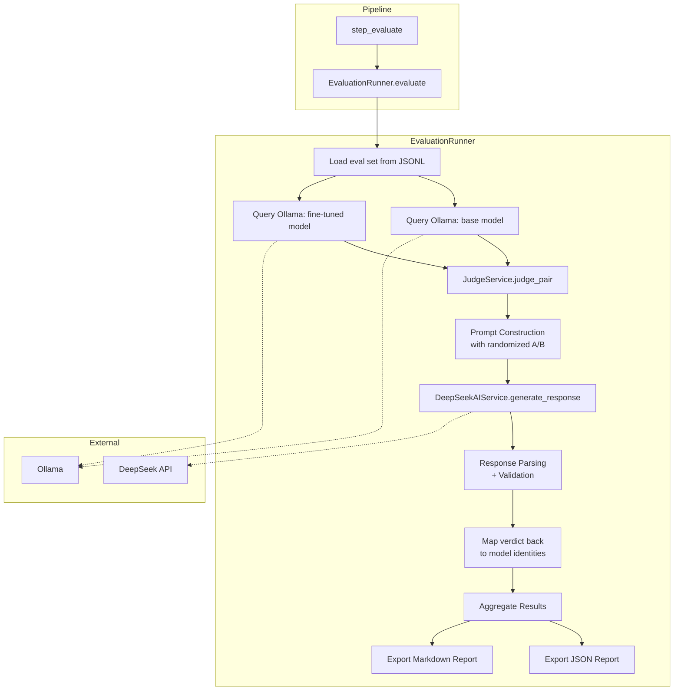

# Design Document: LLM Judge Evaluation

## Overview

This feature replaces the existing cosine-similarity and UMLS concept-recall scoring in the `EvaluationRunner` with an LLM-as-judge approach powered by the DeepSeek API. The current evaluation computes embedding similarity between model responses and gold-standard answers, which penalizes clinically correct responses that use different phrasing. The replacement uses DeepSeek as a judge to score responses on four clinical dimensions (factual accuracy, completeness, clinical relevance, coherence), pick winners via randomized A/B ordering to prevent position bias, and produce aggregate metrics (win rate, mean score delta, per-semantic-type and per-difficulty breakdowns).

The system integrates into the existing pipeline as step 7 (`step_evaluate`) and produces JSON and Markdown reports compatible with the current reporting format. The `sentence-transformers` dependency and all embedding/concept-recall scoring code are removed from the evaluation path.

### Key Design Decisions

1. **Pairwise evaluation with pointwise scoring**: Each judge call scores both responses on four dimensions (1–5 scale) AND picks an overall winner. This gives us both granular dimension scores and a clear head-to-head comparison.

2. **Randomized A/B ordering per question**: The base and fine-tuned responses are randomly assigned to "Response A" and "Response B" labels for each question, preventing systematic position bias. The assignment is recorded for auditability.

3. **Structured JSON output from judge**: The judge prompt requests a specific JSON schema, and the parser handles common LLM output variations (markdown code fences, surrounding text). This maximizes parse reliability.

4. **Retry with graceful degradation**: Failed judge calls are retried up to 2 times. Questions that fail all retries are excluded from aggregation rather than halting the run. A high failure rate (>50%) triggers automatic flagging.

5. **Win-rate-based improvement delta**: The pipeline threshold check uses `improvement_delta = win_rate - 0.5`, making it directly compatible with the existing threshold mechanism (positive = fine-tuned model is better).

6. **Reuse of `DeepSeekAIService`**: The judge calls go through the existing `DeepSeekAIService` class, reusing its connection management, error handling, and configuration. A new `JudgeService` class wraps it with judge-specific prompt construction and response parsing.

## Architecture



### Data Flow

1. `EvaluationRunner.evaluate()` loads the eval set from JSONL (unchanged from current behavior).
2. For each question, both models are queried via Ollama (unchanged).
3. The response pair, question, and gold answer are passed to `JudgeService.judge_pair()`.
4. `JudgeService` constructs a judge prompt with randomized A/B labels, sends it to DeepSeek, parses the structured JSON response, validates scores, and maps the winner back to model identities.
5. Per-question results are collected and aggregated into win rate, mean score delta, per-dimension means, per-semantic-type breakdowns, and per-difficulty breakdowns.
6. Reports are exported as JSON and Markdown.

## Components and Interfaces

### JudgeService

New class in `src/multimodal_librarian/ml/judge_service.py`.

```python
class JudgeService:
    """LLM-as-judge service for pairwise response evaluation."""

    def __init__(
        self,
        deepseek_service: DeepSeekAIService,
        max_retries: int = 2,
        temperature: float = 0.1,
    ) -> None: ...

    async def judge_pair(
        self,
        question: str,
        gold_answer: str,
        base_response: str,
        finetuned_response: str,
    ) -> JudgeResult: ...

    def build_judge_prompt(
        self,
        question: str,
        gold_answer: str,
        response_a: str,
        response_b: str,
    ) -> str: ...

    def parse_judge_response(self, raw_response: str) -> JudgeVerdict: ...

    async def verify_available(self) -> None: ...
```

**Responsibilities:**
- Construct judge prompts with randomized A/B ordering
- Send prompts to DeepSeek via `DeepSeekAIService`
- Parse and validate structured JSON responses
- Retry on parse failures (up to `max_retries` additional attempts)
- Map winner labels back to model identities
- Track success/failure statistics

### Modified EvaluationRunner

The existing `EvaluationRunner` class in `src/multimodal_librarian/ml/evaluation_runner.py` is modified:

**Removed methods:**
- `_load_embedding_model()`
- `_embed()`
- `_extract_candidate_concepts()`
- `_compute_concept_recall()`
- `_score_response()`

**Modified methods:**
- `__init__()` — accepts a `JudgeService` instance instead of managing embedding models
- `evaluate()` — uses `JudgeService.judge_pair()` instead of `_score_response()`; collects `JudgeResult` objects; builds the new report structure
- `_build_report()` — computes win rate, mean score delta, per-dimension means, per-type and per-difficulty breakdowns
- `_export_json_report()` — outputs the new JSON schema with `win_rate`, `mean_score_delta`, `judge_stats`, etc.
- `_export_markdown_report()` — outputs the new Markdown format with dimension breakdowns and win rates

**Unchanged methods:**
- `generate_eval_set()` — eval set generation is unaffected
- `export_eval_set()` / `load_eval_set()` — JSONL I/O is unaffected

### Modified evaluate.py CLI

The CLI entry point `src/multimodal_librarian/ml/evaluate.py` is updated to:
- Instantiate `DeepSeekAIService` (requires `DEEPSEEK_API_KEY`)
- Instantiate `JudgeService` with the DeepSeek service
- Pass `JudgeService` to `EvaluationRunner`
- Call `judge_service.verify_available()` before starting evaluation
- Remove `sentence-transformers` import and embedding model setup

### Modified step_evaluate in Pipeline

The pipeline function `step_evaluate` in `scripts/run-training-pipeline.py` requires no changes — it already delegates to `evaluate.py` via subprocess.

## Data Models

### New Models (in `src/multimodal_librarian/ml/models.py`)

```python
class DimensionScores(BaseModel):
    """Scores on four clinical evaluation dimensions (1–5 integer scale)."""
    factual_accuracy: int = Field(..., ge=1, le=5)
    completeness: int = Field(..., ge=1, le=5)
    clinical_relevance: int = Field(..., ge=1, le=5)
    coherence: int = Field(..., ge=1, le=5)

class JudgeVerdict(BaseModel):
    """Parsed output from a single judge call."""
    response_a_scores: DimensionScores
    response_b_scores: DimensionScores
    winner: str = Field(...)  # "A", "B", or "tie"
    explanation: str = Field(default="")

    @field_validator("winner")
    @classmethod
    def validate_winner(cls, v: str) -> str:
        v_upper = v.strip().upper()
        if v_upper not in ("A", "B", "TIE"):
            return "TIE"  # treat unrecognized as tie
        return v_upper
```

```python
class JudgeResult(BaseModel):
    """Result of judging a single question, with model identity mapped."""
    base_scores: DimensionScores
    finetuned_scores: DimensionScores
    winner: str  # "base", "finetuned", or "tie"
    explanation: str
    position_label: str  # "base_is_A" or "base_is_B"
```

### Modified Models

```python
# ResponseScore is replaced:
# OLD:
@dataclass
class ResponseScore:
    semantic_similarity: float
    concept_recall: float

# NEW:
@dataclass
class ResponseScore:
    factual_accuracy: int      # 1–5
    completeness: int          # 1–5
    clinical_relevance: int    # 1–5
    coherence: int             # 1–5
```

```python
# QuestionResult gains new fields:
@dataclass
class QuestionResult:
    question: str
    gold_answer: str
    base_response: str
    finetuned_response: str
    base_score: ResponseScore
    finetuned_score: ResponseScore
    semantic_type: str
    difficulty_level: str
    winner: str              # NEW: "base", "finetuned", or "tie"
    judge_explanation: str   # NEW: judge's reasoning
    position_label: str      # NEW: "base_is_A" or "base_is_B"
```

```python
# ComparisonReport is updated:
@dataclass
class ComparisonReport:
    results: List[QuestionResult]
    win_rate: float                              # NEW: replaces base_mean_similarity
    mean_score_delta: float                      # NEW: replaces finetuned_mean_similarity
    improvement_delta: float                     # KEPT: now = win_rate - 0.5
    by_semantic_type: Dict[str, Dict[str, float]]
    by_difficulty: Dict[str, Dict[str, float]]
    flagged: bool
    recommendations: List[str]
    judge_stats: Dict[str, Any]                  # NEW: total, success, failed, model
    base_mean_scores: Dict[str, float]           # NEW: per-dimension means
    finetuned_mean_scores: Dict[str, float]      # NEW: per-dimension means
```

### Judge Prompt JSON Schema

The judge is instructed to return JSON matching this structure:

```json
{
  "response_a_scores": {
    "factual_accuracy": 4,
    "completeness": 3,
    "clinical_relevance": 5,
    "coherence": 4
  },
  "response_b_scores": {
    "factual_accuracy": 3,
    "completeness": 2,
    "clinical_relevance": 4,
    "coherence": 3
  },
  "winner": "A",
  "explanation": "Response A provides more accurate clinical details..."
}
```


## Correctness Properties

*A property is a characteristic or behavior that should hold true across all valid executions of a system — essentially, a formal statement about what the system should do. Properties serve as the bridge between human-readable specifications and machine-verifiable correctness guarantees.*

### Property 1: Prompt construction includes all inputs with correct A/B ordering

*For any* question text, gold answer, base response, and fine-tuned response, calling `judge_pair` SHALL produce a prompt that contains all four input strings, labels them as "Response A" and "Response B", and the returned `position_label` correctly reflects which model was assigned to which label (i.e., if `position_label` is "base_is_A" then Response A in the prompt is the base response, and vice versa).

**Validates: Requirements 1.1, 1.2, 3.1**

### Property 2: Judge verdict JSON round-trip

*For any* valid `JudgeVerdict` object (with dimension scores in [1,5], winner in {"A","B","TIE"}, and arbitrary explanation text), serializing it to JSON and then calling `parse_judge_response` on that JSON string SHALL produce a `JudgeVerdict` equivalent to the original. Furthermore, serializing the parsed result back to JSON and re-parsing SHALL also produce an equivalent object.

**Validates: Requirements 2.2, 11.1, 11.4**

### Property 3: Dimension score validation bounds

*For any* four integers each in the range [1, 5], constructing a `DimensionScores` (or `ResponseScore`) object SHALL succeed. *For any* integer outside [1, 5] in any of the four fields, construction SHALL raise a validation error.

**Validates: Requirements 2.5, 9.5**

### Property 4: Dimension score clamping

*For any* integer value, the clamping function SHALL produce `max(1, min(5, value))`. The clamped result is always in [1, 5].

**Validates: Requirements 2.6**

### Property 5: Winner mapping consistency

*For any* combination of `position_label` ∈ {"base_is_A", "base_is_B"} and verdict `winner` ∈ {"A", "B", "TIE"}, the mapped winner SHALL be: "base" if the verdict winner matches the base model's position, "finetuned" if it matches the fine-tuned model's position, or "tie" if the verdict is "TIE".

**Validates: Requirements 3.2**

### Property 6: Aggregate metrics computation

*For any* non-empty list of `QuestionResult` objects with known winners and dimension scores, the `ComparisonReport` SHALL have:
- `win_rate` equal to the count of results where `winner == "finetuned"` divided by the total count
- `mean_score_delta` equal to the mean of (finetuned dimension score − base dimension score) across all four dimensions and all results
- `improvement_delta` equal to `win_rate - 0.5`
- `base_mean_scores` and `finetuned_mean_scores` with per-dimension means matching the arithmetic mean of each dimension across all results

**Validates: Requirements 5.1, 5.2, 5.3, 6.1**

### Property 7: Breakdown computation by grouping key

*For any* non-empty list of `QuestionResult` objects with at least two distinct semantic types or difficulty levels, the per-semantic-type and per-difficulty breakdowns SHALL each contain correct `win_rate`, `mean_score_delta`, and `count` values computed from only the results in that group.

**Validates: Requirements 5.4, 5.5**

### Property 8: Flagging threshold

*For any* `improvement_delta` and configured `Pipeline_Threshold`, the `flagged` field SHALL be `True` if and only if `improvement_delta < threshold`.

**Validates: Requirements 6.2**

### Property 9: JSON report contains all required fields

*For any* valid `ComparisonReport`, exporting to JSON and loading the result SHALL produce a dict containing all required top-level keys (`win_rate`, `mean_score_delta`, `improvement_delta`, `flagged`, `recommendations`, `by_semantic_type`, `by_difficulty`, `judge_stats`, `results`), with `results` having the same length as the input and each entry containing all per-question fields.

**Validates: Requirements 7.2, 7.3, 7.4**

### Property 10: Markdown report contains report values

*For any* valid `ComparisonReport` with at least one result, the exported Markdown string SHALL contain the string representations of `win_rate`, `mean_score_delta`, `improvement_delta`, the flagged status, and the total question count.

**Validates: Requirements 8.2**

### Property 11: Code fence JSON extraction

*For any* valid `JudgeVerdict` JSON string, wrapping it in markdown code fences (`` ```json ... ``` ``) or prepending/appending arbitrary non-JSON text SHALL still parse correctly via `parse_judge_response`, producing a `JudgeVerdict` equivalent to parsing the raw JSON directly.

**Validates: Requirements 11.2**

### Property 12: Invalid winner defaults to tie

*For any* string that is not case-insensitively equal to "A", "B", or "tie", the `JudgeVerdict` winner validator SHALL normalize it to "TIE".

**Validates: Requirements 11.3**

### Property 13: High failure rate triggers flagging

*For any* evaluation run where the number of failed judge calls exceeds 50% of total questions, the `ComparisonReport` SHALL have `flagged` set to `True` and `recommendations` SHALL contain at least one entry mentioning the failure rate.

**Validates: Requirements 10.4**

## Error Handling

### DeepSeek API Errors

| Scenario | Behavior |
|----------|----------|
| API unreachable at start | `JudgeService.verify_available()` raises `RuntimeError` before any questions are processed. The pipeline halts with a clear error message. |
| Single API call fails (timeout, HTTP error) | Retry up to 2 additional times. If all retries fail, log a warning and skip the question. |
| API returns unparseable response | Treated as a call failure — triggers retry logic. |
| API returns scores outside 1–5 | Clamp to nearest bound (1 or 5), log a warning, continue processing. |
| API returns unrecognized winner value | Treat as "tie", log a warning, continue processing. |
| >50% of judge calls fail | Set `flagged = True`, add recommendation about high failure rate. |

### Ollama Errors

| Scenario | Behavior |
|----------|----------|
| Ollama unreachable | `_query_ollama` raises `RuntimeError`. The question is skipped (existing behavior). |
| Model not found | `_query_ollama` raises `RuntimeError` with instructions to pull/create the model. Question is skipped. |
| Timeout (>120s) | `_query_ollama` raises `RuntimeError`. Question is skipped. |

### Data Validation Errors

| Scenario | Behavior |
|----------|----------|
| Empty eval set | `evaluate()` raises `ValueError` (existing behavior). |
| Invalid JSONL line in eval set | Line is skipped with a warning (existing behavior). |
| `DEEPSEEK_API_KEY` not set | `DeepSeekAIService.__init__` raises `RuntimeError` at startup. |

## Testing Strategy

### Property-Based Testing

This feature is well-suited for property-based testing. The core logic involves data transformations (prompt construction, JSON parsing, score aggregation) with clear input/output behavior and universal properties that hold across a wide input space.

**Library:** [Hypothesis](https://hypothesis.readthedocs.io/) (already used in the project — see `.hypothesis/` directory and existing tests in `tests/ml/test_evaluation_runner.py`).

**Configuration:** Each property test runs a minimum of 100 iterations via `@settings(max_examples=100)`.

**Tag format:** Each test is tagged with a comment: `# Feature: llm-judge-evaluation, Property {N}: {title}`

**Properties to implement as PBT:**
- Property 1: Prompt construction (generate random strings for question/gold/base/finetuned)
- Property 2: Judge verdict round-trip (generate random DimensionScores and winner values)
- Property 3: Dimension score validation (generate random integers)
- Property 4: Dimension score clamping (generate random integers including out-of-range)
- Property 5: Winner mapping (enumerate all 6 combinations)
- Property 6: Aggregate metrics (generate random lists of QuestionResults)
- Property 7: Breakdown computation (generate random results with multiple semantic types/difficulties)
- Property 8: Flagging threshold (generate random deltas and thresholds)
- Property 9: JSON report structure (generate random ComparisonReports)
- Property 10: Markdown report content (generate random ComparisonReports)
- Property 11: Code fence extraction (generate random JudgeVerdicts, wrap in code fences)
- Property 12: Invalid winner normalization (generate random non-A/B/tie strings)
- Property 13: High failure rate flagging (generate random failure counts)

### Unit Tests (Example-Based)

Unit tests cover specific scenarios, edge cases, and integration points:

- **Prompt template content** (1.3, 1.4, 1.5): Verify the prompt contains dimension names, 1-5 scale instructions, winner instructions, and JSON format instructions.
- **Retry behavior** (2.3): Mock DeepSeek to return unparseable responses, verify exactly 3 attempts.
- **Graceful skip on failure** (2.4, 10.2): Mock judge to fail for one question, verify others still processed.
- **Position label in report** (3.3): Verify each QuestionResult has a valid position_label.
- **Flagged recommendations content** (6.3): Verify recommendations mention win rate and threshold when flagged.
- **Judge stats fields** (7.5): Verify judge_stats has all required fields.
- **Markdown tables** (8.3, 8.4, 8.5): Verify markdown contains dimension, semantic-type, and difficulty tables.
- **API unreachable halt** (10.1): Mock verify_available to raise, verify evaluation halts.
- **Logging** (10.3): Verify success/failure counts are logged.
- **Ollama failure skip** (10.5): Mock Ollama to fail, verify question is skipped.
- **Removal verification** (9.1–9.4): Verify removed methods don't exist on EvaluationRunner, no sentence-transformers import.

### Integration Tests

- **End-to-end evaluation with mocked services**: Mock both Ollama and DeepSeek, run full evaluation pipeline, verify JSON and Markdown reports are produced with correct structure.
- **CLI entry point**: Verify `evaluate.py` correctly wires up JudgeService and EvaluationRunner.

### Test File Organization

```
tests/ml/
├── test_judge_service.py          # JudgeService unit + property tests
├── test_evaluation_runner.py      # Updated EvaluationRunner tests (replace similarity tests)
└── test_evaluation_models.py      # Data model validation property tests
```
