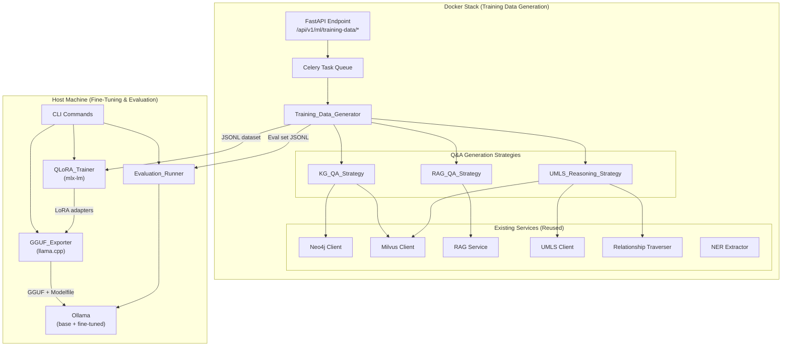

# Design Document: Medical Knowledge Fine-Tuning Pipeline

## Overview

This design describes a three-pipeline system that transforms the Librarian's curated medical knowledge infrastructure into training data for fine-tuning a local LLM. The system leverages the existing Neo4j knowledge graph (7.1M nodes, 35.3M relationships), Milvus vector store (356K chunks), and RAG pipeline to generate high-quality medical Q&A instruction-tuning pairs, fine-tune Llama 3.2 3B using QLoRA via Apple MLX on M2 Max, and evaluate improvement against RAG-generated gold answers.

The architecture splits across two execution environments:

1. **Docker stack** (training data generation): Celery tasks orchestrate Q&A pair generation using existing Neo4j, Milvus, and RAG services. A new FastAPI endpoint triggers and monitors generation jobs.
2. **Host machine** (fine-tuning + evaluation): CLI commands run QLoRA training via `mlx-lm` with native Metal GPU acceleration, export to GGUF for Ollama, and execute before/after evaluation.

### Design Decisions

1. **Three Q&A generation strategies over a single approach**: Each strategy exploits a different facet of the knowledge infrastructure — KG concept-chunk links, RAG multi-source synthesis, and UMLS relationship traversal. This produces diverse training data covering factual recall, cited reasoning, and multi-hop clinical reasoning.

2. **Celery tasks for data generation, CLI for training**: Data generation requires access to Neo4j, Milvus, and the RAG pipeline running inside Docker. Fine-tuning requires Metal GPU access on the host. This split avoids mounting GPU resources into Docker while reusing the existing Celery infrastructure.

3. **MLX `mlx-lm` over PyTorch/Hugging Face Trainer**: `mlx-lm` provides native Metal acceleration on Apple Silicon with built-in QLoRA support. PyTorch MPS backend has incomplete LoRA support and higher memory overhead. MLX's unified memory model is ideal for the 32GB M2 Max.

4. **QLoRA (4-bit) over full LoRA (16-bit)**: With 32GB unified memory, 4-bit quantization of Llama 3.2 3B (~1.7GB quantized) leaves ample headroom for LoRA adapters, optimizer states, and activation memory. Full 16-bit would consume ~6GB for weights alone, leaving less room for batch processing.

5. **Llama 3.2 3B over larger models**: The 3B parameter model fits comfortably in 32GB with 4-bit quantization. It's already running locally via Ollama for bridge generation, so the infrastructure exists. Larger models (8B+) would constrain batch size and training speed.

6. **GGUF export via llama.cpp over MLX-native inference**: Ollama uses GGUF format and is already deployed on the host for bridge generation. Exporting to GGUF enables side-by-side comparison of base and fine-tuned models through the same Ollama interface.

7. **Embedding-based + concept-overlap evaluation over LLM-as-judge**: Using the existing BAAI/bge-base-en-v1.5 embedding model and NER_Extractor for scoring avoids external API dependencies and produces reproducible numeric scores. LLM-as-judge would require an external API call per evaluation and introduces non-determinism.

8. **Deduplication by normalized string similarity (0.95 threshold) over exact match**: Medical questions can be phrased differently but ask the same thing. A similarity threshold catches near-duplicates while preserving genuinely distinct questions about the same concept. The threshold was raised from 0.85 to 0.95 after testing showed that 0.85 was too aggressive, removing the majority of generated pairs.

9. **Semantic-type-aware question templates over a flat template list**: Question templates are organised by UMLS semantic type (`TEMPLATES_BY_SEMANTIC_TYPE`) rather than a single flat list. Templates are derived from common question-stem patterns in MedQA (USMLE-style), MedMCQA (AIIMS/NEET PG), and PubMedQA benchmarks. This ensures clinically appropriate questions per concept category — e.g., "mechanism of action" only for Pharmacologic Substance, "pathophysiology" only for Disease or Syndrome — reducing wasted RAG calls on nonsensical pairings and improving training data quality.

## Architecture



## Components and Interfaces

### 1. Training_Data_Generator

Orchestrates Q&A pair generation from all three strategies, handles deduplication, shuffling, quality validation, and JSONL export. Runs as a Celery task inside Docker.

```python
class TrainingDataGenerator:
    """Orchestrates medical Q&A training data generation."""
    
    def __init__(
        self,
        neo4j_client: Neo4jClient,
        vector_client: MilvusClient,
        rag_service: RAGService,
        umls_client: UMLSClient,
        relationship_traverser: RelationshipTraverser,
        ner_extractor: NER_Extractor,
    ): ...
    
    async def generate(
        self,
        config: TrainingDataConfig,
    ) -> TrainingDataResult:
        """Run all strategies, deduplicate, validate, export."""
        ...
    
    async def validate_dataset(
        self,
        pairs: List[InstructionTuningPair],
    ) -> ValidationResult:
        """Quality-check pairs: min length, UMLS concept presence, structure."""
        ...
    
    def deduplicate(
        self,
        pairs: List[InstructionTuningPair],
        similarity_threshold: float = 0.85,
    ) -> List[InstructionTuningPair]:
        """Remove near-duplicate pairs by normalized instruction similarity."""
        ...
    
    def export_jsonl(
        self,
        pairs: List[InstructionTuningPair],
        output_path: Path,
        seed: int = 42,
    ) -> DatasetSummary:
        """Shuffle and write JSONL with metadata."""
        ...
    
    @staticmethod
    def parse_jsonl(
        input_path: Path,
    ) -> List[InstructionTuningPair]:
        """Parse JSONL file into InstructionTuningPair objects."""
        ...
    
    @staticmethod
    def print_jsonl(
        pairs: List[InstructionTuningPair],
        output_path: Path,
    ) -> None:
        """Serialize InstructionTuningPair objects to JSONL."""
        ...
```

### 2. KG_QA_Strategy

Generates Q&A pairs from Concept→EXTRACTED_FROM→Chunk relationships in Neo4j.

```python
class KGQAStrategy:
    """Generate Q&A pairs from knowledge graph concept-chunk links."""
    
    def __init__(
        self,
        neo4j_client: Neo4jClient,
        vector_client: MilvusClient,
    ): ...
    
    async def generate(
        self,
        target_count: int,
        min_chunk_tokens: int = 50,
        progress_callback: Optional[Callable] = None,
    ) -> List[InstructionTuningPair]:
        """
        Query Concept nodes with EXTRACTED_FROM edges and UMLS metadata.
        For each concept, retrieve linked chunk content from Milvus,
        generate question from concept metadata, extract answer from chunk.
        Skip pairs where chunk has < min_chunk_tokens relevant content.
        """
        ...
```

**Cypher query pattern** for concept selection:
```cypher
MATCH (c:Concept)-[e:EXTRACTED_FROM]->(ch:Chunk)
WHERE c.cui IS NOT NULL 
  AND c.semantic_type IS NOT NULL
WITH c, collect(ch.chunk_id) AS chunk_ids, count(e) AS edge_count
WHERE edge_count >= 1
RETURN c.name AS name, c.cui AS cui, c.semantic_type AS semantic_type,
       c.synonyms AS synonyms, chunk_ids
ORDER BY edge_count DESC
LIMIT $limit
```

### 3. RAG_QA_Strategy

Generates Q&A pairs by running seed questions through the existing RAG pipeline.

```python
class RAGQAStrategy:
    """Generate Q&A pairs using RAG pipeline gold answers."""
    
    def __init__(
        self,
        rag_service: RAGService,
        neo4j_client: Neo4jClient,
        umls_client: UMLSClient,
    ): ...
    
    async def generate_seed_questions(
        self,
        target_count: int,
    ) -> List[SeedQuestion]:
        """
        Generate seed questions from two sources:
        1. UMLS concept names with clinical semantic types
           (using TEMPLATES_BY_SEMANTIC_TYPE for type-appropriate questions)
        2. Semantic-type-aware medical question templates filled with
           concept names (derived from MedQA, MedMCQA, PubMedQA
           benchmark question-stem patterns)
        """
        ...
    
    async def generate(
        self,
        target_count: int,
        min_citations: int = 2,
        progress_callback: Optional[Callable] = None,
    ) -> List[InstructionTuningPair]:
        """
        Run seed questions through RAG_Service, capture cited responses.
        Flag pairs with < min_citations as low-confidence.
        Skip questions where RAG fails to respond.
        """
        ...
```

### 4. UMLS_Reasoning_Strategy

Generates multi-hop reasoning Q&A pairs by traversing UMLS relationship edges.

```python
class UMLSReasoningStrategy:
    """Generate multi-hop reasoning Q&A from UMLS relationships."""
    
    def __init__(
        self,
        relationship_traverser: RelationshipTraverser,
        umls_client: UMLSClient,
        vector_client: MilvusClient,
    ): ...
    
    async def generate(
        self,
        target_count: int,
        max_hops: int = 2,
        relationship_types: List[str] = None,
        progress_callback: Optional[Callable] = None,
    ) -> List[InstructionTuningPair]:
        """
        Use RelationshipTraverser to find 1-hop and 2-hop paths.
        Generate relationship-based questions and reasoning answers.
        Retrieve supporting chunk content via EXTRACTED_FROM edges.
        Skip paths with no supporting chunk content.
        Default relationship_types: CAUSES, TREATS, TREATED_BY,
        PRESENTS_WITH, IS_A, PART_OF.
        """
        ...
```

### 5. QLoRA_Trainer

Runs on the host machine. Wraps `mlx-lm` for QLoRA fine-tuning with Metal acceleration.

```python
class QLoRATrainer:
    """QLoRA fine-tuning via mlx-lm on Apple Silicon."""
    
    def __init__(self, config: TrainingConfig): ...
    
    def train(self) -> TrainingSummary:
        """
        1. Load base model in 4-bit via mlx_lm.load()
        2. Apply LoRA adapters to target modules
        3. Format dataset into chat template
        4. Train with mlx_lm.lora.train()
        5. Monitor memory, reduce batch size if > 28GB
        6. Save adapter weights
        """
        ...
    
    def _format_dataset(
        self,
        dataset_path: Path,
    ) -> Path:
        """Convert JSONL to mlx-lm chat format."""
        ...
```

**mlx-lm training configuration**:
```yaml
model: "mlx-community/Llama-3.2-3B-Instruct-4bit"
adapter_path: "./adapters"
data: "./training_data"
train: true
lora_layers: 16
lora_parameters:
  rank: 16
  alpha: 32
  keys: ["self_attn.q_proj", "self_attn.v_proj", "self_attn.k_proj", "self_attn.o_proj"]
learning_rate: 1e-4
batch_size: 4
grad_accumulation_steps: 4
iters: -1  # determined by epochs
epochs: 3
warmup_ratio: 0.03
save_every: 100
```

### 6. GGUF_Exporter

Merges LoRA adapters with base model and converts to GGUF for Ollama.

```python
class GGUFExporter:
    """Export fine-tuned model to GGUF for Ollama deployment."""
    
    def __init__(self, config: ExportConfig): ...
    
    def export(self) -> ExportResult:
        """
        1. Fuse LoRA adapters with base model via mlx_lm.fuse()
        2. Convert fused model to GGUF via llama.cpp convert script
        3. Quantize to Q4_K_M (configurable)
        4. Generate Ollama Modelfile
        5. Register with Ollama via 'ollama create'
        """
        ...
    
    def _generate_modelfile(
        self,
        gguf_path: Path,
        model_name: str,
    ) -> Path:
        """Generate Ollama Modelfile with system prompt and parameters."""
        ...
```

**Ollama Modelfile template**:
```
FROM ./librarian-medical-3b.gguf
PARAMETER temperature 0.7
PARAMETER top_p 0.9
PARAMETER num_ctx 4096
SYSTEM """You are a medical knowledge assistant trained on curated medical textbooks, clinical guidelines, and biomedical literature. Provide accurate, evidence-based responses to medical questions."""
```

### 7. Evaluation_Runner

Runs on the host machine. Compares base vs fine-tuned model responses against gold answers.

```python
class EvaluationRunner:
    """Before/after model evaluation with gold answers."""
    
    def __init__(self, config: EvaluationConfig): ...
    
    async def generate_eval_set(
        self,
        rag_service: RAGService,
        neo4j_client: Neo4jClient,
        training_questions: Set[str],
        count: int = 50,
        min_semantic_types: int = 5,
    ) -> EvaluationSet:
        """
        Select 50 questions spanning 5+ UMLS semantic types.
        Exclude training set questions. Generate gold answers via RAG.
        Replace failed questions with alternatives from same type.
        """
        ...
    
    async def evaluate(
        self,
        eval_set_path: Path,
        base_model: str,
        finetuned_model: str,
    ) -> ComparisonReport:
        """
        Send each question to both models via Ollama.
        Score with embedding similarity + UMLS concept recall.
        Produce per-question and aggregate comparison.
        """
        ...
    
    async def _score_response(
        self,
        response: str,
        gold_answer: str,
    ) -> ResponseScore:
        """
        1. Semantic similarity via bge-base-en-v1.5 embeddings
        2. Factual overlap via NER_Extractor concept recall
        """
        ...
```

### 8. FastAPI Endpoint

Integrates training data generation into the existing API.

```python
# src/multimodal_librarian/api/routers/ml_training.py
router = APIRouter(prefix="/api/v1/ml/training-data", tags=["ml-training"])

@router.post("/generate")
async def start_generation(
    config: TrainingDataRequest,
    celery_service = Depends(get_celery_service),
) -> TrainingDataJobResponse:
    """Start async training data generation via Celery."""
    ...

@router.get("/status/{job_id}")
async def get_status(job_id: str) -> TrainingDataStatusResponse:
    """Poll generation job status."""
    ...

@router.get("/download/{job_id}")
async def download_dataset(job_id: str) -> FileResponse:
    """Download completed dataset JSONL."""
    ...
```

### 9. CLI Commands

Host-side commands for fine-tuning, export, and evaluation.

```python
# src/multimodal_librarian/ml/finetune.py
# python -m multimodal_librarian.ml.finetune --dataset <path> [options]

# src/multimodal_librarian/ml/export.py  
# python -m multimodal_librarian.ml.export --adapter <path> --output <path>

# src/multimodal_librarian/ml/evaluate.py
# python -m multimodal_librarian.ml.evaluate --eval-set <path> --base-model <name> --finetuned-model <name>
```

Each CLI command displays a progress bar (via `tqdm` or `rich`), logs elapsed time and ETA, and provides descriptive error messages with corrective suggestions on failure.

## Data Models

### InstructionTuningPair

The core training data unit, serialized to/from JSONL.

```python
@dataclass
class InstructionTuningPair:
    instruction: str          # The question
    context: str              # Supporting context (chunk excerpt, relationship chain, etc.)
    response: str             # The answer
    metadata: PairMetadata    # Strategy, source concepts, confidence score

@dataclass
class PairMetadata:
    strategy: str             # "kg", "rag", or "umls_reasoning"
    source_concepts: List[str]  # UMLS CUIs or concept names involved
    confidence_score: float   # 0.0-1.0
    source_document: Optional[str] = None
    chunk_ids: Optional[List[str]] = None
    relationship_chain: Optional[str] = None  # For UMLS reasoning pairs
```

**JSONL format** (one per line):
```json
{"instruction": "What is metformin and how is it used in clinical practice?", "context": "Metformin is a biguanide oral antidiabetic...", "response": "Metformin is a first-line medication for type 2 diabetes...", "metadata": {"strategy": "kg", "source_concepts": ["C0025598"], "confidence_score": 0.92, "source_document": "Harrison's Principles of Internal Medicine", "chunk_ids": ["abc-123"]}}
```

### TrainingDataConfig

```python
@dataclass
class TrainingDataConfig:
    target_pair_count: int = 7500
    strategies: List[str] = field(default_factory=lambda: ["kg", "rag", "umls_reasoning"])
    random_seed: int = 42
    min_confidence_score: float = 0.5
    min_chunk_tokens: int = 50
    similarity_threshold: float = 0.85  # Deduplication threshold (raised to 0.95 in implementation)
    output_dir: str = "./training_data"
```

### TrainingConfig

```python
@dataclass
class TrainingConfig:
    model_name: str = "mlx-community/Llama-3.2-3B-Instruct-4bit"
    dataset_path: str = ""
    output_dir: str = "./adapters"
    lora_rank: int = 16
    lora_alpha: int = 32
    target_modules: List[str] = field(default_factory=lambda: ["q_proj", "v_proj", "k_proj", "o_proj"])
    learning_rate: float = 1e-4
    batch_size: int = 4
    grad_accumulation_steps: int = 4
    epochs: int = 3
    warmup_ratio: float = 0.03
    max_memory_gb: float = 28.0
    save_every: int = 100
    log_every: int = 10
```

### EvaluationSet

```python
@dataclass
class EvaluationQuestion:
    question: str
    gold_answer: str
    semantic_type: str
    source_citations: List[str]
    difficulty_level: str  # "single-concept", "multi-concept", "reasoning"

@dataclass
class EvaluationSet:
    questions: List[EvaluationQuestion]
    metadata: Dict[str, Any]  # Generation timestamp, semantic type distribution
```

### ComparisonReport

```python
@dataclass
class ResponseScore:
    semantic_similarity: float  # 0.0-1.0 cosine similarity
    concept_recall: float       # 0.0-1.0 UMLS concept overlap

@dataclass
class QuestionResult:
    question: str
    gold_answer: str
    base_response: str
    finetuned_response: str
    base_score: ResponseScore
    finetuned_score: ResponseScore
    semantic_type: str
    difficulty_level: str

@dataclass
class ComparisonReport:
    results: List[QuestionResult]
    base_mean_similarity: float
    finetuned_mean_similarity: float
    improvement_delta: float
    by_semantic_type: Dict[str, Dict[str, float]]
    by_difficulty: Dict[str, Dict[str, float]]
    flagged: bool  # True if improvement < 5%
    recommendations: List[str]
```


## Correctness Properties

*A property is a characteristic or behavior that should hold true across all valid executions of a system — essentially, a formal statement about what the system should do. Properties serve as the bridge between human-readable specifications and machine-verifiable correctness guarantees.*

### Property 1: Instruction tuning pair structural validity

*For any* InstructionTuningPair produced by any of the three generation strategies (KG, RAG, UMLS Reasoning), the pair SHALL have a non-empty `instruction` field, a non-empty `context` field, a non-empty `response` field, and a `metadata` object with a valid `strategy` value and a `confidence_score` between 0.0 and 1.0.

**Validates: Requirements 1.6, 2.6, 4.4**

### Property 2: KG question generation includes concept name

*For any* Concept with a non-empty name, semantic type, and at least one synonym, the question generated by KG_QA_Strategy SHALL contain the concept name (case-insensitive match).

**Validates: Requirements 1.3**

### Property 3: KG answer preserves source attribution

*For any* Concept-Chunk pair where the chunk has a source document title and chunk ID, the answer generated by KG_QA_Strategy SHALL include both the source document title and the chunk ID in the output.

**Validates: Requirements 1.4**

### Property 4: Short chunk filtering

*For any* chunk with fewer than 50 tokens of content, the KG_QA_Strategy SHALL skip that Concept-Chunk pair. *For any* chunk with 50 or more tokens, the pair SHALL be processed (not skipped due to length).

**Validates: Requirements 1.5**

### Property 5: Low-confidence flagging by citation count

*For any* RAG response with fewer than 2 source citations, the resulting InstructionTuningPair SHALL have `metadata.confidence_score` below the confidence threshold. *For any* RAG response with 2 or more citations, the pair SHALL NOT be flagged as low-confidence.

**Validates: Requirements 2.3**

### Property 6: Relationship question references all path concepts

*For any* relationship path (1-hop or 2-hop) between UMLS concepts, the question generated by UMLS_Reasoning_Strategy SHALL reference all concept names in the path. For a 1-hop path (A→B), both A and B appear. For a 2-hop path (A→B→C), all three appear.

**Validates: Requirements 3.2, 3.3**

### Property 7: UMLS reasoning context contains relationship chain

*For any* InstructionTuningPair produced by UMLS_Reasoning_Strategy, the `context` field SHALL contain the relationship chain (e.g., "Drug_A TREATS Disease_B") describing the traversed path.

**Validates: Requirements 3.6**

### Property 8: Deduplication preserves unique pairs and removes near-duplicates

*For any* list of InstructionTuningPairs, after deduplication with threshold 0.95: (a) no two remaining pairs have instruction similarity ≥ 0.95, and (b) every removed pair has similarity ≥ 0.95 with at least one remaining pair.

**Validates: Requirements 4.2**

### Property 9: Deterministic shuffling with seed

*For any* list of InstructionTuningPairs and any random seed, shuffling the list twice with the same seed SHALL produce identical orderings.

**Validates: Requirements 4.3**

### Property 10: Chat template formatting preserves content

*For any* valid InstructionTuningPair, formatting it into the Llama chat template SHALL produce a string that contains the original instruction text, context text, and response text.

**Validates: Requirements 5.3**

### Property 11: Modelfile contains required directives

*For any* GGUF file path and model name, the generated Ollama Modelfile SHALL contain a `FROM` directive referencing the GGUF path, at least one `PARAMETER` directive, and a `SYSTEM` directive with a non-empty system prompt.

**Validates: Requirements 6.3**

### Property 12: Evaluation set excludes training questions

*For any* training dataset and generated evaluation set, the intersection of training instruction texts and evaluation question texts SHALL be empty.

**Validates: Requirements 7.2**

### Property 13: Evaluation set JSONL format

*For any* exported evaluation set, each JSONL line SHALL contain the fields: `question`, `gold_answer`, `semantic_type`, `source_citations`, and `difficulty_level`, all non-empty.

**Validates: Requirements 7.5**

### Property 14: Scoring metrics are bounded and well-behaved

*For any* response and gold_answer pair: (a) semantic similarity score is in [0.0, 1.0], (b) concept recall score is in [0.0, 1.0], (c) when the response is identical to the gold_answer, semantic similarity is ≥ 0.95, and (d) when the response contains all UMLS concepts from the gold_answer, concept recall is 1.0.

**Validates: Requirements 8.2, 8.3**

### Property 15: Improvement flagging threshold

*For any* comparison report where the fine-tuned model's mean semantic similarity improvement over the base model is less than 5%, the report SHALL be flagged with `flagged=True` and contain at least one recommendation. When improvement is ≥ 5%, `flagged` SHALL be `False`.

**Validates: Requirements 8.6**

### Property 16: Dataset validation correctly partitions pairs

*For any* list of InstructionTuningPairs, validation SHALL partition them into accepted and rejected sets such that: (a) every accepted pair has response length ≥ 50 tokens, non-empty instruction, non-empty context, valid JSON structure, and at least one NER-recognized UMLS concept in the response, and (b) every rejected pair fails at least one of these checks and has a non-empty rejection reason.

**Validates: Requirements 11.1, 11.2, 11.3**

### Property 17: Quality warning threshold

*For any* validation result where the pass rate (accepted / total) falls below 0.70, a warning SHALL be logged. When pass rate is ≥ 0.70, no warning SHALL be logged.

**Validates: Requirements 11.5**

### Property 18: JSONL round-trip serialization

*For any* valid InstructionTuningPair, serializing it to a JSONL line and then parsing that line back SHALL produce an InstructionTuningPair that is equivalent to the original (all fields match, including metadata).

**Validates: Requirements 12.1, 12.2, 12.3**

### Property 19: Graceful handling of invalid JSONL lines

*For any* JSONL file containing a mix of valid and invalid lines (malformed JSON or missing required fields), parsing SHALL return InstructionTuningPair objects for all valid lines and skip all invalid lines, with each skipped line producing a log entry containing the line number.

**Validates: Requirements 12.4**

## Error Handling

### Training Data Generation (Docker)

| Error Condition | Handling Strategy |
|---|---|
| Neo4j connection failure during KG strategy | Log error, skip KG strategy, continue with RAG and UMLS strategies. Report partial generation in summary. |
| Milvus connection failure during chunk retrieval | Log error, skip affected concept-chunk pairs. Continue with concepts that have cached or already-retrieved chunks. |
| RAG_Service timeout or failure for a question | Skip that question, log failure reason with question text. Continue processing remaining questions (Req 2.4). |
| RelationshipTraverser timeout | Skip affected concept pairs. Log timeout with concept CUIs. Continue with remaining pairs (existing 3.0s timeout). |
| Celery task hard timeout | Task fails with timeout status. Progress is persisted in Redis. User can retry via API. |
| Dataset has < 1,000 pairs after dedup | Log warning with per-strategy counts (Req 4.7). Do not fail — export whatever was generated. |
| Quality pass rate < 70% | Log warning recommending strategy parameter review (Req 11.5). Continue with accepted pairs. |

### Fine-Tuning (Host)

| Error Condition | Handling Strategy |
|---|---|
| MLX model download failure | CLI displays error with model name and suggests checking network/HuggingFace access. Exit with code 1. |
| Peak memory > 28GB | Reduce batch size by half, restart current epoch (Req 5.7). Log the adjustment. If batch_size reaches 1 and still exceeds, abort with memory error. |
| JSONL dataset parse error | Skip invalid lines, log line numbers. If > 50% lines are invalid, abort with dataset quality error. |
| Training NaN loss | Abort training, save last valid checkpoint. Suggest reducing learning rate in error message. |
| Adapter save failure (disk space) | Abort with descriptive error including required disk space estimate. |

### Export (Host)

| Error Condition | Handling Strategy |
|---|---|
| mlx_lm.fuse failure | Log error with adapter/model paths. Suggest verifying adapter compatibility. Exit with code 1. |
| llama.cpp conversion failure | Log error with conversion command. Suggest installing llama.cpp. Exit with code 1. |
| Ollama not running | Save GGUF and Modelfile to output directory. Log instructions for manual `ollama create` (Req 6.5). Exit with code 0. |

### Evaluation (Host)

| Error Condition | Handling Strategy |
|---|---|
| Ollama model not found | Log error with model name. Suggest `ollama pull` or `ollama create`. Exit with code 1. |
| Embedding model unavailable | Fall back to local sentence-transformers model. Log the fallback. |
| RAG_Service failure for eval question | Replace with alternative question from same semantic type (Req 7.4). If no alternatives available, reduce eval set size and note in report. |
| NER_Extractor failure during scoring | Use embedding similarity only. Set concept_recall to -1.0 to indicate unavailable. Note in report. |

## Testing Strategy

### Property-Based Testing

This feature is well-suited for property-based testing. The core data transformation pipeline (generation → serialization → validation → deduplication) involves pure functions with clear input/output behavior and universal properties that hold across a wide input space.

**Library**: [Hypothesis](https://hypothesis.readthedocs.io/) (already used in the project — `.hypothesis/` directory exists)

**Configuration**: Minimum 100 iterations per property test.

**Tag format**: `# Feature: medical-knowledge-finetuning, Property {N}: {title}`

Properties 1–19 from the Correctness Properties section above will each be implemented as a single Hypothesis property-based test. Key implementation notes:

- **Properties 1–7** (generation strategies): Use Hypothesis `@given` with custom strategies generating random concept metadata, chunk content, relationship paths, and RAG responses. Mock Neo4j/Milvus/RAG at the function boundary.
- **Property 8** (deduplication): Generate random lists of instruction strings with controlled similarity. Verify the deduplication invariant.
- **Property 9** (deterministic shuffle): Generate random lists and seeds. Verify idempotence.
- **Property 10** (chat template): Generate random InstructionTuningPairs. Verify content preservation.
- **Properties 14** (scoring bounds): Generate random embedding vectors and concept sets. Verify mathematical bounds.
- **Property 18** (round-trip): Generate random InstructionTuningPairs with arbitrary Unicode content. Verify `parse(print(x)) == x`.
- **Property 19** (graceful parsing): Generate JSONL files with random mix of valid/invalid lines. Verify correct partitioning.

### Unit Tests

Unit tests complement property tests for specific examples and edge cases:

- **KG_QA_Strategy**: Test with specific concept types (Pharmacologic Substance, Disease or Syndrome) to verify question template selection.
- **RAG_QA_Strategy**: Test seed question generation from each of the two sources independently.
- **UMLS_Reasoning_Strategy**: Test specific relationship chains (e.g., Aspirin TREATS Headache, Headache PRESENTS_WITH Photophobia).
- **Deduplication**: Test exact duplicates, near-duplicates at boundary (0.84 vs 0.86 similarity), and completely distinct pairs.
- **Validation**: Test edge cases — response with exactly 50 tokens, empty metadata fields, Unicode content.
- **CLI argument parsing**: Test each CLI command with valid and invalid argument combinations.

### Integration Tests

- **End-to-end data generation**: Run a small-scale generation (target 50 pairs) against test Neo4j/Milvus instances with known data. Verify output JSONL structure and content.
- **API endpoints**: Test POST /generate, GET /status, GET /download lifecycle with mocked Celery.
- **Evaluation pipeline**: Run evaluation with mocked Ollama responses against a known eval set. Verify report structure and score calculations.

### Test File Organization

```
tests/
├── ml/
│   ├── test_training_data_generator.py      # Unit + property tests for orchestrator
│   ├── test_kg_qa_strategy.py               # Unit + property tests for KG strategy
│   ├── test_rag_qa_strategy.py              # Unit + property tests for RAG strategy
│   ├── test_umls_reasoning_strategy.py      # Unit + property tests for UMLS strategy
│   ├── test_qlora_trainer.py                # Unit tests for trainer config/formatting
│   ├── test_gguf_exporter.py                # Unit tests for export pipeline
│   ├── test_evaluation_runner.py            # Unit + property tests for evaluation
│   ├── test_instruction_tuning_pair.py      # Property tests for serialization round-trip
│   └── test_dataset_validation.py           # Property tests for validation logic
├── integration/
│   └── test_ml_training_api.py              # API endpoint integration tests
```

## Post-Implementation Changes

This section documents architectural changes made during live pipeline testing that deviate from or extend the original design.

### Change 1: Local Ollama LLM replaces Gemini for training data generation

**Problem:** The RAG Q&A strategy and eval set gold answer generation originally used `AIService` (Gemini) for LLM inference. This incurred significant API costs ($125 during testing) and created a dependency on an external service for a batch pipeline.

**Solution:** Created `OllamaAIService` (`src/multimodal_librarian/services/ollama_ai_service.py`) — a drop-in replacement for `AIService` that routes `generate_response()` calls to a local Ollama instance. The training task (`ml_training_tasks.py`) now imports `OllamaAIService` instead of `AIService` for both RAG training data generation and eval set gold answer generation.

**Key details:**
- Model configurable via `OLLAMA_TRAINING_MODEL` env var (default: `llama3.1:8b`, currently using `llama3.2:3b` for speed)
- Timeout configurable via `OLLAMA_TRAINING_TIMEOUT` env var (default: 180s)
- Host resolved via `OLLAMA_HOST` env var (Docker containers use `http://host.docker.internal:11434`)
- `AIService` (Gemini) is no longer imported anywhere in `ml_training_tasks.py`
- User-facing chat continues to use Gemini via `AIService`
- Bridge generation and KG extraction continue to use `llama3.2:3b` via the existing `OllamaClient`

**Files changed:**
- `src/multimodal_librarian/services/ollama_ai_service.py` (new)
- `src/multimodal_librarian/services/ml_training_tasks.py` (modified)
- `docker-compose.yml` (new env vars added to celery-worker)

### Change 2: Pre-flight verification gate

**Problem:** If Ollama is down or the training model isn't installed, the pipeline would fail deep into execution after wasting time on KG/UMLS generation.

**Solution:** `OllamaAIService.verify_available()` sends a test prompt to Ollama before any expensive work begins. It checks: (1) Ollama is reachable, (2) the model exists in Ollama's model list, (3) a trivial inference call succeeds. If any check fails, the task aborts immediately with a `PREFLIGHT FAILED` error.

**Additionally:** The Celery task logs `"LLM provider for RAG/eval: OllamaAIService (OLLAMA_TRAINING_MODEL=...). Gemini is NOT used."` at startup for operator verification.

### Change 3: Skip query classification for training pipeline

**Problem:** Each RAG call made 2 Ollama inferences: one for LLM-based query intent classification (SEARCH/NO_SEARCH/WEB_SEARCH) and one for response generation. For training data generation, every seed question is known to need document search, making the classification call wasteful.

**Solution:** Added `skip_query_classification: bool = False` parameter to `RAGService.generate_response()`. When `True`, the method bypasses `QueryProcessor._classify_query_intent()` and goes straight to document search. The RAG Q&A strategy passes `skip_query_classification=True` for all training seed questions.

**Files changed:**
- `src/multimodal_librarian/services/rag_service.py` (new parameter on `generate_response`)
- `src/multimodal_librarian/ml/rag_qa_strategy.py` (passes `skip_query_classification=True`)

### Change 4: Deduplication threshold raised to 0.95

**Problem:** The original 0.85 threshold was too aggressive — it removed the vast majority of generated pairs (e.g., 7,500 raw → 4 unique at 0.85). The dedup logic removes pairs with similarity >= threshold, so a lower threshold is more aggressive.

**Solution:** Raised `similarity_threshold` from 0.85 to 0.95 in `TrainingDataConfig`, meaning only near-identical pairs (≥95% similar) are removed.

**Files changed:**
- `src/multimodal_librarian/ml/models.py` (`TrainingDataConfig.similarity_threshold = 0.95`)

### Change 5: End-to-end pipeline orchestration script

**Problem:** The original design had separate CLI commands for each phase. Running the full pipeline required manual coordination: trigger API → poll → download → finetune → export → evaluate.

**Solution:** Created `scripts/run-training-pipeline.py` that orchestrates all 4 phases end-to-end with live progress output, resume capability (`--start-from`), and cleanup of old runs (`--cleanup`).

**Pipeline phases:**
1. Phase 1 (Docker): Trigger data generation via API → poll for completion → download dataset + eval set
2. Phase 2 (Host): QLoRA fine-tuning via `mlx-lm`
3. Phase 3 (Host): GGUF export + Ollama registration
4. Phase 4 (Host): Before/after evaluation

**Key features:**
- `--start-from finetune|export|evaluate` for resuming failed runs
- `--cleanup --keep N` for removing old training runs and freeing disk space
- Timestamped run directories under `training_runs/`
- `MAX_POLL_MINUTES = 480` (8 hours) for RAG-heavy runs
- Makefile targets: `make ml-pipeline`, `make ml-pipeline-small`, `make ml-finetune`, `make ml-export`, `make ml-evaluate`, `make ml-cleanup`

**Files added:**
- `scripts/run-training-pipeline.py`
- Makefile targets

### Change 6: Ollama Modelfile tuning for repetition prevention

**Problem:** The fine-tuned model produced repetition loops during inference, generating the same phrases repeatedly.

**Solution:** Added `num_predict 512` and `repeat_penalty 1.2` parameters to the generated Ollama Modelfile in `GGUFExporter._generate_modelfile()`.

**Files changed:**
- `src/multimodal_librarian/ml/gguf_exporter.py`

### Change 7: Ollama model quantization during registration

**Problem:** The dequantized fused model was 6.4 GB (fp16), causing slow inference and timeouts. Ollama was importing it without re-quantizing.

**Solution:** Added `--quantize q4_K_M` flag to the `ollama create` command in `GGUFExporter._register_with_ollama()`, reducing the registered model to ~2.0 GB.

**Files changed:**
- `src/multimodal_librarian/ml/gguf_exporter.py`

### Neo4j Schema Corrections

During live testing, several Cypher queries were corrected to match the actual Neo4j schema:

- **Actual schema:** `Concept` → `SAME_AS` → `UMLSConcept` (has `cui`, `preferred_name`) → `HAS_SEMANTIC_TYPE` → `UMLSSemanticType` (has `type_name`, `type_id`). UMLS relationships are `UMLS_REL` edges with `rela_type` property.
- **KG strategy:** Fixed concept query to join through `SAME_AS→UMLSConcept→HAS_SEMANTIC_TYPE→UMLSSemanticType` instead of accessing `c.cui`/`c.semantic_type` directly.
- **UMLS strategy:** Fixed relationship queries to use `UMLS_REL.rela_type` with a mapping dict (`_RELA_TO_TEMPLATE_KEY`) instead of typed relationship edges.
- **RAG strategy:** Fixed `_UMLS_CONCEPTS_BY_SEMANTIC_TYPE_QUERY` to join through `HAS_SEMANTIC_TYPE→UMLSSemanticType` instead of accessing `c.semantic_type` directly.
