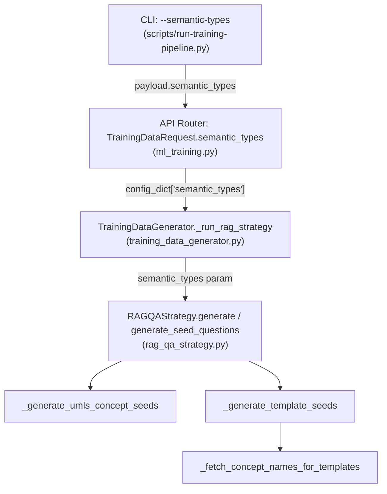

# Design Document: Stratified Training Data

## Overview

This feature modifies the RAG Q&A strategy's seed question generation to support a configurable semantic type inclusion list and stratified budget allocation. Currently, `RAGQAStrategy.generate_seed_questions` iterates over all 28 `CLINICAL_SEMANTIC_TYPES`, producing a heavily skewed training distribution — 51% of pairs go to types not even evaluated, while evaluated types like "Sign or Symptom" receive as little as 1.8%. The existing `--semantic-types` CLI parameter only performs post-hoc filtering (Step 3a in the pipeline script), which wastes generation budget on types that are later discarded.

The design threads a `semantic_types: Optional[List[str]]` parameter from the CLI through the API request, Celery task config, `TrainingDataGenerator`, and into `RAGQAStrategy`, where it controls which types are iterated during seed generation. When provided, the budget is split evenly across the included types (`target_count // len(semantic_types)` per type), with remainder distributed to the first types in the list. When omitted, the existing behavior (all 28 types) is preserved.

### Design Goals

1. **Generation-time inclusion** — Only query Neo4j for concepts in the specified types, avoiding wasted LLM calls.
2. **Stratified budget** — Even distribution across included types so the fine-tuned model trains equally on all evaluated categories.
3. **Backward compatibility** — `None` means "use all 28 types" everywhere, preserving existing behavior for callers that don't specify the parameter.
4. **Minimal surface area** — Thread a single `Optional[List[str]]` through the existing call chain; no new classes or services.

## Architecture

The change is a vertical slice through four layers, each passing the inclusion list to the next:



No new services, databases, or infrastructure are introduced. The change is purely additive to existing function signatures and data structures.

## Components and Interfaces

### 1. TrainingDataConfig (models.py)

Add a single field:

```python
@dataclass
class TrainingDataConfig:
    # ... existing fields ...
    semantic_types: Optional[List[str]] = None
```

When `None`, all downstream code falls back to `CLINICAL_SEMANTIC_TYPES`. When set, it is an ordered list of type strings (e.g., the 5 eval types).

### 2. CLI Orchestrator (scripts/run-training-pipeline.py)

The existing `--semantic-types` argument already accepts `nargs="*"`. Changes:

- When values are provided, include `"semantic_types": args.semantic_types` in the API request payload.
- When values are provided, **skip Step 3a** (the post-hoc JSON filtering loop), since filtering now happens at generation time.
- When not provided, omit `semantic_types` from the payload (server defaults to `None`).

### 3. API Router (ml_training.py)

Add `semantic_types` to `TrainingDataRequest`:

```python
class TrainingDataRequest(BaseModel):
    # ... existing fields ...
    semantic_types: Optional[List[str]] = Field(
        default=None,
        description="Semantic types to include in generation. "
                    "When omitted, all 28 clinical types are used.",
    )
```

In `start_generation`, conditionally include it in `config_dict`:

```python
if config.semantic_types is not None:
    config_dict["semantic_types"] = config.semantic_types
```

### 4. TrainingDataGenerator (training_data_generator.py)

In `_run_rag_strategy`, pass `config.semantic_types` to `RAGQAStrategy.generate`:

```python
result = await strategy.generate(
    target_count=target_count,
    semantic_types=config.semantic_types,  # NEW
    progress_callback=_rag_progress,
    partial_save_path=partial_path,
)
```

### 5. RAGQAStrategy (rag_qa_strategy.py)

#### `generate` method

Accept `semantic_types: Optional[List[str]] = None` and forward to `generate_seed_questions`:

```python
async def generate(
    self,
    target_count: int,
    semantic_types: Optional[List[str]] = None,  # NEW
    min_citations: int = 2,
    ...
) -> List[InstructionTuningPair]:
    seeds = await self.generate_seed_questions(
        seed_count, semantic_types=semantic_types
    )
```

#### `generate_seed_questions` method

Accept `semantic_types: Optional[List[str]] = None`. Resolve the active type list:

```python
active_types = semantic_types if semantic_types else CLINICAL_SEMANTIC_TYPES
```

Split the budget across the two sources (UMLS concepts and templates) as before, then within each source, compute per-type budgets:

```python
per_type_budget = source_budget // len(active_types)
remainder = source_budget % len(active_types)
```

Log the active list and per-type budget.

#### `_generate_umls_concept_seeds` method

Accept `semantic_types: Optional[List[str]] = None`. Use `active_types` instead of `CLINICAL_SEMANTIC_TYPES`:

```python
active_types = semantic_types if semantic_types else CLINICAL_SEMANTIC_TYPES
per_type_limit = max(budget // len(active_types), 5)
for semantic_type in active_types:
    ...
```

#### `_generate_template_seeds` method

Accept `semantic_types: Optional[List[str]] = None` and forward to `_fetch_concept_names_for_templates`.

#### `_fetch_concept_names_for_templates` method

Accept `semantic_types: Optional[List[str]] = None`. Use `active_types` instead of `CLINICAL_SEMANTIC_TYPES`:

```python
active_types = semantic_types if semantic_types else CLINICAL_SEMANTIC_TYPES
per_type = max(limit // len(active_types), 3)
shuffled_types = list(active_types)
random.shuffle(shuffled_types)
```

### 6. Logging

After seed generation completes in `generate_seed_questions`, log:
- The active inclusion list
- The computed per-type budget
- Per-type seed counts (aggregated from the generated seeds)

```python
type_counts = Counter(s.semantic_type for s in seeds)
logger.info(
    "RAG Q&A: Seed distribution — types=%s, per_type_budget=%d, "
    "counts=%s",
    active_types,
    per_type_budget,
    dict(type_counts),
)
```

## Data Models

### Modified: `TrainingDataConfig`

| Field | Type | Default | Description |
|-------|------|---------|-------------|
| `semantic_types` | `Optional[List[str]]` | `None` | Ordered list of UMLS semantic type strings to include. `None` = all 28 types. |

All other fields remain unchanged.

### Modified: `TrainingDataRequest` (API)

| Field | Type | Default | Description |
|-------|------|---------|-------------|
| `semantic_types` | `Optional[List[str]]` | `None` | Semantic types to include in generation. Omit for all types. |

### Modified: API Payload (JSON)

```json
{
  "target_pair_count": 7500,
  "strategies": ["kg", "rag", "umls_reasoning"],
  "random_seed": 42,
  "min_confidence_score": 0.80,
  "similarity_threshold": 0.90,
  "semantic_types": [
    "Pharmacologic Substance",
    "Disease or Syndrome",
    "Therapeutic or Preventive Procedure",
    "Sign or Symptom",
    "Diagnostic Procedure"
  ]
}
```

When `semantic_types` is omitted from the JSON, the server treats it as `None` (all types).

### Unchanged Models

- `SeedQuestion` — already has a `semantic_type` field; no changes needed.
- `InstructionTuningPair`, `PairMetadata` — unchanged.
- `CLINICAL_SEMANTIC_TYPES` — remains the full 28-type list; used as the fallback when `semantic_types` is `None`.


## Correctness Properties

*A property is a characteristic or behavior that should hold true across all valid executions of a system — essentially, a formal statement about what the system should do. Properties serve as the bridge between human-readable specifications and machine-verifiable correctness guarantees.*

### Property 1: Inclusion list restricts seed semantic types

*For any* non-empty subset of `CLINICAL_SEMANTIC_TYPES` passed as `semantic_types`, every `SeedQuestion` returned by `generate_seed_questions` SHALL have a `semantic_type` value that is a member of the provided subset.

**Validates: Requirements 1.3, 4.3, 5.1, 6.4**

### Property 2: Stratified budget allocation sums to target

*For any* positive `target_count` and any non-empty `semantic_types` list, the per-type budget allocation SHALL satisfy:
1. Each type receives `target_count // len(semantic_types)` as its base allocation.
2. The first `target_count % len(semantic_types)` types in the list each receive one additional question.
3. The sum of all per-type allocations equals `target_count`.

This property applies equally to both the UMLS concept seed source and the template seed source.

**Validates: Requirements 4.1, 4.2, 4.4, 5.2**

### Property 3: TrainingDataConfig serialization round-trip

*For any* valid `TrainingDataConfig` instance (with `semantic_types` set to `None` or any list of strings), converting to a JSON-serialisable dict via `dataclasses.asdict` and reconstructing via `TrainingDataConfig(**d)` SHALL produce an equivalent instance.

**Validates: Requirements 6.1**

## Error Handling

### Invalid Semantic Type Strings

No validation is performed against `CLINICAL_SEMANTIC_TYPES` at the config or API level. If a caller passes a type string that doesn't match any Neo4j `UMLSConcept` nodes, the Neo4j query simply returns zero results for that type, and the seed count for that type is zero. This is logged but not treated as an error — it mirrors the existing behavior when a valid type has no concepts in the graph.

**Rationale:** Strict validation would couple the API to the exact set of types in the graph, which may evolve. The current approach is resilient to graph changes.

### Empty Semantic Types List

If `semantic_types` is provided as an empty list `[]`, the code treats it the same as `None` (fall back to all 28 types). This avoids a division-by-zero in budget computation and matches the principle of least surprise.

### Budget Underflow

When `target_count` is very small relative to `len(semantic_types)` (e.g., 3 questions across 5 types), `per_type_budget` rounds down to 0 for some types. The existing `max(..., 5)` floor in `_generate_umls_concept_seeds` handles this — each type gets at least 5 concept queries regardless of budget. The overall budget cap (`if len(seeds) >= budget: break`) still enforces the total limit.

### Propagation Failures

If `semantic_types` fails to propagate (e.g., a Celery serialization issue drops the field), the downstream code receives `None` and falls back to all 28 types. This is safe — the worst case is the old behavior, not a crash.

## Testing Strategy

### Property-Based Tests (Hypothesis)

Property-based testing is appropriate for this feature because the core logic involves pure functions (budget computation, type filtering) with clear input/output behavior and a large input space (arbitrary subsets of 28 types × arbitrary target counts).

**Library:** [Hypothesis](https://hypothesis.readthedocs.io/) (already in use in this project, as evidenced by `.hypothesis/` directory).

**Configuration:** Minimum 100 iterations per property test.

**Tag format:** `Feature: stratified-training-data, Property {N}: {title}`

| Property | What to generate | What to assert |
|----------|-----------------|----------------|
| 1: Inclusion list restricts seed semantic types | Random non-empty subsets of `CLINICAL_SEMANTIC_TYPES`, random `target_count` (10–500) | Every `SeedQuestion.semantic_type` ∈ provided subset |
| 2: Stratified budget allocation sums to target | Random `target_count` (1–10000), random non-empty type lists (1–28 elements) | Per-type base = `target_count // len(types)`, remainder distributed to first types, total = `target_count` |
| 3: Config serialization round-trip | Random `TrainingDataConfig` with `semantic_types` as `None` or random subsets | `TrainingDataConfig(**asdict(config)) == config` |

For Property 1, the Neo4j client and RAG service will be mocked to return deterministic concept records keyed by semantic type, so the test validates the filtering logic without external dependencies.

### Unit Tests (pytest)

Unit tests cover specific examples, integration wiring, and edge cases that don't benefit from randomized input:

| Test | Scope | What to verify |
|------|-------|----------------|
| `test_config_defaults` | `TrainingDataConfig` | `semantic_types` defaults to `None` |
| `test_none_uses_all_types` | `generate_seed_questions` | When `None`, queries all 28 types |
| `test_cli_includes_semantic_types_in_payload` | `step_generate` | Payload contains `semantic_types` when provided |
| `test_cli_omits_semantic_types_when_none` | `step_generate` | Payload omits field when `None` |
| `test_cli_skips_post_hoc_filter` | `step_generate` | Step 3a is skipped when `semantic_types` provided |
| `test_api_request_model_accepts_field` | `TrainingDataRequest` | Pydantic model validates with/without field |
| `test_api_includes_in_config_dict` | `start_generation` | `config_dict` contains `semantic_types` when provided |
| `test_api_omits_from_config_dict` | `start_generation` | `config_dict` omits field when not provided |
| `test_generator_forwards_to_rag_strategy` | `_run_rag_strategy` | `RAGQAStrategy.generate` called with `semantic_types` |
| `test_generate_forwards_to_seed_questions` | `RAGQAStrategy.generate` | `generate_seed_questions` called with `semantic_types` |
| `test_empty_list_falls_back` | `generate_seed_questions` | Empty list `[]` treated as `None` |
| `test_logging_per_type_counts` | `generate_seed_questions` | Log records contain per-type counts |
| `test_logging_inclusion_list` | `generate_seed_questions` | Log records contain active list and budget |

### Integration Tests

Not required for this feature — the change is purely in-process parameter threading with no new external service interactions. The existing integration test suite for the training pipeline covers the end-to-end flow.
