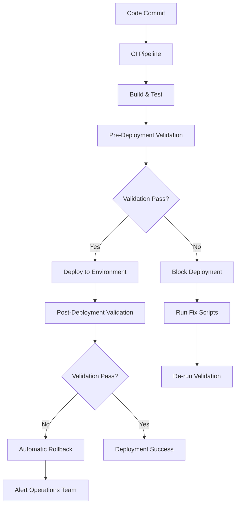

# Deployment Workflow Integration Guide

This guide explains how to integrate the Production Deployment Checklist validation framework with existing deployment workflows and CI/CD pipelines.

## Table of Contents

1. [Integration Overview](#integration-overview)
2. [CI/CD Pipeline Integration](#cicd-pipeline-integration)
3. [Deployment Script Integration](#deployment-script-integration)
4. [Existing Script Integration](#existing-script-integration)
5. [Workflow Automation](#workflow-automation)
6. [Monitoring and Alerting](#monitoring-and-alerting)

## Integration Overview

The validation framework is designed to integrate seamlessly with existing deployment processes by providing:

- **Pre-deployment validation gates**: Block deployments that don't meet requirements
- **Post-deployment verification**: Validate configuration after deployment
- **Automated remediation guidance**: Reference existing fix scripts
- **Audit logging**: Track all validation activities
- **CI/CD integration**: JSON output for pipeline consumption

### Integration Architecture



## CI/CD Pipeline Integration

### GitHub Actions Integration

Create `.github/workflows/production-deployment.yml`:

```yaml
name: Production Deployment with Validation

on:
  push:
    branches: [main]
  workflow_dispatch:

jobs:
  validate-and-deploy:
    runs-on: ubuntu-latest
    
    steps:
    - name: Checkout code
      uses: actions/checkout@v3
      
    - name: Setup Python
      uses: actions/setup-python@v4
      with:
        python-version: '3.9'
        
    - name: Install dependencies
      run: |
        pip install -e .
        pip install boto3
        
    - name: Configure AWS credentials
      uses: aws-actions/configure-aws-credentials@v2
      with:
        aws-access-key-id: ${{ secrets.AWS_ACCESS_KEY_ID }}
        aws-secret-access-key: ${{ secrets.AWS_SECRET_ACCESS_KEY }}
        aws-region: us-east-1
        
    - name: Pre-deployment validation
      id: validation
      run: |
        python -m multimodal_librarian.validation.cli \
          --config deployment-configs/production.json \
          --output-format json > validation-report.json
        
        # Check if validation passed
        if [ $? -eq 0 ]; then
          echo "validation_passed=true" >> $GITHUB_OUTPUT
        else
          echo "validation_passed=false" >> $GITHUB_OUTPUT
        fi
        
    - name: Upload validation report
      uses: actions/upload-artifact@v3
      with:
        name: validation-report
        path: validation-report.json
        
    - name: Deploy to production
      if: steps.validation.outputs.validation_passed == 'true'
      run: |
        echo "✅ Validation passed. Deploying to production..."
        ./scripts/deploy-to-production.sh
        
    - name: Post-deployment validation
      if: steps.validation.outputs.validation_passed == 'true'
      run: |
        # Wait for deployment to stabilize
        sleep 60
        
        # Run post-deployment validation
        python -m multimodal_librarian.validation.cli \
          --config deployment-configs/production.json \
          --output-format json > post-deployment-validation.json
          
    - name: Rollback on validation failure
      if: failure()
      run: |
        echo "❌ Deployment or validation failed. Rolling back..."
        ./scripts/emergency-rollback.sh
        
    - name: Notify team
      if: always()
      uses: 8398a7/action-slack@v3
      with:
        status: ${{ job.status }}
        text: |
          Deployment Status: ${{ job.status }}
          Validation Report: Available in artifacts
      env:
        SLACK_WEBHOOK_URL: ${{ secrets.SLACK_WEBHOOK }}
```

### Jenkins Pipeline Integration

Create `Jenkinsfile`:

```groovy
pipeline {
    agent any
    
    environment {
        AWS_DEFAULT_REGION = 'us-east-1'
        DEPLOYMENT_CONFIG = 'deployment-configs/production.json'
    }
    
    stages {
        stage('Checkout') {
            steps {
                checkout scm
            }
        }
        
        stage('Setup') {
            steps {
                sh '''
                    python -m venv venv
                    . venv/bin/activate
                    pip install -e .
                    pip install boto3
                '''
            }
        }
        
        stage('Pre-deployment Validation') {
            steps {
                script {
                    sh '''
                        . venv/bin/activate
                        python -m multimodal_librarian.validation.cli \
                          --config ${DEPLOYMENT_CONFIG} \
                          --output-format json > validation-report.json
                    '''
                    
                    def validationReport = readJSON file: 'validation-report.json'
                    
                    if (!validationReport.overall_status) {
                        error("Validation failed: ${validationReport.remediation_summary}")
                    }
                    
                    echo "✅ Pre-deployment validation passed"
                }
            }
        }
        
        stage('Deploy') {
            steps {
                sh './scripts/deploy-to-production.sh'
            }
        }
        
        stage('Post-deployment Validation') {
            steps {
                script {
                    // Wait for deployment to stabilize
                    sleep(60)
                    
                    sh '''
                        . venv/bin/activate
                        python -m multimodal_librarian.validation.cli \
                          --config ${DEPLOYMENT_CONFIG} \
                          --output-format json > post-deployment-validation.json
                    '''
                    
                    def postValidationReport = readJSON file: 'post-deployment-validation.json'
                    
                    if (!postValidationReport.overall_status) {
                        error("Post-deployment validation failed: ${postValidationReport.remediation_summary}")
                    }
                    
                    echo "✅ Post-deployment validation passed"
                }
            }
        }
    }
    
    post {
        failure {
            script {
                echo "❌ Pipeline failed. Initiating rollback..."
                sh './scripts/emergency-rollback.sh'
            }
        }
        
        always {
            archiveArtifacts artifacts: '*-validation.json', fingerprint: true
            
            // Send notification
            emailext (
                subject: "Deployment ${currentBuild.result}: ${env.JOB_NAME} - ${env.BUILD_NUMBER}",
                body: """
                Deployment Status: ${currentBuild.result}
                
                Build URL: ${env.BUILD_URL}
                
                Validation reports are available in the build artifacts.
                """,
                to: "${env.DEPLOYMENT_NOTIFICATION_EMAIL}"
            )
        }
    }
}
```

### GitLab CI Integration

Create `.gitlab-ci.yml`:

```yaml
stages:
  - validate
  - deploy
  - verify

variables:
  AWS_DEFAULT_REGION: "us-east-1"
  DEPLOYMENT_CONFIG: "deployment-configs/production.json"

before_script:
  - pip install -e .
  - pip install boto3

pre_deployment_validation:
  stage: validate
  script:
    - |
      python -m multimodal_librarian.validation.cli \
        --config $DEPLOYMENT_CONFIG \
        --output-format json > validation-report.json
      
      # Check validation result
      if [ $? -ne 0 ]; then
        echo "❌ Pre-deployment validation failed"
        cat validation-report.json
        exit 1
      fi
      
      echo "✅ Pre-deployment validation passed"
  artifacts:
    reports:
      junit: validation-report.json
    paths:
      - validation-report.json
    expire_in: 1 week

deploy_production:
  stage: deploy
  script:
    - echo "🚀 Deploying to production..."
    - ./scripts/deploy-to-production.sh
  dependencies:
    - pre_deployment_validation
  only:
    - main

post_deployment_validation:
  stage: verify
  script:
    - sleep 60  # Wait for deployment to stabilize
    - |
      python -m multimodal_librarian.validation.cli \
        --config $DEPLOYMENT_CONFIG \
        --output-format json > post-deployment-validation.json
      
      if [ $? -ne 0 ]; then
        echo "❌ Post-deployment validation failed. Initiating rollback..."
        ./scripts/emergency-rollback.sh
        exit 1
      fi
      
      echo "✅ Post-deployment validation passed"
  dependencies:
    - deploy_production
  artifacts:
    paths:
      - post-deployment-validation.json
    expire_in: 1 week
```

## Deployment Script Integration

### Enhanced Deployment Script

Create `scripts/deploy-with-validation.sh`:

```bash
#!/bin/bash

set -e

# Configuration
DEPLOYMENT_CONFIG="${1:-deployment-configs/production.json}"
ENVIRONMENT="${2:-production}"
ROLLBACK_ON_FAILURE="${3:-true}"

# Colors for output
RED='\033[0;31m'
GREEN='\033[0;32m'
YELLOW='\033[1;33m'
NC='\033[0m' # No Color

# Logging function
log() {
    echo -e "${GREEN}[$(date +'%Y-%m-%d %H:%M:%S')]${NC} $1"
}

error() {
    echo -e "${RED}[$(date +'%Y-%m-%d %H:%M:%S')] ERROR:${NC} $1"
}

warning() {
    echo -e "${YELLOW}[$(date +'%Y-%m-%d %H:%M:%S')] WARNING:${NC} $1"
}

# Capture current deployment state for rollback
capture_deployment_state() {
    log "Capturing current deployment state..."
    
    # Get current task definition
    CURRENT_TASK_DEF=$(aws ecs describe-services \
        --cluster production \
        --services multimodal-librarian \
        --query 'services[0].taskDefinition' \
        --output text)
    
    echo "$CURRENT_TASK_DEF" > .rollback-task-definition
    
    log "Current task definition saved: $CURRENT_TASK_DEF"
}

# Run pre-deployment validation
run_pre_deployment_validation() {
    log "Running pre-deployment validation..."
    
    python -m multimodal_librarian.validation.cli \
        --config "$DEPLOYMENT_CONFIG" \
        --output-format json > pre-deployment-validation.json
    
    VALIDATION_EXIT_CODE=$?
    
    if [ $VALIDATION_EXIT_CODE -eq 0 ]; then
        log "✅ Pre-deployment validation passed"
        return 0
    else
        error "❌ Pre-deployment validation failed"
        
        # Show remediation guidance
        echo ""
        echo "Remediation guidance:"
        jq -r '.remediation_summary' pre-deployment-validation.json
        
        echo ""
        echo "Failed checks:"
        jq -r '.checks_performed[] | select(.passed == false) | "- \(.check_name): \(.message)"' pre-deployment-validation.json
        
        return 1
    fi
}

# Deploy to AWS
deploy_to_aws() {
    log "Deploying to AWS..."
    
    # Build and push Docker image
    log "Building Docker image..."
    docker build -t multimodal-librarian:latest .
    
    # Tag and push to ECR
    ECR_URI=$(aws ecr describe-repositories --repository-names multimodal-librarian --query 'repositories[0].repositoryUri' --output text)
    docker tag multimodal-librarian:latest "$ECR_URI:latest"
    
    log "Pushing to ECR: $ECR_URI"
    aws ecr get-login-password --region us-east-1 | docker login --username AWS --password-stdin "$ECR_URI"
    docker push "$ECR_URI:latest"
    
    # Update ECS service
    log "Updating ECS service..."
    aws ecs update-service \
        --cluster production \
        --service multimodal-librarian \
        --force-new-deployment
    
    # Wait for deployment to complete
    log "Waiting for deployment to complete..."
    aws ecs wait services-stable \
        --cluster production \
        --services multimodal-librarian
    
    log "✅ Deployment completed"
}

# Run post-deployment validation
run_post_deployment_validation() {
    log "Waiting for service to stabilize..."
    sleep 60
    
    log "Running post-deployment validation..."
    
    python -m multimodal_librarian.validation.cli \
        --config "$DEPLOYMENT_CONFIG" \
        --output-format json > post-deployment-validation.json
    
    VALIDATION_EXIT_CODE=$?
    
    if [ $VALIDATION_EXIT_CODE -eq 0 ]; then
        log "✅ Post-deployment validation passed"
        return 0
    else
        error "❌ Post-deployment validation failed"
        
        # Show validation failures
        echo ""
        echo "Validation failures:"
        jq -r '.checks_performed[] | select(.passed == false) | "- \(.check_name): \(.message)"' post-deployment-validation.json
        
        return 1
    fi
}

# Rollback deployment
rollback_deployment() {
    if [ "$ROLLBACK_ON_FAILURE" != "true" ]; then
        warning "Rollback disabled. Manual intervention required."
        return 0
    fi
    
    if [ ! -f .rollback-task-definition ]; then
        error "No rollback state found. Cannot rollback automatically."
        return 1
    fi
    
    ROLLBACK_TASK_DEF=$(cat .rollback-task-definition)
    
    warning "Rolling back to previous task definition: $ROLLBACK_TASK_DEF"
    
    aws ecs update-service \
        --cluster production \
        --service multimodal-librarian \
        --task-definition "$ROLLBACK_TASK_DEF"
    
    # Wait for rollback to complete
    aws ecs wait services-stable \
        --cluster production \
        --services multimodal-librarian
    
    warning "✅ Rollback completed"
}

# Send notification
send_notification() {
    local status=$1
    local message=$2
    
    # Send Slack notification if webhook is configured
    if [ -n "$SLACK_WEBHOOK_URL" ]; then
        curl -X POST -H 'Content-type: application/json' \
            --data "{\"text\":\"Deployment $status: $message\"}" \
            "$SLACK_WEBHOOK_URL"
    fi
    
    # Send email notification if configured
    if [ -n "$NOTIFICATION_EMAIL" ]; then
        echo "$message" | mail -s "Deployment $status" "$NOTIFICATION_EMAIL"
    fi
}

# Main deployment flow
main() {
    log "Starting deployment to $ENVIRONMENT"
    log "Configuration: $DEPLOYMENT_CONFIG"
    
    # Capture current state for potential rollback
    capture_deployment_state
    
    # Run pre-deployment validation
    if ! run_pre_deployment_validation; then
        error "Pre-deployment validation failed. Deployment aborted."
        send_notification "FAILED" "Pre-deployment validation failed"
        exit 1
    fi
    
    # Deploy to AWS
    if ! deploy_to_aws; then
        error "Deployment failed."
        rollback_deployment
        send_notification "FAILED" "Deployment failed and was rolled back"
        exit 1
    fi
    
    # Run post-deployment validation
    if ! run_post_deployment_validation; then
        error "Post-deployment validation failed."
        rollback_deployment
        send_notification "FAILED" "Post-deployment validation failed and was rolled back"
        exit 1
    fi
    
    # Cleanup
    rm -f .rollback-task-definition
    
    log "🎉 Deployment completed successfully!"
    send_notification "SUCCESS" "Deployment completed successfully with all validations passed"
}

# Run main function
main "$@"
```

## Existing Script Integration

The validation framework integrates with existing fix scripts through the FixScriptManager. Here's how to leverage existing scripts:

### IAM Permission Fix Integration

```python
from multimodal_librarian.validation import FixScriptManager, IAMPermissionsValidator

def fix_iam_permissions_with_validation(deployment_config):
    """Fix IAM permissions and validate the fix"""
    
    # Run initial validation
    validator = IAMPermissionsValidator()
    result = validator.validate(deployment_config)
    
    if result.passed:
        print("✅ IAM permissions already valid")
        return True
    
    print(f"❌ IAM validation failed: {result.message}")
    
    # Get fix scripts
    fix_manager = FixScriptManager()
    iam_scripts = fix_manager.get_iam_fix_scripts()
    
    print("Available fix scripts:")
    for script in iam_scripts:
        print(f"- {script.script_path}: {script.description}")
    
    # Run the appropriate fix script
    try:
        # Use the correct IAM fix script
        subprocess.run([
            "python", 
            "scripts/fix-iam-secrets-permissions-correct.py",
            "--role-arn", deployment_config.iam_role_arn
        ], check=True)
        
        print("✅ IAM fix script completed")
        
        # Re-run validation to confirm fix
        result = validator.validate(deployment_config)
        
        if result.passed:
            print("✅ IAM permissions now valid")
            return True
        else:
            print(f"❌ IAM permissions still invalid: {result.message}")
            return False
            
    except subprocess.CalledProcessError as e:
        print(f"❌ Fix script failed: {e}")
        return False
```

### Storage Configuration Fix Integration

```python
def fix_storage_configuration_with_validation(deployment_config):
    """Fix storage configuration and validate the fix"""
    
    from multimodal_librarian.validation import StorageConfigValidator
    import json
    
    # Run initial validation
    validator = StorageConfigValidator()
    result = validator.validate(deployment_config)
    
    if result.passed:
        print("✅ Storage configuration already valid")
        return True
    
    print(f"❌ Storage validation failed: {result.message}")
    
    # Load task definition update template
    with open('task-definition-update.json', 'r') as f:
        task_def_update = json.load(f)
    
    # Ensure ephemeral storage is set to 30GB
    task_def_update['ephemeralStorage'] = {'sizeInGiB': 30}
    
    # Update task definition
    try:
        # Write updated task definition
        with open('updated-task-definition.json', 'w') as f:
            json.dump(task_def_update, f, indent=2)
        
        # Register new task definition
        subprocess.run([
            "aws", "ecs", "register-task-definition",
            "--cli-input-json", "file://updated-task-definition.json"
        ], check=True)
        
        print("✅ Task definition updated")
        
        # Re-run validation to confirm fix
        result = validator.validate(deployment_config)
        
        if result.passed:
            print("✅ Storage configuration now valid")
            return True
        else:
            print(f"❌ Storage configuration still invalid: {result.message}")
            return False
            
    except subprocess.CalledProcessError as e:
        print(f"❌ Task definition update failed: {e}")
        return False
```

### SSL Configuration Fix Integration

```python
def fix_ssl_configuration_with_validation(deployment_config):
    """Fix SSL configuration and validate the fix"""
    
    from multimodal_librarian.validation import SSLConfigValidator
    
    # Run initial validation
    validator = SSLConfigValidator()
    result = validator.validate(deployment_config)
    
    if result.passed:
        print("✅ SSL configuration already valid")
        return True
    
    print(f"❌ SSL validation failed: {result.message}")
    
    # Run SSL setup script
    try:
        subprocess.run([
            "python",
            "scripts/add-https-ssl-support.py",
            "--load-balancer-arn", deployment_config.load_balancer_arn,
            "--certificate-arn", deployment_config.ssl_certificate_arn
        ], check=True)
        
        print("✅ SSL setup script completed")
        
        # Wait for changes to propagate
        time.sleep(30)
        
        # Re-run validation to confirm fix
        result = validator.validate(deployment_config)
        
        if result.passed:
            print("✅ SSL configuration now valid")
            return True
        else:
            print(f"❌ SSL configuration still invalid: {result.message}")
            return False
            
    except subprocess.CalledProcessError as e:
        print(f"❌ SSL setup script failed: {e}")
        return False
```

### Comprehensive Fix and Validation Script

Create `scripts/fix-and-validate.py`:

```python
#!/usr/bin/env python3

import argparse
import sys
import time
from multimodal_librarian.validation import ChecklistValidator, DeploymentConfig

def main():
    parser = argparse.ArgumentParser(description='Fix deployment issues and validate')
    parser.add_argument('--config', required=True, help='Deployment configuration file')
    parser.add_argument('--fix-iam', action='store_true', help='Fix IAM permissions')
    parser.add_argument('--fix-storage', action='store_true', help='Fix storage configuration')
    parser.add_argument('--fix-ssl', action='store_true', help='Fix SSL configuration')
    parser.add_argument('--fix-all', action='store_true', help='Fix all issues')
    
    args = parser.parse_args()
    
    # Load configuration
    with open(args.config, 'r') as f:
        config_data = json.load(f)
    
    config = DeploymentConfig(**config_data)
    
    # Run initial validation
    validator = ChecklistValidator()
    report = validator.validate_deployment_readiness(config)
    
    if report.overall_status:
        print("✅ All validations already pass")
        return 0
    
    print("❌ Validation failures detected:")
    for check in report.checks_performed:
        if not check.passed:
            print(f"- {check.check_name}: {check.message}")
    
    # Apply fixes based on arguments
    fixes_applied = False
    
    if args.fix_iam or args.fix_all:
        if fix_iam_permissions_with_validation(config):
            fixes_applied = True
    
    if args.fix_storage or args.fix_all:
        if fix_storage_configuration_with_validation(config):
            fixes_applied = True
    
    if args.fix_ssl or args.fix_all:
        if fix_ssl_configuration_with_validation(config):
            fixes_applied = True
    
    if not fixes_applied:
        print("❌ No fixes were applied or all fixes failed")
        return 1
    
    # Run final validation
    print("\n🔍 Running final validation...")
    time.sleep(10)  # Allow changes to propagate
    
    final_report = validator.validate_deployment_readiness(config)
    
    if final_report.overall_status:
        print("✅ All validations now pass!")
        return 0
    else:
        print("❌ Some validations still fail:")
        for check in final_report.checks_performed:
            if not check.passed:
                print(f"- {check.check_name}: {check.message}")
        return 1

if __name__ == '__main__':
    sys.exit(main())
```

## Workflow Automation

### Automated Fix and Retry Workflow

```python
def automated_deployment_workflow(deployment_config, max_retries=3):
    """Automated deployment with fix and retry logic"""
    
    for attempt in range(max_retries):
        print(f"\n🔄 Deployment attempt {attempt + 1}/{max_retries}")
        
        # Run validation
        validator = ChecklistValidator()
        report = validator.validate_deployment_readiness(deployment_config)
        
        if report.overall_status:
            print("✅ Validation passed. Proceeding with deployment...")
            
            # Deploy
            deploy_result = deploy_to_aws(deployment_config)
            
            # Post-deployment validation
            time.sleep(60)
            post_report = validator.validate_deployment_readiness(deployment_config)
            
            if post_report.overall_status:
                print("✅ Deployment successful!")
                return True
            else:
                print("❌ Post-deployment validation failed")
                if attempt < max_retries - 1:
                    print("🔧 Attempting to fix issues...")
                    apply_fixes_based_on_report(post_report, deployment_config)
                continue
        
        else:
            print("❌ Pre-deployment validation failed")
            if attempt < max_retries - 1:
                print("🔧 Attempting to fix issues...")
                apply_fixes_based_on_report(report, deployment_config)
                continue
    
    print(f"❌ Deployment failed after {max_retries} attempts")
    return False

def apply_fixes_based_on_report(report, deployment_config):
    """Apply fixes based on validation report"""
    
    for check in report.checks_performed:
        if not check.passed:
            if "IAM" in check.check_name:
                fix_iam_permissions_with_validation(deployment_config)
            elif "Storage" in check.check_name:
                fix_storage_configuration_with_validation(deployment_config)
            elif "SSL" in check.check_name:
                fix_ssl_configuration_with_validation(deployment_config)
```

## Monitoring and Alerting

### CloudWatch Integration

```python
import boto3
from datetime import datetime

def send_validation_metrics(report, deployment_config):
    """Send validation metrics to CloudWatch"""
    
    cloudwatch = boto3.client('cloudwatch')
    
    # Overall validation status
    cloudwatch.put_metric_data(
        Namespace='DeploymentValidation',
        MetricData=[
            {
                'MetricName': 'ValidationSuccess',
                'Dimensions': [
                    {
                        'Name': 'Environment',
                        'Value': deployment_config.target_environment
                    }
                ],
                'Value': 1 if report.overall_status else 0,
                'Unit': 'Count',
                'Timestamp': datetime.utcnow()
            }
        ]
    )
    
    # Individual check metrics
    for check in report.checks_performed:
        cloudwatch.put_metric_data(
            Namespace='DeploymentValidation',
            MetricData=[
                {
                    'MetricName': f'{check.check_name.replace(" ", "")}Success',
                    'Dimensions': [
                        {
                            'Name': 'Environment',
                            'Value': deployment_config.target_environment
                        }
                    ],
                    'Value': 1 if check.passed else 0,
                    'Unit': 'Count',
                    'Timestamp': datetime.utcnow()
                }
            ]
        )
```

### Slack Integration

```python
import requests
import json

def send_slack_notification(report, deployment_config, webhook_url):
    """Send validation results to Slack"""
    
    if report.overall_status:
        color = "good"
        title = "✅ Deployment Validation Passed"
        message = f"All validation checks passed for {deployment_config.target_environment}"
    else:
        color = "danger"
        title = "❌ Deployment Validation Failed"
        message = f"Validation failed for {deployment_config.target_environment}"
    
    # Create attachment with check details
    fields = []
    for check in report.checks_performed:
        fields.append({
            "title": check.check_name,
            "value": "✅ Passed" if check.passed else f"❌ {check.message}",
            "short": True
        })
    
    payload = {
        "attachments": [
            {
                "color": color,
                "title": title,
                "text": message,
                "fields": fields,
                "footer": "Deployment Validation Framework",
                "ts": int(report.timestamp.timestamp())
            }
        ]
    }
    
    response = requests.post(webhook_url, json=payload)
    response.raise_for_status()
```

This integration guide provides comprehensive patterns for incorporating the validation framework into existing deployment workflows, ensuring that the critical deployment steps are always validated before production releases.