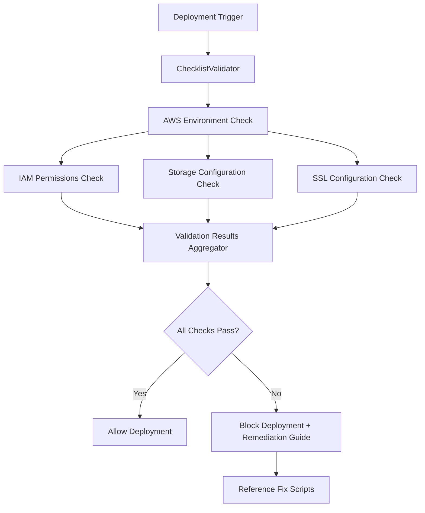

# Production Deployment Validation Framework

This framework provides automated validation of the 3 critical production deployment steps that have been repeatedly rediscovered during deployments, preventing deployment failures and reducing time spent on troubleshooting.

## Overview

The Production Deployment Checklist validates:

1. **IAM Permissions Validation** - Ensures ECS tasks have proper access to Secrets Manager
2. **Ephemeral Storage Configuration** - Validates minimum 30GB storage allocation  
3. **HTTPS/SSL Security Configuration** - Verifies proper SSL setup and security headers

## Documentation

📚 **Comprehensive Documentation Available:**

- **[Usage Guide](USAGE_GUIDE.md)** - Detailed examples and usage patterns for all validation types
- **[Deployment Integration Guide](DEPLOYMENT_INTEGRATION.md)** - CI/CD pipeline integration and workflow automation
- **[Troubleshooting Guide](TROUBLESHOOTING_GUIDE.md)** - Common issues and solutions for validation failures
- **[API Documentation](API_DOCUMENTATION.md)** - Complete programmatic interface reference
- **[CLI Usage Guide](CLI_USAGE.md)** - Command-line interface documentation
- **[Configuration Management](CONFIG_MANAGEMENT.md)** - Configuration file formats and management

## Quick Start

### Basic Usage

```python
from multimodal_librarian.validation import ChecklistValidator, DeploymentConfig

# Create deployment configuration
config = DeploymentConfig(
    task_definition_arn="arn:aws:ecs:us-east-1:123456789012:task-definition/my-app:1",
    iam_role_arn="arn:aws:iam::123456789012:role/my-app-role",
    load_balancer_arn="arn:aws:elasticloadbalancing:us-east-1:123456789012:loadbalancer/app/my-lb/1234567890123456",
    target_environment="production"
)

# Run validation
validator = ChecklistValidator()
report = validator.validate_deployment_readiness(config)

# Check results
if report.overall_status:
    print("✅ Deployment validation passed!")
else:
    print("❌ Deployment validation failed:")
    print(report.remediation_summary)
```

### Command Line Interface

```bash
# Validate using command line arguments
python -m multimodal_librarian.validation.cli \
  --task-definition-arn arn:aws:ecs:us-east-1:123456789012:task-definition/my-app:1 \
  --iam-role-arn arn:aws:iam::123456789012:role/my-app-role \
  --load-balancer-arn arn:aws:elasticloadbalancing:us-east-1:123456789012:loadbalancer/app/my-lb/1234567890123456 \
  --environment production

# Validate using configuration file
python -m multimodal_librarian.validation.cli --config deployment-config.json

# Generate JSON report for CI/CD integration
python -m multimodal_librarian.validation.cli --config deployment-config.json --output-format json
```

### Configuration File Example

```json
{
  "task_definition_arn": "arn:aws:ecs:us-east-1:123456789012:task-definition/my-app:1",
  "iam_role_arn": "arn:aws:iam::123456789012:role/my-app-role",
  "load_balancer_arn": "arn:aws:elasticloadbalancing:us-east-1:123456789012:loadbalancer/app/my-lb/1234567890123456",
  "ssl_certificate_arn": "arn:aws:acm:us-east-1:123456789012:certificate/12345678-1234-1234-1234-123456789012",
  "target_environment": "production",
  "region": "us-east-1"
}
```

## Architecture

### Core Components

- **ChecklistValidator**: Main orchestrator that runs all validation checks
- **BaseValidator**: Abstract base class for individual validators
- **FixScriptManager**: Manages references to fix scripts and generates remediation guidance
- **ValidationResult**: Data model for individual check results
- **ValidationReport**: Comprehensive report of all validation results
- **AWSConfigManager**: Handles AWS SDK configuration and credentials

### Validation Flow



## Validation Checks

### 1. IAM Permissions Validation

Validates that the ECS task's IAM role has the necessary permissions:

- `secretsmanager:GetSecretValue` permission
- Ability to retrieve database credentials from Secrets Manager
- Ability to retrieve API keys from Secrets Manager

**Fix Scripts**: 
- `scripts/fix-iam-secrets-permissions.py`
- `scripts/fix-iam-secrets-permissions-correct.py`

### 2. Ephemeral Storage Configuration

Validates ECS task definition storage allocation:

- Minimum 30GB ephemeral storage configured
- Proper task definition JSON structure
- Storage allocation sufficient for document processing and ML model loading

**Fix Scripts**:
- `task-definition-update.json`

### 3. HTTPS/SSL Security Configuration

Validates load balancer and SSL setup:

- HTTPS listener configured on load balancer
- Valid SSL certificate
- HTTP to HTTPS redirect enabled
- Proper security headers in responses

**Fix Scripts**:
- `scripts/add-https-ssl-support.py`

## Error Handling

The framework provides comprehensive error handling:

- **AWS Configuration Errors**: Clear guidance on credential setup
- **Permission Errors**: Specific IAM policy requirements
- **Resource Not Found**: Validation of ARN formats and resource existence
- **Network Errors**: Retry logic with exponential backoff

## Integration with Existing Scripts

The validation framework integrates with existing fix scripts through the **FixScriptManager**:

### Using FixScriptManager

```python
from multimodal_librarian.validation import FixScriptManager

# Initialize the manager
manager = FixScriptManager()

# Get scripts for specific validation types
iam_scripts = manager.get_iam_fix_scripts()
storage_scripts = manager.get_storage_fix_scripts()
ssl_scripts = manager.get_ssl_fix_scripts()

# Generate comprehensive remediation guide
failed_checks = ["IAM Permissions Check", "Storage Configuration Check"]
guide = manager.generate_remediation_guide(failed_checks)

print(f"Fix scripts available: {len(guide.script_references)}")
for script in guide.script_references:
    print(f"- {script.script_path}: {script.description}")
    print(f"  Usage: {script.usage_instructions}")
```

### Available Fix Scripts

- **IAM Issues**: 
  - `scripts/fix-iam-secrets-permissions.py`
  - `scripts/fix-iam-secrets-permissions-correct.py`
- **Storage Issues**: 
  - `task-definition-update.json`
  - `scripts/fix-task-definition-secrets.py`
- **SSL Issues**: 
  - `scripts/add-https-ssl-support.py`
- **Networking Issues**:
  - `scripts/comprehensive-networking-fix.py`
  - `scripts/fix-vpc-security-group-mismatch.py`
- **Production Deployment**:
  - `scripts/comprehensive-production-fix.py`
  - `scripts/restore-full-production-environment-scaled.py`

## AWS Permissions Required

The validation framework requires the following AWS permissions:

```json
{
  "Version": "2012-10-17",
  "Statement": [
    {
      "Effect": "Allow",
      "Action": [
        "sts:GetCallerIdentity",
        "iam:GetRole",
        "iam:GetRolePolicy",
        "iam:ListAttachedRolePolicies",
        "ecs:DescribeTaskDefinition",
        "elasticloadbalancing:DescribeLoadBalancers",
        "elasticloadbalancing:DescribeListeners",
        "acm:DescribeCertificate",
        "secretsmanager:GetSecretValue",
        "secretsmanager:ListSecrets"
      ],
      "Resource": "*"
    }
  ]
}
```

## Development

### Adding New Validators

1. Create a new validator class inheriting from `BaseValidator`
2. Implement the `validate()` method
3. Register the validator with `ChecklistValidator`

```python
from multimodal_librarian.validation import BaseValidator, ValidationResult

class MyCustomValidator(BaseValidator):
    def validate(self, deployment_config):
        # Perform validation logic
        if validation_passes:
            return self.create_success_result("my_check", "Validation passed")
        else:
            return self.create_failure_result(
                "my_check", 
                "Validation failed",
                remediation_steps=["Step 1", "Step 2"],
                fix_scripts=["scripts/fix-my-issue.py"]
            )

# Register with checklist validator
validator = ChecklistValidator()
validator.register_validator(MyCustomValidator(), "my_custom_validator")
```

### Testing

Run the basic framework test:

```bash
python test_validation_framework.py
```

## Troubleshooting

### Common Issues

1. **AWS Credentials Not Found**
   - Configure AWS CLI: `aws configure`
   - Set environment variables: `AWS_ACCESS_KEY_ID`, `AWS_SECRET_ACCESS_KEY`
   - Use IAM roles for EC2/ECS environments

2. **Permission Denied Errors**
   - Ensure IAM user/role has required permissions (see above)
   - Check resource ARNs are correct and accessible

3. **Invalid ARN Format**
   - Verify ARN format: `arn:aws:service:region:account:resource`
   - Use AWS CLI to get correct ARNs: `aws ecs describe-task-definition --task-definition my-app`

### Debug Mode

Enable debug logging for detailed troubleshooting:

```bash
python -m multimodal_librarian.validation.cli --config config.json --debug
```

## Future Enhancements

- Support for additional validation checks (database connectivity, API health)
- Integration with CI/CD pipelines
- Webhook notifications for validation results
- Custom validation rules via configuration
- Performance metrics and monitoring